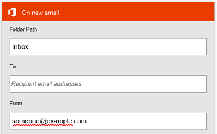
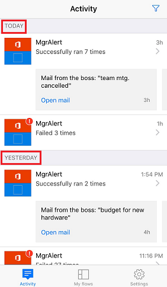
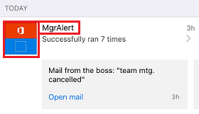
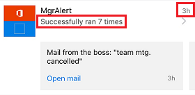
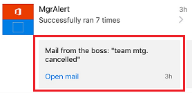
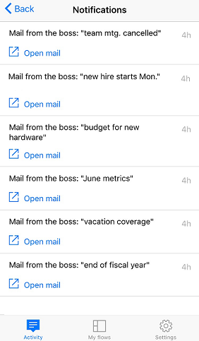
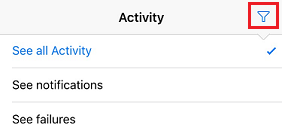
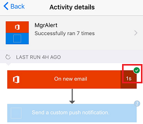
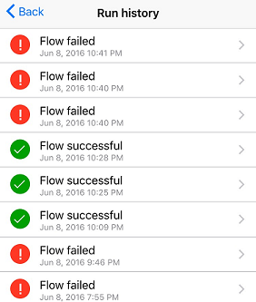

# Monitor activity in Power Automate from your phone

View a summary of how many times each flow succeeded or failed today, yesterday, and previous days. Explore details about each run, such as when it ran, how long each step took and, if it failed, why.

**Prerequisites**

<iframe width="560" height="315" src="https://www.youtube.com/embed/vZuYZ64K3tI?list=PL8nfc9haGeb55I9wL9QnWyHp3ctU2_ThF" frameborder="0" allowfullscreen></iframe>

* Install the Power Automate mobile app for [Android](https://aka.ms/flowmobiledocsandroid), [iOS](https://aka.ms/flowmobiledocsios), or [Windows Phone](https://aka.ms/flowmobilewindows) on a [supported device](getting-started.md#use-the-mobile-app). The graphics in this topic reflect the iPhone version of the app, but the graphics on Android and Windows Phone are similar.
* If you don't already have a cloud flow, create one on [the website for Power Automate](https://flow.microsoft.com/). For easier testing, use one that you can trigger yourself instead of waiting for an external event.

The flow in this tutorial runs when you receive mail from a specific address:

You could configure such a cloud flow with your personal email address for testing and a different address (for example, your manager's) when the flow is ready for real use.

When the flow runs, it sends a custom push notification, with this syntax, to your phone:

**Note:** You can also [manage your flows](mobile-manage-flows.md) from the mobile app.

## Display a summary of activity
<iframe width="560" height="315" src="https://www.youtube.com/embed/nVCGJamOw6s?list=PL8nfc9haGeb55I9wL9QnWyHp3ctU2_ThF" frameborder="0" allowfullscreen></iframe>

1. If your flow hasn't run before, trigger a run to generate data.
   
    It might take some time for the data to appear in the app.
2. Open the mobile app, which shows the **Activity** tab by default.
   
    This tab organizes data by day, with today's data at the top.
   
    
   
    Each entry shows the name of a cloud flow with icons that correspond to its trigger events and actions.
   
    
   
    If at least one run of a cloud flow has succeeded in a day, an entry shows the number of successes and the time when it succeeded most recently. A different entry shows similar information if a cloud flow has failed.
   
    
   
    If a cloud flow sends a push notification, the text of the most recent notification appears at the bottom of the entry for successful runs.
   
    
3. If multiple push notifications were sent in a day, swipe left on the notification to view notifications from up to three previous runs. If more than four notifications were sent in a day, swipe left until **See more** appears, and then tap it to view a list of all notifications.
   
    
4. Tap **Back** to return to the activity summary.
5. To filter the activity summary, tap the icon in the upper-right corner.
   
    You can show all entries, only the failure entries, or only the entries that include push notifications.
   
    

## Show details of a run
1. In the activity summary, tap an entry to show details for the most recent run.
   
     Each event and action appears with an icon that indicates whether the event or action succeeded or failed. If it succeeded, the amount of time it took (in seconds) also appears.
   
    
2. At the bottom of the screen, tap **See previous runs** to list all runs of the flow, and then tap a run to show its details.
   
    

[!INCLUDE[footer-include](includes/footer-banner.md)]