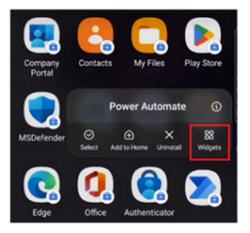
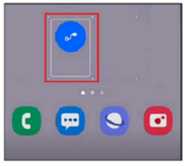
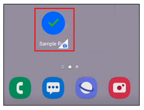

# Create widgets

Widgets make accessing and running instant flows effortless. For quick and easy access to your instant flows, you have the option to create a widget as a shortcut on your mobile device’s home screen. Widgets allow you to trigger instant flows straight from your mobile's home screen without having to open the Power Automate app. If your instant flow requires inputs, the flow will open in the app so you can fill in the required fields before triggering the flow.

To create a widget:

1. Select Power Automate mobile app settings.

1. Select **Widgets**.

    

1. Choose the location for the widget.

    

    > [!NOTE]
    > If you haven't previously signed into the app before creating a widget, the app will be opened to allow you to sign in. Once you are signed in, you can create a widget and run your flow straight from your home screen.

1. Select the flow to run when prompted.

1. Use the widget to run the flow directly using the widget when needed, without opening the Power Automate mobile app.

      

> [!NOTE]
>You can't run shared instant flows using a widget, but you *can* run [solution-aware flows](../overview-solution-flows.md) using a widget.

[!INCLUDE[footer-include](../includes/footer-banner.md)]