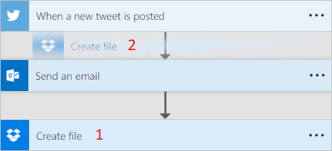
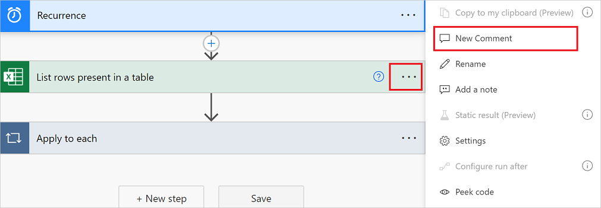
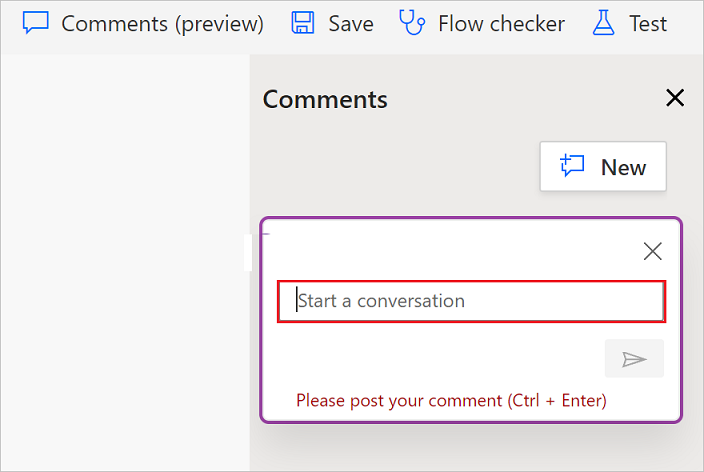
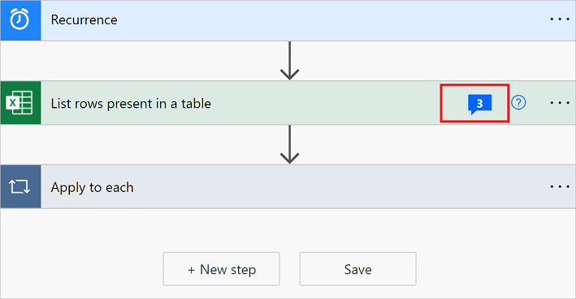
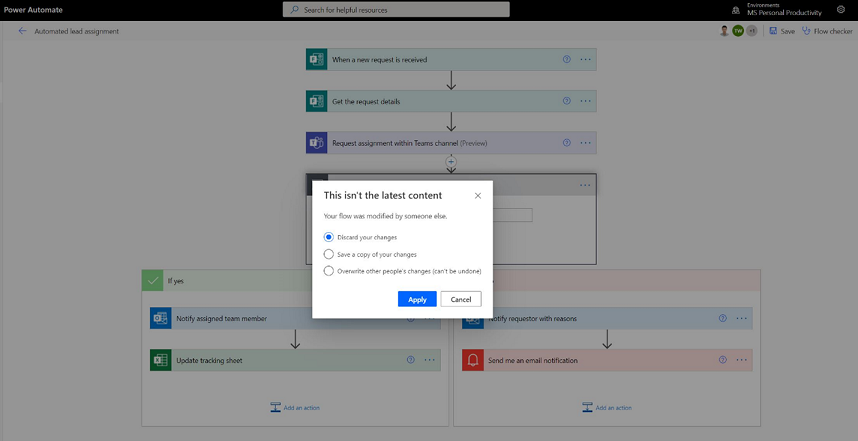
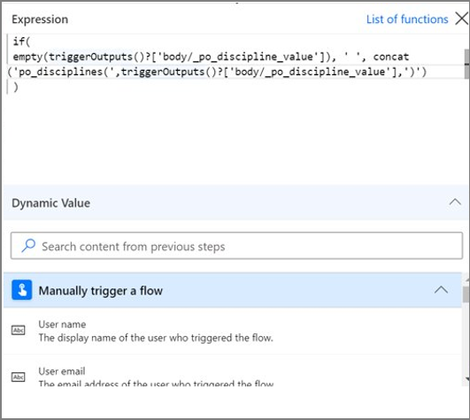

# Add multiple actions and advanced options to a cloud flow

Customize a cloud flow by adding one or more advanced options and multiple actions for the same trigger. For example, add an advanced option that sends an email message as high priority. In addition to sending mail when an item is added to a SharePoint list, create a file in Dropbox that contains the same information.

[!INCLUDE [sharepoint-detailed-docs](includes/sharepoint-detailed-docs.md)]

## Prerequisites
* [Create a cloud flow](get-started-logic-flow.md)

## Add another action
In this procedure, you'll add an action in the middle of the flow. This action will save a file in your Dropbox, archiving the item in the list.

1. In [flow.microsoft.com](https://flow.microsoft.com), select **My flows** in the top navigation bar.
2. In the list of flows, select the flow that you want to edit.
3. Select **New step**, and then select **Add an action**.
   
    
4. In the list of possible actions, search for **Create file**, and then select **Dropbox - Create file**.
   
    
5. If prompted, provide your Dropbox credentials.
6. Select the folder icon on the right side of the **Folder path** box.
7. Find and then select the folder in which you want to place the new file.
   
    
8. Enter the name of the new file into the **File name** box. Be sure to append an extension, such as ".txt", to the file name. Here, let's use the **TweetId** in the file's name to ensure uniqueness of the files. You may have to select **See more** to find the **TweetId** token.
9. Add the text that you want the file to contain by typing into the **File content** box. You can also add tokens into the **File content** box.
   
    
   
   > [!IMPORTANT]
   > If you give the file a name that matches an existing file's name (in the selected folder), the existing file will be overwritten.
   > 
   > 
10. Select **Update flow**, which is located on the menu at the top of the screen.
11. Send a tweet that contains the keyword you specified.
    
     Within a minute, a file is created in your Dropbox account.

## Reorder or delete an action

* To receive email after the file is created in Dropbox, move the Dropbox action by dragging its title bar above the email action. Release the Dropbox action over the arrow between the trigger (**When a new tweet is posted**) and the email action. (The cursor indicates whether the action is positioned correctly.)
  
  > [!NOTE]
  > You can't move a step before another if you're using any outputs from that step.
  > 
  > 
  
    
* To delete an action, select the ellipsis (...) near the right edge of the title bar for the action you want to delete, select **Delete**, and then select **OK**.
  
    
  
     **Note:** You can't delete an action if you're using any outputs from it anywhere in the flow. First, remove those outputs from the fields, and then you can delete the action.

## Copy and paste actions

If you want to duplicate actions while designing a cloud flow, you can copy and paste them. For example, if you are building a condition and want similar actions in the **If yes** side and the **If no** side, instead of creating both actions from scratch you can build the first action in one side and then copy it to the other side.

### To copy an action
1. Select the action menu (the ... at the top-right of the action).
1. Select **Copy to my clipboard**. 
1. Select **New step** where you want your action to go. 

     Notice the **My clipboard** tab that lets you choose from all of the actions that you've copied.
1. Select the item you want to paste.

## Add advanced options
Start with a cloud flow that has a **Send an email** action.

1. Select **Show advanced options**, which is located at the bottom of the **Send an email** card.
   
     You'll then see the advanced options for sending an email.
   
    
2. Select **High** from the **Importance** list, and then select **Hide advanced options** to hide the advanced options.
3. Select **Update flow**, which is located on the menu at the top of the screen.
   
     This step saves your changes.

## Use co-presence to see all editors

Power Automate displays the list of other makers who are editing a flow simultaneously. The list of editors is updated periodically.

## Add comments to actions and triggers

Makers can have threaded comments with colleagues as they build their flows. They can add or edit comments, reply to comment threads, and resolve and delete comment threads. It's possible to have multiple comment threads for both actions and triggers.

>[!IMPORTANT]
>Comments are supported for environments that have a Dataverse database.

Follow these steps to add a comment to any action or trigger in your flow.

1. Select the ellipsis on the trigger or action.
1. Select **New Comment**.

   

   The comments pane opens.

1. Enter your comments in the **Start a conversation** box on the **Comments** pane, and then post it.

   

 The Power Automate designer provides visual cues on the action cards to display the number of comment threads contained within each.

### Limitations

- Makers must save the flow at least once before a comment could be added.
- The comment thread count icons don't appear for control actions such as condition, switch, and scope.

## Address conflicts from multiple edits

If multiple users make changes to the flow simultaneously, Power Automate presents appropriate options to the maker to minimize conflicts during a save operation. A maker can choose to refresh the flow definition or save a copy of the flow to keeps their changes.

## New expression editor for actions (experimental feature)

Do you struggle with writing expressions in your flow actions? Now, you can make use of the improved expression editor in experimental mode. To use the improved expression editor, [enable the Experimental Features setting](experimental-features.md) and select **fx** on an action. 

- The expression editor view is larger to help you manage richer and complex expressions.
    

- Ability to choose dynamic content in the expressions without having to switch tabs.
    

- Ability to preserve expressions with errors and unblock the view to work in parallel on other parts of flow.

    
 
> [!NOTE]
> Some actions may not support the new expression editor.

[!INCLUDE[footer-include](includes/footer-banner.md)]