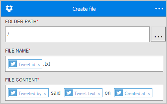

<properties
    pageTitle="Add an advanced parameter and multiple actions | Microsoft Flow"
    description="Expand a flow to include an advanced parameter, such as setting email to high priority, and add another action for the same event."
    services=""
    suite="flow"
    documentationCenter="na"
    authors="stepsic-microsoft-com"
    manager="erikre"
    editor=""
    tags=""/>

<tags
   ms.service="flow"
   ms.devlang="na"
   ms.topic="article"
   ms.tgt_pltfrm="na"
   ms.workload="na"
   ms.date="04/08/2016"
   ms.author="stepsic"/>

# Add multiple actions and advanced parameters to a flow #
Customize a flow by adding one or more advanced parameters and multiple actions for the same trigger. For example, add an advanced parameter that sends an email message as high priority. In addition to sending mail when an item is added to a SharePoint list, create a file in Dropbox that contains the same information.

**Prerequisites**

- [Create a flow](get-started-logic-flow.md)

## Add another action ##

In this procedure, you'll add an action in the middle of the flow. This action will save a file in your Dropbox, archiving the item in the list.

1. In [flow.microsoft.com](https://flow.microsoft.com), select **My Flows** in the top navigation bar.

1. In the list of flows, select the edit icon, which looks like a pencil, next to the flow that you want to edit.

1. Select the "+" button, and then select **Add action**.

    

1. In the list of possible actions, search for **Create file**, and then click **Dropbox - Create file**.

1. If prompted, provide your Dropbox credentials.

1. In the form that appears, select the ellipsis button, browse to the folder you want, and then select **Choose**.

1. Give the file a name with an extension such as .txt and, to ensure that each file name is unique to a list item, add one or more placeholders.

	If a file has the same name as an existing file, the new file will override the existing one.

1. Add whatever content you want in the file, including as many placeholders as you want, and then select **Update flow**.

    

1. Send a tweet that contains the keyword you specified.

    Within a minute, a file is created in your Dropbox account.

## Reorder or delete an action ##

- To receive email after the file is created in Dropbox, move the Dropbox action by dragging its title bar above the email action, and drop the Dropbox action when the cursor indicates that it's OK.

	**Note:** You can't move a step before another if you're using any outputs from that step.

    

- To delete an action, select the ellipsis (...) near the right edge of the title bar for the action you want to delete, select **Delete**, and then select **OK**.

    

	**Note:** You can't delete an action if you are using any outputs from it anywhere in the flow. First, remove those outputs from the fields, and then you can delete the action.

## Add advanced parameters

Start with a flow that has a step for **Send email**.

1. Near the bottom of the **Send email** form, select the **...** icon to show advanced parameters.

    

2. In the **Importance** list, select **High**, and then select the **...** icon again to hide the advanced parameters.

3. Near the bottom of the screen, select **Update flow** to save your change.

    
