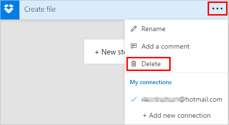
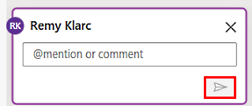

# Add multiple actions and advanced options to a cloud flow

Customize a cloud flow by adding one or more advanced options and multiple actions for the same trigger. For example, add an advanced option that sends an email message as high priority. In addition to sending mail when an item is added to a list created in Microsoft Lists, create a file in Dropbox that contains the same information.

[!INCLUDE [sharepoint-detailed-docs](includes/sharepoint-detailed-docs.md)]

## Prerequisites
[Create a cloud flow](get-started-logic-flow.md)

## Add another action
In this procedure, you'll add an action in the middle of the flow. This action will save a file in your Dropbox, archiving the item in the list.

1. Sign into [Power Automate](https://flow.microsoft.com).
1. On the left pane, select **My flows**.
1. In the list of flows, select the **Edit** icon next to the flow you want to edit.

    > [!div class="mx-imgBorder"]
    >

1. Select **New step**, enter **dropbox** in the search field, and select **Create file - Dropdown** in the **Actions** list.

    > [!div class="mx-imgBorder"]  
    >

1. If prompted, provide your Dropbox credentials.
1. Select the folder icon on the right side of the **Folder path** box.
1. Select **>** and then choose the folder in which you want to place the new file.

    > [!div class="mx-imgBorder"]
    >

1. Enter the name of the new file into the **File name** box. Be sure to append an extension, such as ".txt", to the file name. Here, let's use the **TweetId** in the file's name to ensure uniqueness of the files. You may have to select **See more** to find the **TweetId** token.
1. Add the text that you want the file to contain by typing into the **File content** box. You can also add tokens into the **File content** box.

    > [!div class="mx-imgBorder"]
    >
   
   > [!IMPORTANT]
   > If the file name you enter matches an existing file's name in the selected folder, the existing file will be overwritten.

1. Save your flow.
1. Send a tweet that contains the keyword you specified.
    
     Within a minute, a file is created in your Dropbox account.

## Reorder or delete an action

* To receive email after the file is created in Dropbox, move the Dropbox action by dragging its title bar above the email action. Release the Dropbox action over the arrow between the trigger (**When a new tweet is posted**) and the email action. (The cursor indicates whether the action is positioned correctly.)
  
  > [!NOTE]
  > You can't move a step before another if you're using any outputs from that step.

    > [!div class="mx-imgBorder"]  
    >

* To delete an action, select **...** (the ellipsis) near the right edge of the title bar for the action you want to delete, select **Delete**, and then select **OK**.

    > [!div class="mx-imgBorder"]
    >
  
     **Note:** You can't delete an action if you're using any outputs from it anywhere in the flow. First, remove those outputs from the fields, and then you can delete the action.

## Copy and paste actions

If you want to duplicate actions while designing a cloud flow, you can copy and paste them. For example, if you're building a condition and want similar actions in the **If yes** side and the **If no** side, you can build the first action in one side and then copy it to the other side. This is an alternative to creating both actions from scratch.

### To copy an action
1. On the action menu heading, select **...** (the ellipses).
1. Select **Copy to my clipboard**. 
1. Select **New step** where you want your action to go. 

     Notice the **My clipboard** tab that lets you choose from all of the actions that you've copied.
1. Select the item you want to paste.

## Add advanced options
Start with a cloud flow that has a **Send an email (V2)** action.

1. On the bottom of the **Send an email (V2)** card, select **Show advanced options**.

     You'll see the advanced options for sending an email. The word **Show** changes to **Hide** so that you can toggle the advanced options.

    > [!div class="mx-imgBorder"]
    >

1. From the **Importance** dropdown list, select **High**.
1. Select **Hide advanced options**.
1. Save your flow.

## Use co-presence to get notified of all editors

Power Automate displays the list of other makers who are editing a flow simultaneously. The list of editors is updated periodically.

>[!div class="mx-imgBorder"]
>

## Add comments to actions and triggers

Makers can have threaded comments with colleagues as they build their flows. They can add or edit comments, reply to comment threads, and resolve and delete comment threads. It's possible to have multiple comment threads for both actions and triggers.

>[!IMPORTANT]
>Comments are supported for environments that have a Dataverse database.

Follow these steps to add a comment to any action or trigger in your flow.

1. On the trigger or action heading, select **...** (the ellipsis).
1. Select **New Comment**.

    >[!div class="mx-imgBorder"]
    >

   The comments pane opens.
1. Enter a comment to your action with an @mention to others. If you do this, an email notification will be sent to them when you select the **Send** icon.

    >[!div class="mx-imgBorder"]
    >

    If the person you want to @mention isn't a co-owner of the flow, they'll get the **Share and notify** option. Select this option to share the flow with the other user, and send an email notification automatically.

    >[!div class="mx-imgBorder"]
    >

1. Enter your comments in the **Start a conversation** box on the **Comments** pane, and then post it.

  The Power Automate designer provides visual cues on the action cards to display the number of comment threads contained within each.

>[!div class="mx-imgBorder"]
>

### Limitations

- Makers must save the flow at least once before they can add a comment.
- The comment thread count icons don't appear for control actions such as condition, switch, and scope.
- Comments aren't allowed for managed solution flows.
- The **Share and notify** option is available only for non-solution aware flows. For solution aware flows, @mentioning is limited to users who are already co-owners of the flow.

## Address conflicts from multiple edits

If multiple users make changes to the flow simultaneously, Power Automate presents appropriate options to the maker to minimize conflicts during a save operation. A maker can choose to refresh the flow definition or save a copy of the flow to keep their changes.

>[!div class="mx-imgBorder"]
>

## New expression editor for actions (experimental feature)

Do you struggle with writing expressions in your flow actions? You can make use of the improved expression editor in experimental mode. To use the improved expression editor, [enable the Experimental Features setting](experimental-features.md) and select **fx** on an action. 

- The large expression editor view helps you manage rich and complex expressions.

    >[!div class="mx-imgBorder"]
    >

- The expression editor allows you to choose dynamic content in the expressions without having to switch tabs.

    >[!div class="mx-imgBorder"]
    >

- The expression editor preserves expressions with errors and unblocks the view to work in parallel on other parts of flow.

    >[!div class="mx-imgBorder"]
    >
 
> [!NOTE]
> Some actions might not support the new expression editor.

[!INCLUDE[footer-include](includes/footer-banner.md)]
