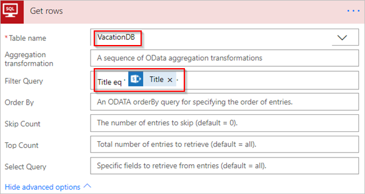
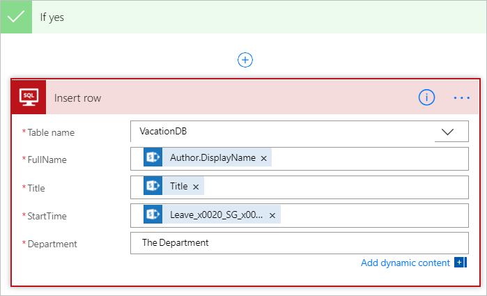
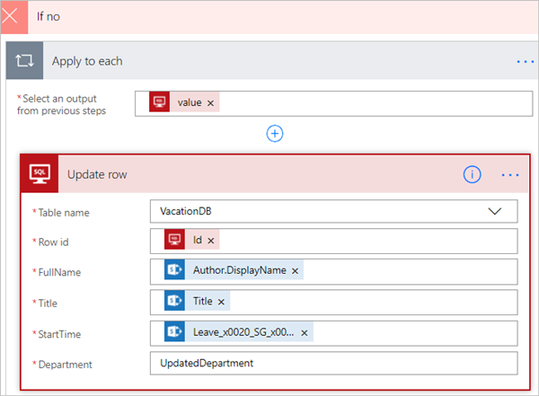

<properties
    pageTitle="Use OData filters | Microsoft Flow"
    description="Learn to use OData filters with Microsoft Flow"
    services=""
    suite="flow"
    documentationCenter="na"
    authors="MSFTMan"
    manager="anneta"
    editor=""
    tags=""/>

<tags
   ms.service="flow"
   ms.devlang="na"
   ms.topic="article"
   ms.tgt_pltfrm="na"
   ms.workload="na"
   ms.date="09/15/2017"
   ms.author="deonhe"/>

# Learn to use OData filters

This walkthrough shows you how to copy data from a Microsoft SharePoint [list](https://support.office.com/en-us/article/SharePoint-lists-I-An-introduction-f11cd5fe-bc87-4f9e-9bfe-bbd87a22a194) (the source) to an [SQL Azure](https://docs.microsoft.com/azure/sql-database/sql-database-technical-overview) table (the destination) using a filter query in Microsoft Flow.

>[AZURE.NOTE] You can copy data among any of the more than [150 services](https://flow.microsoft.com/connectors/) that Microsoft Flow supports.

## Prerequisites

- Access to two data sources.

    The data sources can be any of the more than [150 services](https://flow.microsoft.com/connectors/) that Microsoft Flow supports. In this example, we use a Microsoft SharePoint [list](https://support.office.com/en-us/article/SharePoint-lists-I-An-introduction-f11cd5fe-bc87-4f9e-9bfe-bbd87a22a194) and an [Azure SQL](https://docs.microsoft.com/azure/sql-database/sql-database-technical-overview) table as the data sources.

- Access to [Microsoft Flow](https://flow.microsoft.com).

- A basic understanding of how your data is stored.

>[AZURE.TIP]Every column name in the source and destination don't need to match, but you must provide data for all *required* columns when you insert or update an item. Microsoft Flow identifies the required fields for you.

## Quick overview of the steps

If you're comfortable with Microsoft Flow, use these quick steps to copy data from one data source to another:

1. Identify both data sources and ensure you have access to them.
1. Identify at least one column that uniquely identifies items between the two data sources. In the example below, we use the **Title** column, but you could use any column(s) you want.
1. Set up a trigger to monitor the source database. In the detailed example below, we use the **SharePoint - When an existing item is modified** trigger to monitor the SharePoint [list](https://support.office.com/en-us/article/SharePoint-lists-I-An-introduction-f11cd5fe-bc87-4f9e-9bfe-bbd87a22a194) for changes.

    >[AZURE.TIP] The **SharePoint - When an existing item is modified** trigger monitors *all* changes made to the list, including when **new items** are added.

1. Search the destination database to determine if the changed item exists there. In the example below, we use the **SQL Server - Get rows** action to check if the new or changed item exists in the destination (SQL Azure).
1. Use a **Condition** like this:
    - If the new or changed item doesn't exist in the destination, create it. In the example below, we use the **SQL Server - Insert row** action to *create* new items.
    - If the new or changed item exists in the destination, update it. In the example below, we use the **SQL Server - Update row** action to *update* the existing item.
1. Trigger your flow and confirm that items are being copied from your data source to your data destination.

That's it.

Here are the detailed steps to create a flow that copies data from a Microsoft SharePoint list (source) to Azure SQL (destination).

## Start monitoring the source for changes

>[AZURE.IMPORTANT]If you aren't familiar with the basics of creating flows, review how to add [actions, triggers](multi-step-logic-flow.md/#add-another-action), and [conditions](add-a-condition.md). The steps below assume you know how to perform these steps.

1. Sign into [Microsoft Flow](https://flow.microsoft.com), select **My flows** > **Create from blank**.
1. Search for **SharePoint** > select the **SharePoint - When an item is created or modified** trigger from the list of triggers.

    If you haven't created a connection to SharePoint previously, sign into your SharePoint site by selecting **Sign in** on the **SharePoint - When an item is created or modified** card and follow the instructions to sign in.

1. Enter the **Site Address** and then select the **List Name** on the **When an item is created or modified** card.

    Provide the **Site Address** and **List Name** for the SharePoint list your flow monitors for new or updated items.

    

## Check if the changed item exists in the destination

After a new or modified item triggers the flow, determine if the item exits in the destination. We use the **SQL Server - Get rows** action to search the destination database.

1. Select **New step** > **Add an action**.
1. Search for **Get rows**, select **SQL Server - Get rows**, and then select the table you want to monitor from the **Table name** list.
1. Select **Show advanced options**.
1. In the **Filter Query** box, enter **Title eq '**, select the **Title** token from the dynamic content list, and then enter **'**.

    The previous step assumes you're matching the Titles of the rows in the source and the destination.

    The **Get rows** card should now look like this image:

    

1. At the top of the page, enter a name for your flow in the **Flow name** box, and then select **Create flow** to save it.

    

## Check if the item exists

Select **New step** > **Add a condition** to open the **Condition** card.

On the condition card:

1. Select the box on the left.

    The **Add dynamic content from the apps and connectors used in this flow** list opens.

1. Select **value** from the **Get rows** category.

    >[AZURE.TIP]Confirm you've selected **value** from the **Get rows** category. Do not select **value** from the **When an item is created or modified** category.

1. Select **is equal to** from the list in the center.

1. Enter **0** (zero) in the box on the right side.

    The **Condition** card now resembles this image:

    

1. Select **Edit in advanced mode**.

    When advanced mode opens, you see **@equals(body('Get_rows')?['value'], 0)** expression in the box. Edit this expression by adding **length()** around the **body('Get_items')?['value']** function. The entire expression now appears like this: **@equals(length(body('Get_rows')?['value']), 0)**

    The **Condition** card now resembles this image:

    

    >[AZURE.TIP]Adding the **length()** function allows the flow to check the **value** list and determine if it contains any items.

When your flow "gets" items from the destination, there are two possible outcomes.

|Outcome|Next step|
|-------|---------|
|The item exists|[Update the item](odata-filters.md#update-the-item)|
|The item doesn't exist|[Create a new item](odata-filters.md#create-the-item)|

## Create the item

If the item doesn't exist in the destination, create it using the **SQL Server - Insert row** action.

On the **If yes** branch of the **Condition**:

1. Select **Add an action**, search for **insert row**, and then select **SQL Server - Insert row**.

    The **Insert row** card opens.

1. From the **Table name** list, select the table into which the new item will be inserted.

    The **Insert row** card expands and displays all fields in the selected table. Fields with an asterisk (*) are required and must be populated for the row to be valid.

1. Select each field that you want to populate and enter the data.

    You may enter the data manually, select one or more tokens from the **Dynamic content**, or enter any combination of text and tokens into the fields.

    The **Insert row** card now resembles this image:

    

## Update the item

If the item exists in the destination, update it with the changes.

1. Add the **SQL Server - Update row** action to the **If no** branch of the **Condition**.
1. Follow the steps in the [create the item](odata-filters.md#create-the-item) section of this document to populate the fields of the table.

Select the **Update flow** button to save your flow.

Now, whenever an item in your SharePoint list (source) changes, your flow triggers and either inserts a new item or updates an existing item in your Azure SQL database (destination).

## Learn more

Use [data operations](data-operations.md) in your flows.
