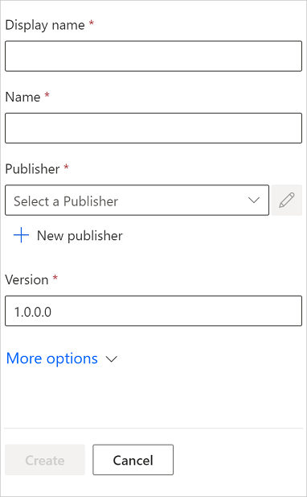

# Overview

When you host your flows in a [solution](https://docs.microsoft.com/powerapps/maker/common-data-service/solutions-overview), they become portable, making it effortless to move them and all their components from one environment to another. A typical use case is for an independent software vendor (ISV) to develop flows in a sandbox environment, and then move those flows to a test environment. After testing, the ISV would then move the flows to a production environment for clients who purchase these flows. This process is much easier when you create your flows in solutions, and then move the solutions and their contents.

Flows created in a solution are known as *solution-aware* flows. You can add multiple flows in a single solution. You cannot move non-solution-aware flows (flows not created in a solution) into a solution.

> [!NOTE]
> For detailed information about solution concepts and implementing a healthy application lifecycle management (ALM) practice in your organization, see [Application lifecycle management (ALM) with Microsoft Power Platform](/power-platform/alm/).

## Prerequisites

You must have the following components to create solutions, and solution-aware flows:

- [Common Data Service](https://docs.microsoft.com/powerapps/maker/common-data-service/data-platform-intro)
- An environment with version 9.1.0.267 or later.

  To check your version, go to [Power Platform admin center](https://admin.powerplatform.microsoft.com/), select **Environments**, select the environment you are interested in, and then select the **Details** tab.

## Create a solution

Follow these steps to create a solution:

1. Sign in to [Power Automate](https://flow.microsoft.com).
1. Select **Solutions** from the navigation bar.

1. Select **New solution**.

   

1. Provide all required information for your new solution, including **Display Name**, **Publisher**, **Version**, and **Name**. It's also a good idea to provide a description of your solution.

   

1. Select **Save and Close** from the menu at the top.

  
   Your new solution might appear like this image:

   

  
## Learn more

- [Create a flow in a solution](./create-flow-solution.md)
- [Export a solution](./export-flow-solution.md)
- [Import a solution](./import-flow-solution.md)
- [Edit a solution-aware flow](./edit-solution-aware-flow.md)
- [Remove a solution-aware flow](./remove-solution-aware-flow.md)
