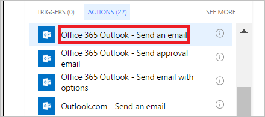
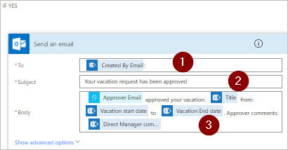
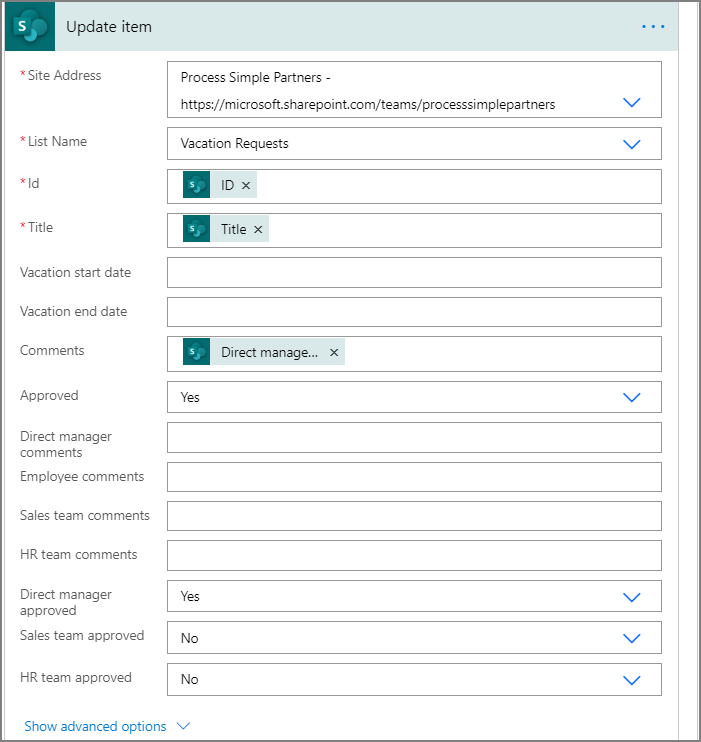

<properties
    pageTitle="Create a parallel modern approval workflow | Microsoft Flow"
    description="Create a parallel modern approval workflow"
    services=""
    suite="flow"
    documentationCenter="na"
    authors="MSFTMan"
    manager="anneta"
    editor=""
    tags=""/>

<tags
   ms.service="flow"
   ms.devlang="na"
   ms.topic="article"
   ms.tgt_pltfrm="na"
   ms.workload="na"
   ms.date="06/02/2017"
   ms.author="deonhe"/>

# Create parallel approval workflows with Microsoft Flow

In this walk-through, we use Microsoft Flow to create a flow that automates a parallel approval workflow. In a parallel approval workflow, multiple persons are required to approve. Examples include approving an invoice, purchase order, vacation, etc. Each person's approval is independent of all other approvers.

This flow automates an employee vacation request process that requires approval from all persons (or teams) that the employee supports regularly. Employees use a SharePoint list to request vacation. Vacation approvals are required from the employee's direct manager, the Sales team, and the Human Resources. Each vacation request is routed each approver for a decision. The flow sends email with status changes, and then updates SharePoint with the decisions.

## Prerequisites

- [Microsoft Flow](https://flow.microsoft.com).

- A SharePoint Online list.

- Office 365 Outlook and Office 365 Users account.

>[AZURE.NOTE]While we use SharePoint Online and Office 365 Outlook in this walk-through, you can use other services such as Zendesk, Salesforce, or Gmail.

Before you create the flow, create a [SharePoint Online list](https://support.office.com/article/Training-Create-and-set-up-a-list-1DDC1F5A-A908-478B-BB6D-608F34B71F94); later, we'll use this list to request approval for vacations.

The SharePoint Online list that you create must include the following columns:

<!-- update the sharepoint list    -->

   

Make note of the name and URL of the SharePoint Online list. We use these items later when you configure the **SharePoint - When a new item is created** trigger.

## Create your flow from the blank template

1. Sign into [Microsoft Flow](https://flow.microsoft.com).

     

1. Select the **My flows** tab.

     

1. Select **Create from blank**.

     

## Add a trigger

1. Enter **SharePoint** into the search box.

     

1. Find, and then select the **SharePoint - When a new item is created** trigger.

     

1. Select the **Site Address** and the **List Name** for the SharePoint list that your flow monitors for new items.

<!--update this image... the name of the list needs updating-->

   

## Get the manager for the person who created the vacation request

1. Select **New step**, and then select **Add an action**.

     

1. Enter **get manager** into the **Choose an action** search box.

1. Find, and then select the **Office 365 Users - Get manager** action.

     

1. Insert the **Created By Email** token into the **User** box on the **Get manager** card.

   This action gets the manger for the person who created the vacation request in SharePoint.

   

## Name and save your flow

1. Provide a name for your flow, and then select **Create flow** to save the work we've done so far.

<!--update image    -->

   

>[AZURE.NOTE] Select **Update flow** from the top of the screen periodically to save the changes to your flow.

<!--update image    -->

   

After each save operation, select **Edit flow** from the top of the screen, and then continue making changes.

## Add an approval action for immediate manager

1. Select **Edit flow**.

     

1. Select **New step**, and then select **Add an action**.

     

1. Enter **approval** into the **Choose an action** search box.

     

1. Select the **Approvals - Start an approval** action.

     

1. Configure the **Start an approval** card to suit your needs.

     Note: **Title** and **Assigned To** are required.

     

Note: This action sends the vacation request to the email address in the **Assigned To** box, so ensure you use the **Email** token from the **Get manager** list.

## Insert a parallel branch approval action for the sales team

1. Select the down arrow that's located between the **Get manager** card and the **Start an approval** card.

1. Select the plus sign that shows up on the down arrow after you select it.

1. Select **Add a parallel branch**

   

Repeat the [steps used to Add an approval action for immediate manager](parallel-modern-approvals.md/#Add-an-approval-action-for-immediate-manager).

Note: Use the email address for the sales team in the **Assigned To** box.

## Insert a parallel branch approval action for the human resources team

Repeat the [steps used to Add an approval action for immediate manager](parallel-modern-approvals.md/#Add-an-approval-action-for-immediate-manager).

Note: Use the email address for the human resources team in the **Assigned To** box.

If you've followed along, your flow should resemble this image:

   

## Options after adding parallel branches

After you've added actions to parallel branches, you have two options for adding more steps to your flow:

- Use the small **Insert a new step** button (the circular plus button that appears when you select any white space on a branch or the area immediately below a branch). This button adds a step to that specific branch. With this approach, steps run in parallel and sequence in multiple branches.

- Use the **New step** button at the bottom of the entire workflow. This button adds an action that runs after all parallel branches complete. When you use this button, you're merging the flow once again, after it branched.

We perform these steps on each branch:

1. Add a condition that checks is the vacation request was approved or rejected.

1. Send an email that informs the employee of the decision.

1. Update the vacation request in SharePoint with the approval decision.

## Add a condition to each branch

1. Select any white space on the **Start an approval** branch.
1. Select the small **Insert a new step** button (the circular plus button that appears after you select the white space in the previous step).
1. Select **Add a condition** from the menu that appears after the previous step.
1. Select the first box on the **Condition** card, and then select the **Response** token from the **Start an approval** category in the dynamic content list.

   

1. Confirm the list (in the middle of the **Condition card**) is set to **is equal to**.
1. Enter **Approve** (this text is case-sensitive) into the last box.
1. Your condition card should now resemble this image:

   

>[AZURE.NOTE]This condition checks the response from the **Start an approval** action that goes to the employee's manager.

## Add email actions to each branch

Perform these steps on the **IF YES, DO NOTHING** side of the **Condition** branch.

   Note: Your flow uses these steps to send an email when the request is approved:

1. Select **Add an action** on the **IF YES, DO NOTHING** branch of the condition.

     

1. Enter **send email** into the search box on the **Choose an action** card.

     

1. Select the **Office 365 Outlook - Send an email** action.

     

1. Configure the email card to suit your needs.

     Note: **To**, **Subject**, and **Body** are required.

     This card is a template for the email that is sent when the status of the vacation request changes.

     Note: In the **Body** box on the **Send an email** card, use the **Comments** token from the **Approvals - Start an approval** action.

<!--add the png to includes to make this work    -->
   

To report a rejection, use the **IF NO, DO NOTHING** side of the **Condition** branch, and then repeat these steps to add a template for the rejection email.

   Note: Your flow uses these steps to send an email when the request is rejected.

## Update the vacation request with the decision

Perform these steps to update SharePoint when decisions are made.

   Note: Be sure perform these steps on both the **IF YES** and the **IF NO** sides of the branch.

1. Select **Add an action** from the **IF YES** branch.

1. Enter **update** into the search box on the **Choose an action** card.

     

1. Select the **SharePoint - Update item** action.

     

1. Configure the **Update item** card to suit your needs.

<!-- confirm this image works in this context   -->
   

## Complete branch actions

>[AZURE.NOTE]Repeat the steps to [add a condition](parallel-modern-approvals.md/#Add-a-condition-to-each-branch), [send emails](parallel-modern-approvals.md/#Add-email-actions-to-each-branch), and [update SharePoint](parallel-modern-approvals.md/#update-the-vacation-request-with-the-decision) on the **Start an approval 2** and **Start an approval 3** branches.

## Complete the flow

1. Select **New step** > **Add an action**

   

1. Use the steps provided previously to send an email that summarizes the results of each approval. Send this email to the employee who requested vacation. Your card may resemble this image:

   

   Note: This email is sent after each approver give their decision.

## Learn more about modern approval

- [introduction to modern approvals](./modern-approvals.md)
