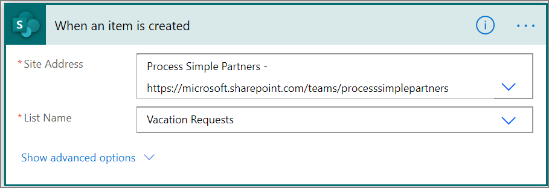
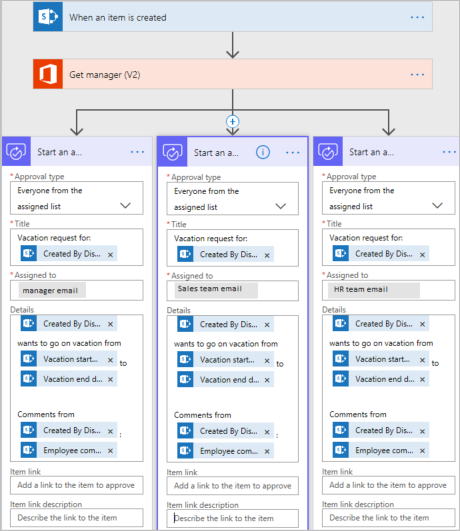

# Create parallel approval workflows with Power Automate

In a parallel approval workflow, multiple persons are required to approve items such as invoices, purchase orders, vacation requests, etc. Each person's approval is independent of all other approvers.

In this walkthrough, we use Power Automate to create a flow that automates a parallel approval workflow. This flow automates an employee vacation request process that requires approval from all persons (or teams) that the employee supports regularly. Employees use a [SharePoint list](https://support.office.com/article/Introduction-to-lists-0a1c3ace-def0-44af-b225-cfa8d92c52d7) to request vacation. Vacation approvals are required from the employee's direct manager, the Sales team, and the Human Resources team. Each vacation request is routed to each approver for a decision. The flow sends email with status changes and then updates SharePoint with the decisions.

## Prerequisites

[!INCLUDE [prerequisites-for-modern-approvals](includes/prerequisites-for-modern-approvals.md)]

The SharePoint Online list you create must include the following columns:

| Title                   | Single line of text    |
|-------------------------|------------------------|
| Modified                | Date and time          |
| Created                 | Date and time          |
| Employee comments       | Single line Of text    |
| Direct manager comments | Multiple lines Of text |
| Sales team comments     | Multiple lines of text |
| HR team comments        | Multiple lines of text |
| Direct manager approved | Yes/No                 |
| Sales team approved     | Yes/No                 |
| HR team approved        | Yes/No                 |
| Vacation start date     | Date and time          |
| Vacation end date       | Date and time          |
| Created By              | Person or group        |
| Modified By             | Person or group        |

Make note of the name and URL of the SharePoint Online list. We use these items later to configure the **SharePoint - When an item is created** trigger.

## Create your flow from the blank template

[!INCLUDE [sign-in-and-create-flow-from-blank-template](includes/sign-in-and-create-flow-from-blank-template.md)]

## Add a trigger

[!INCLUDE [add-trigger-when-sharepoint-item-created](includes/add-trigger-when-sharepoint-item-created.md)]

   

## Get the manager for the person who created the vacation request

[!INCLUDE [add-get-manager-action](includes/add-get-manager-action.md)]

## Name and save your flow

Provide a name for your flow, and then select **Save** to save the work we've done so far.

   > [!NOTE]
   > Select the **Save** icon periodically to save the changes to your flow.

## Add an approval action for immediate manager

[!INCLUDE [add-an-approval-action](includes/add-an-approval-action.md)]

   > [!IMPORTANT]
   > This action sends the vacation request to the email address in the **Assigned To** box, so insert the **Email** token from the **Get manager (v2)** list.

## Insert a parallel branch approval action for the sales team

1. Select the down arrow that's located between the **Get manager (v2)** and the **Start and wait for an approval** cards.
1. Select the plus sign that shows up on the down arrow after you select it.
1. Select **Add a parallel branch**.

    
5. Search for, select, and then configure a **Start and wait for an approval** action that sends the vacation request to the sales team. See the [steps used to Add an approval action for immediate manager](parallel-modern-approvals.md#add-an-approval-action-for-immediate-manager) if you're not sure how to add the **Start and wait for an approval** action.

   > [!IMPORTANT]
   > Use the sales team's email address in the **Assigned To** box of the **Start an approval 2** action.

## Insert a parallel branch approval action for the human resources team

Repeat the steps to [insert a parallel branch for the sales team](parallel-modern-approvals.md#insert-a-parallel-branch-approval-action-for-the-sales-team) to add, and then configure a **Start an approval** action to send vacation requests to human resources.

> [!IMPORTANT]
> Use the human resources team's email address in the **Assigned To** box of the **Start an approval 3** action.

If you've followed along, your flow should resemble this example:

   

## Options after adding parallel branches

After you've added actions to parallel branches, there are two ways to add steps to your flow:

* **Add a step within a branch:** Use the  *Insert a new step* (**+**) button above or below the card.  This button that appears when you select a branch or hover over the connector arrow). This button adds a step to that **specific branch**. This button is shown here:
  

* **Add a step to the flow:** Use the larger **+New step** button at the bottom of the entire workflow. Steps you add with this button run after all branches complete.  This button is shown here:
  

In the following sections, we add steps within each branch:

* Add a condition that checks if the vacation request was approved or rejected.
* Send an email that informs the employee of the decision.
* Update the vacation request in SharePoint with the approval decision.

Then, we use the *+New step* button to send an email that summarizes all decisions made on the vacation request.

Let's continue:

## Add a condition to each branch

1. Select the first **Start and wait for an approval** branch.
1. Select the small *Insert a new step* (**+**) button below the card (the circular plus button that appears when you hover over the connector arrow).
1. Select **Add an action** from the menu that appears, and then select **Condition** in the list of actions.
1. Select the first box on the **Condition** card, and then select the **Response** token from the **Start and wait for an approval** category in the dynamic content list.

    
1. Confirm the list (in the middle of the **Condition card**) is set to **is equal to**.
1. Enter **Approve** (this text is case-sensitive) into the last box.
1. Your condition card should now resemble this example:

    

   > [!NOTE]
   > This condition checks the response from the **Start an approval** action that goes to the employee's manager.

1. Repeat the preceding steps on the **Start an approval 2** (the approval request to sales) and **Start an approval 3** (the approval request to human resources) branches.

## Add email actions to each branch

Perform the following steps on the **IF YES** side of the **Condition** branch.

   Note: Your flow uses these steps to send an email when the request is approved:

[!INCLUDE [add-action-to-send-email-when-vacation-approved](includes/add-action-to-send-email-when-vacation-approved.md)]

   

To send an email when a request is rejected, use the **IF NO** side of the **Condition** branch, and then repeat the preceding steps to add a template for the rejection email.

Repeat the preceding steps on the **Start and wait for an approval 2** (the approval request to sales) and **Start and wait for an approval 3** (the approval request to human resources) branches.

## Update the vacation request with the decision

Perform the following steps to update SharePoint when decisions are made.

   Note: Be sure perform these steps on both the **IF YES** and the **IF NO** sides of the branch.

[!INCLUDE [add-action-to-update-sharepoint-with-approval](includes/add-action-to-update-sharepoint-with-approval.md)]
    

Repeat the preceding steps on the **Start an approval 2** and **Start an approval 3** branches.

## Complete the flow

1. Select **+New step**
1. Use the steps provided previously to send an email that summarizes the results of each approval. Send this email to the employee who requested vacation. Your card may resemble this example:

## Learn more about modern approvals

[Introduction to modern approvals](modern-approvals.md)
