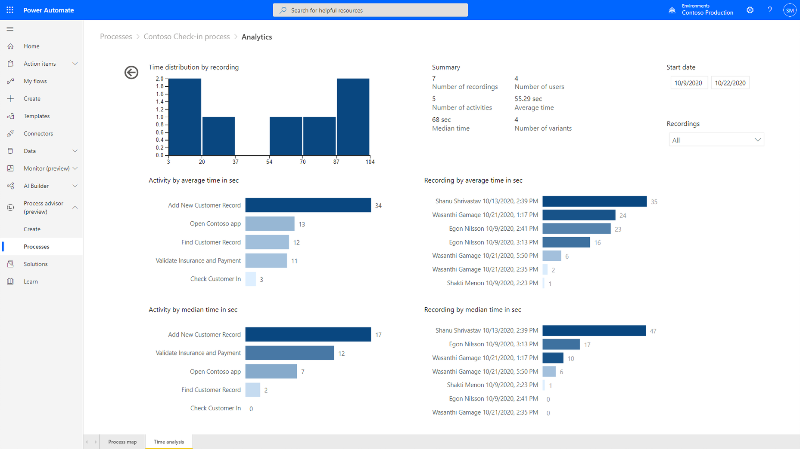

# Share processes (preview)

[!INCLUDE [cc-beta-prerelease-disclaimer](includes/cc-beta-prerelease-disclaimer.md)]

When you create a process in process advisor, only you can see it. But getting input from others is a key to understanding different ways to accomplish the process you have created. Share your processes with others in your organization so they can also manage or contribute to them. There are two primary ways to share a process in process advisor:

- Share a process with a co-owner.
- Share a process with a contributor.

If you're the co-owner or contributor of a process, you'll find it listed on the Processes page in process advisor.
Important: You must be the co-owner to add or remove owners and contributors to a process.

## Share action

The share action is available on the Processes screen in process advisor for each process where you're a co-owner. It's also available for the system administrator in the environment, or for any security role that has Share permissions on process advisor system entities.
The share action is also available on the process detail screen in process advisor, with the same conditions.
Sharing is not needed at the recordings level. Once you share a process with a co-owner, they will be able to manage the recordings associated to the process.

## Share panel

> [!div class="mx-imgBorder"]
> 

When you select the share action, a share panel is displayed. The share panel is where you select Microsoft Dataverse users and teams in your organization, and share your process with them.

When sharing a process with others, the option to automatically send an email invitation is selected. This email invitation states that you have shared a process with them. As co-owners or contributors they are asked to help you manage the process or adding new recordings, respectively. There is a link in the email invitation that leads them to the process shared.

## Share a process with a contributor

Adding a contributor to a process is the most common way to share a process. Any co-owner of a process can perform these actions:

- View the process details.
- Add and label recordings.
- Manage your own recordings that have been added to the process (including labeling and deleting recordings).

## Share a process with a co-owner

Adding a co-owner to a process allows others to help you label and validating the contributors recordings, manage the process and visualize the process analytics and dashboard. Any co-owner of a process can perform these actions:

- View  details.
- Update properties, such as name and description.
- Invite co-owners and contributors.
- Add and label recordings.
- Manage all recordings that have been added to the process (including labeling and deleting others’ recordings).
- Analyze the process.
- View the analytics of an analyzed process.
- Delete the process.
