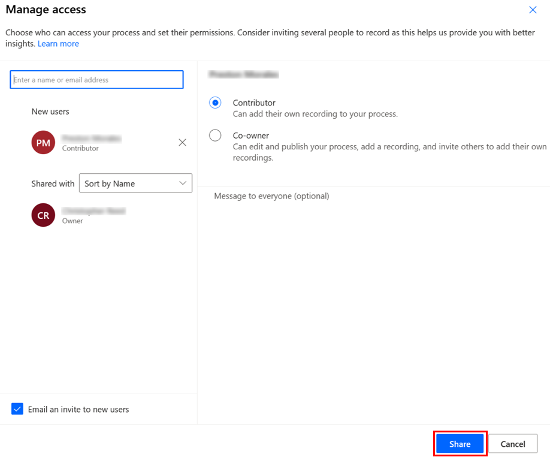

# Share task mining processes in process advisor

When you create a process in process advisor, only you can see it. But getting input from others is a key to understanding different ways to accomplish the process you've created. Share your processes with others in your organization so they can also manage or contribute to them.

Here's a short video on how to share a process in process advisor: 
 
> [!VIDEO https://www.microsoft.com/en-us/videoplayer/embed/RWN6PP]

There are two primary ways to share a process in process advisor:

- Share a process with a co-owner

- Share a process with a contributor

If you're the co-owner or contributor of a process, you'll find it listed on the **Processes** screen.
 
> [!IMPORTANT]
> You must be the co-owner to add or remove owners and contributors to a process.

## Share action

The share action is available on the **Processes** screen for the following:

- Each process where you're a co-owner.

- The system administrator in the environment.

- Any security role that has share permissions on process advisor system entities.

The share action is also available on the process details page with the same conditions. Sharing isn't needed at the recording level. Once you share a process with a co-owner, they can manage the recordings associated with a process.

> [!div class="mx-imgBorder"]
> 

## Share panel

When you select the share action, a share panel is displayed. The share panel is where you select Microsoft Dataverse users and teams in your organization, and share your process with them. You can search for any user to invite to your process in the Dataverse tenant.

When sharing a process with others, the option to automatically send an email invitation is selected. As co-owners or contributors, they're asked to help you manage the process or add new recordings, respectively. There's a link in the email invitation that leads them to the shared process.

## Share a process with a contributor

Adding a contributor to a process is the most common way to share. Any contributor of a process can perform these actions:

- View the process details.

- Add and label recordings.

- Manage your own recordings that have been added to the process (including labeling and deleting recordings).

## Share a process with a co-owner

Adding a co-owner to a process allows others to help you label and validate the contributors' recordings, manage the process, and visualize the process analytics and dashboard. Any co-owner of a process can perform these actions:

- [View status of the analysis](process-advisor-analyze.md)

- [Update properties, such as name and description](process-advisor-processes.md#manage-activity-names)

- [Invite co-owners and contributors](process-advisor-share.md#share-action)

- [Add and label recordings](process-advisor-processes.md)

- [Manage all recordings that have been added to the process (including labeling and deleting others' recordings)](process-advisor-processes.md)

- [Analyze the process](process-advisor-analyze.md)

- [View the analytics of an analyzed process](process-advisor-analyze.md)

- [Delete the process](process-advisor-security.md)

>[!NOTE]
>
>- Only the owners of a process can analyze it.
>- Removing all process roles from a user (such as co-owner and contributor) doesn't remove that process from the user's process list view. They can't perform any actions on the process.
>- The admin experience for processes they don't own isn't supported.

[!INCLUDE[footer-include](includes/footer-banner.md)]
