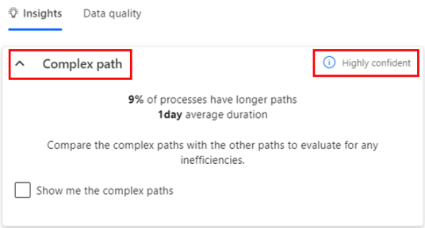

# Get automated recommendations to improve your processes (preview)

[!INCLUDE[cc-beta-prerelease-disclaimer](./includes/cc-beta-prerelease-disclaimer.md)]

Process mining offers insights and recommendations that are designed to guide you in your process optimization journey. These insights and recommendations appear in both the analytics page and the process details page. In this section, you'll learn the benefits of applying them to your flows.

> [!IMPORTANT]
> - This is a preview feature and might not be available in your region yet.
>
> - [!INCLUDE[cc_preview_features_definition](includes/cc-preview-features-definition.md)]
>
> - These process insights are available for all data processes that load event log data via manual or templated uploads. They aren't currently available for cloud flows.

## Data quality

The Data quality panel provides an indicator for the *event log* data used to generate the [process map and analytics](process-mining-visualize.md). To learn more about event logs, go to [Data requirements](process-mining-processes-and-data.md#data-requirements). Issues in the event log could affect confidence in the generated insights for the process. For example, not having enough sample case IDs or activity names would lower the confidence in the insights that can be drawn, usually because the sample size is too small.

> [!div class="mx-imgBorder"]
> 

If the data quality indicator shows **Low quality** or **Medium quality**, you should reimport an event log with the recommended elements. The dot in the indicator represents the category and isn't a sliding scale.  

## Confidence rating

The confidence rating provides an indicator of how relevant we think the *insight category* is to your process. For example, **Complex path** is the insight category in the following screenshot. 

Having a lower number of candidate variants and high event log data quality lead to higher confidence ratings. For example, having 10 potential variants for the *shortest path* insight category doesn't have a highly confident level, especially if the event log data only has 10 sample cases captured. Shortest paths represent the paths with the fastest runtime or cycle time that your process takes. To learn more about variants, go to [Visiualize processes](process-advisor-visualize.md).

> [!div class="mx-imgBorder"]
> 

## Insight categories

Understanding the insight category assigned to your process will help you determine how to evaluate the appropriate path or variant for your process. Insight categories are classified according to path characteristics. The following table describes the various paths and their recommended actions to evaluate your process.

|Path name  |Description  |Recommended actions  |
|---------|---------|---------|
|Common    | Common paths represent the most frequent paths that your process takes. If this insight is found with medium or high confidence, the default process map and analytics will filter to show one or more common path variants.   | Evaluate these paths for optimization potential, since they're the most used. They're also great candidates for standardization.        |
|Complex     |  Complex paths represent the paths with the greatest number of activities that your process takes.        | Evaluate these paths for process inefficiencies, especially if activities are looping or erratic.  |
|Simple     | Simple paths represent the paths with the fewest number of activities that your process takes. | Evaluate these paths to check if they might be optimal path(s) that others should adopt. They may also represent incomplete process executions.        |
|Longest     | Longest paths represent the paths with the longest runtime or cycle time that your process takes.  | Evaluate these paths for process inefficiencies, especially if certain activities seem to be bottlenecks.        |
|Shortest     | Shortest paths represent the paths with the fastest runtime or cycle time that your process takes.  | Evaluate these paths to check if they might be the optimal path or paths that others should adopt. They may also represent incomplete process executions.         |
