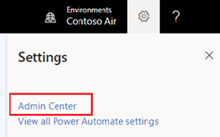
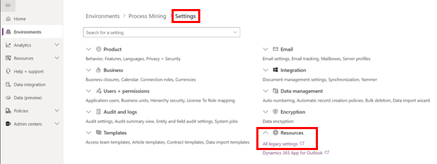
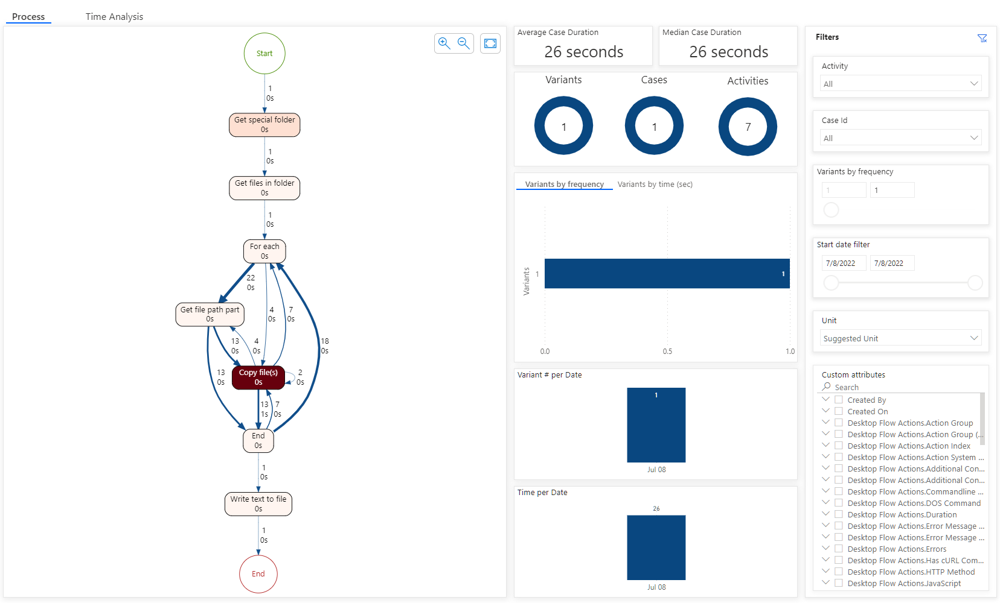
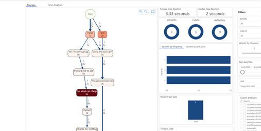
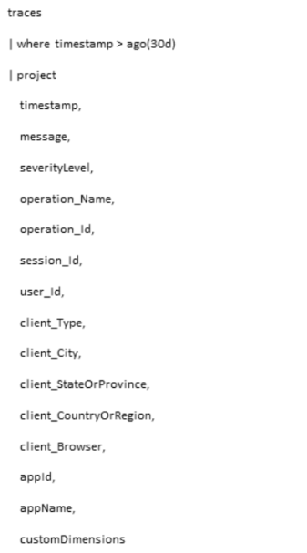

# Power Platform templates for process mining

Process advisor templates allow you to easily onboard your data with a few selections, which avoids the traditional data identification and manipulation required in traditional process mining tools. Templates will enable users to reach their insights quickly and without the previously required data mastery. Our templates like ADO, Power Apps, Bot Framework, and more, will empower all to reach process insights and implement optimizations and automations.

## Desktop Flows template

The process advisor Power Automate **Desktop Flows** template will enable you to visualize the actions your RPA bots are executing. Insights will allow you to maximize your RPA functionality and manage bot success rate.

To learn more about Power Automate desktop flows, go to [Introduction to desktop flows](desktop-flows/introduction.md).  

### Prerequisites

Before you can visualize your Power Automate Desktop Flows, you must have a Power Automate RPA license. To learn more, go to [Introduction to desktop flows](desktop-flows/introduction.md).

### Create and run the Desktop Flows template

The process of creating and running a template is similar for all templates.

1. On the **Power Platform** tab in the **Start with a popular template** section, select the **Desktop Flows** tile.

    > [!div class="mx-imgBorder"]
    > 

1. In the **Process name** field, enter a name for your process.

1. Select the gear icon, and then select **Admin Center**.

    > [!NOTE]
    > - Open this in a new window or instance so that you don't close the template wizard.
    > - If you don't have admin rights for your environment, contact your admin for support.

    > [!div class="mx-imgBorder"]
    > 

1. On the left pane, select **Environments**.

1. On the right pane, select your environment.

    > [!div class="mx-imgBorder"]
    > 

1. Select **Settings** > **Resources** > **All legacy settings**.

    > [!div class="mx-imgBorder"]
    > 

1. On the toolbar, select **Settings** > **Customizations**.

    > [!div class="mx-imgBorder"]
    > 

1. On the **Customization** screen, select **Developer Resources**.

    > [!div class="mx-imgBorder"]
    > 

1. Copy the **Service Root URL**. You'll use this as your Dataverse API. To learn more about Dataverse API, go to [Discover the URL for your organization](/power-apps/developer/data-platform/webapi/discover-url-organization-web-api).

    > [!div class="mx-imgBorder"]
    > 

1. Go back to your Template and paste this in the **Dataverse API URL** field.

1. (Optional) Enter a description of the process in the **Description** field.

1. Select **Create**.

    > [!div class="mx-imgBorder"]
    > 

1. In the **Connect to data source** screen in the **Authentication kind** field, replace "Anonymous" with **Organizational account**.

1. Select **Sign in** and authenticate through AAD.

    > [!div class="mx-imgBorder"]
    > 

1. After connection credentials are established, select **Save**. Process advisor will analyze your process.

   The process for the **Desktop flows** and **Power Apps Insights** templates might take at least two minutes to complete. The process for the **Power Virtual Agents** template will take longer to complete. You can leave the page and return later while it is processing.

### Visualize the process map for the Desktop Flows template

After your process report has been published, you can visualize the process map and use the custom attributes filter to dig deeper into your insights.

> [!div class="mx-imgBorder"]
> 

## Power Virtual Agents template

The Power Virtual Agents template will enable you to visualize the process map and variant use of your virtual agents. Insights will allow you to better understand your users' journey and be able to maximize the bots effectiveness.

To learn more, go to [Power Virtual Agents overview](/power-virtual-agents/fundamentals-what-is-power-virtual-agents).

### Prerequisites

Before you can visualize your Power Virtual Agents, you must have a Power Virtual Agent license. To learn more, go to [Power Virtual Agents overview](/power-virtual-agents/fundamentals-what-is-power-virtual-agents).

### Create and run the Power Virtual Agents template

The process of creating and running a template is similar for all templates.

1. On the **Power Platform** tab in the **Start with a popular template** section, select the **Power Virtual Agents** tile.

    > [!div class="mx-imgBorder"]
    > 

1. Do steps 2 through 15 in the **Create and run the Desktop Flows template** section earlier in this article.

### Visualize the process map for the Power Virtual Agents template

After your process report has been published, you can visualize the process map and the variants of the customer journey through your virtual agents. You can also leverage the custom attributes filter to dig deeper into your insights.

> [!div class="mx-imgBorder"]
> 

## Power Apps Insights template

The **Power Apps Insights** template will enable you to visualize the actions and success of your Power Apps. The template will enable you to maximize your apps' functionality and manage its success rate.

To learn more about Power Apps, go to the [Microsoft Power Apps documentation](/power-apps/).

### Prerequisites

Before you can visualize your Power Apps, you must have a Power Apps license. To learn more, go to the [Microsoft Power Apps documentation](/power-apps/).

### Create and run the Power Apps Insights template

In order to deploy the **Power Apps Insights** template, you'll need to create an Application Insights resource.

1.	Create an Application Insights resource by following the instructions in [Create an Application Insights resource](/azure/azure-monitor/app/create-new-resource).

1. On the **Power Platform** tab in the **Start with a popular template** section, select the **Power Apps Insights** tile.

    > [!div class="mx-imgBorder"]
    > 

1. In the **Process name** field, enter a name for your process.

1. Go to the Application Insights Azure Resource you created in step 1.

1. On left panel, select **Configure** > **API Access**.

    > [!div class="mx-imgBorder"]
    > 

1. Copy the Power App **Application ID**.

    > [!div class="mx-imgBorder"]
    > 

1. Go back to the process advisor **Create a new process** screen and paste it in the **Power App Application Insights App Id** field.

1. Identify the parameter that you want to analyze from your app and enter it in the **Case Id field name** and **Activity field name** fields in the **Create a new process** screen.

    These field names can be either the name of a custom parameter (defined in customDimensions) or one of the following parameters: `appId`, `appName`, `client_Browser`, `client_City`,  `client_CountryOrRegion`, `client_StateOrProvince`, `client_Type`, `message`, `operation_Name`, `operation_Id`, `session_Id`, `severityLevel`, or `user_Id`. You can find these parameters in the dropdown lists in the **Case ID field name** and **Activity field name** dropdown lists in the **Create a new process** screen.

    These fields can be tested by navigating to the **Log Analytics** menu in your Application Insights resource with this query:

    > [!div class="mx-imgBorder"]
    > 

1. (Optional) Enter a description of the process in the **Description** field.

1. Select **Create**.

    > [!div class="mx-imgBorder"]
    > 

1. Complete the **Connect data source** screen by doing steps 13 through 15 in the **Create and run the Desktop Flows template** section earlier in this article.

### Visualize the process map for the Power Apps Insights template

After your process report has been published, you can visualize the process map and use the custom attributes filter to dig deeper into your insights.

> [!div class="mx-imgBorder"]
> 
