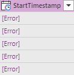
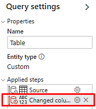
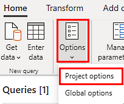

# Troubleshoot issues in process advisor (preview)

[!INCLUDE[cc-beta-prerelease-disclaimer](./includes/cc-beta-prerelease-disclaimer.md)]

Once you're done with setup, select **Analyze**. You'll be able to view the Analytics page when the analysis is complete. Analysis typically takes a few minutes but may be faster or slower depending on how much data needs to be analyzed.

*If you don't visit the Analytics page for 14 days, you'll need to re-analyze the process to access the Analytics page again.*

> [!IMPORTANT]
> - This is a preview feature.
>
> - [!INCLUDE[cc_preview_features_definition](includes/cc-preview-features-definition.md)]

<!-- from editor: I changed the link text to the heading that the link opens to. -->

For more information and a short video of analytics, go to [Use KPIs and visualizations for analytics](process-mining-visualize.md#use-kpis-and-visualizations-for-analytics).

## Issues with dataflow refresh

### "There was an issue with a recent dataflow refresh, check your dataflow refresh history."

When you go through setup, process advisor creates a dataflow that's tied to the process. Normally you don’t need to interact with the dataflow, but if there are issues with the dataflow refresh, you might need to troubleshoot them. Dataflow refresh is what reads the data source and makes it ready to be analyzed.

To troubleshoot:

1. Make a note of the environment in the environment display on the upper-right corner of the page.

    > [!div class="mx-imgBorder"]
    > 

1. Make a note of the value of **Name** in the Data Source card below the Details card.

1. Sign in to https://powerapps.microsoft.com/.

1. Select the same environment that you noted in step 1.

1. Select **Dataverse** > **Dataflows**.

1. Find the dataflow name that you noted in step 2.

1. View the issue by selecting the **Warning** icon in the **Last refresh** column.

    > [!div class="mx-imgBorder"]
    > 
 
1. Download the report by selecting the **Download** icon in the **Actions** column.

    > [!div class="mx-imgBorder"]
    > 

9.	Open the report to see details of the issue.

## Issues with analyze

### "You must have one case with at least two activities to analyze your process. Please change your data."

Process mining will normally not be helpful when there is only one activity name in the data. This is because the process map visualizes the flow of the process from one activity to the next. In this case, you should do the following:

- Check the column that's been mapped to activity name.
- Confirm that there is only one value for that column.
- Determine if there's another column that contains something with more than one possible value that can represent activities of the process.

### "Following column(s) do not have the right data types: [x]. Please check your data and try again."

The *case ID* and *activity name* columns should be of the **Text** data type. The *timestamp* columns should be of the **Date/Time** data type. One of the most frequent causes of invalid format is in the *timestamp* column. To fix this, return to setup and select the icon next to the *timestamp* column and ensure it's been mapped to **Date/Time**.

> [!div class="mx-imgBorder"]
> 

If the format is incorrect, you'll see something like this:

> [!div class="mx-imgBorder"]
> 

One possibility is that although the *timestamp* column has a valid datetime format, the format is valid for a different locale than the locale that the process is created in. A typical example is this datetime format being used in the United States locale: **dd/mm/yyyy hh:mm:ss**. In this case, we won't automatically detect that column as a datetime column. One way to fix this is by manually changing the locale. To do this:

1. Delete the **Changed column** type step that you did previously. Do this by selecting **X** next to the last applied step in the Query settings pane on the right.

    > [!div class="mx-imgBorder"]
    > 

1. On the toolbar, select **Options** > **Project options**.

    > [!div class="mx-imgBorder"]
    > 

1. On the **Locale** dropdown list, select the correct locale and then select **OK**.

1. Use the same method to set the *timestamp* column to the **Date/Time** data type again.

Where the format is **dd/mm/yyyy hh:mm:ss**, setting the locale to **English (Canada)** should result in successful conversion of the column type. For other cases, find the correct locale that supports your specific datetime format.

### "More than 50% of your data has invalid format. Please check your data and try again."

To fix this, go to ["Following column(s) do not have the right data types: [x]. Please check your data and try again."](#following-columns-do-not-have-the-right-data-types-x-please-check-your-data-and-try-again)

### "Following column(s) are missing from your dataflow: [x]. Please check your data and try again."

This issue should occur only if you didn't properly map the columns in your data source to the columns. For more information, go to [Map data](process-mining-transform.md#map-data).

### "Your entity contains no data, check your dataflow and try again."

This issue should occur only if there is no data. Either the data source that you are connecting to has no data, or the power query expression you used filtered out all the data. Check your query and ensure that you can see some data rows in the preview table.

### "The number of rows in your data exceeds the limit. [x] rows have been ignored."

For preview, we support only up to 150,000 rows of data. To learn how to fix this using Power Query, go to [Reduce the number of total records](process-mining-transform.md#reduce-the-number-of-total-records).

### "There are too many columns in your data. Please select no more than 5 columns."

For preview, we support only up to five columns in addition to your mapped columns. To learn how to fix this using Power Query, go to [Select additional columns](process-mining-transform.md#select-additional-columns).

### "Analysis failed, please try again."

You might have run into other analyze issues. For more ways that we can support you, go to [Support](https://flow.microsoft.com/support/), or post your issue in the [Community Forums](https://community.dynamics.com/f).
 
