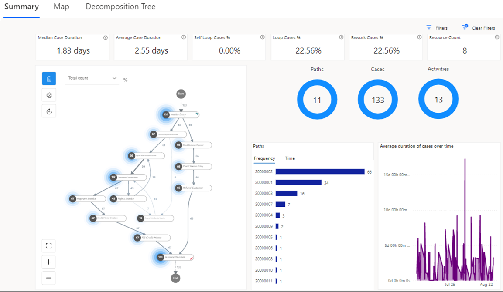
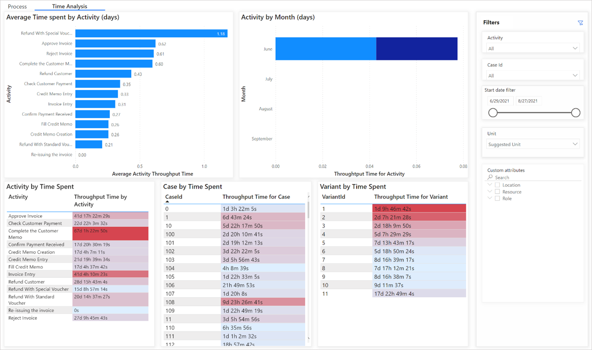

# Visualize and gain insights from processes in process advisor (preview)

[!INCLUDE[cc-beta-prerelease-disclaimer](./includes/cc-beta-prerelease-disclaimer.md)]

This topic explains metrics and visuals, and what they could tell you about your process.

> [!IMPORTANT]
> - This is a preview feature.
>
> - [!INCLUDE[cc_preview_features_definition](includes/cc-preview-features-definition.md)]

## Visualize and gain insights from processes with the process map

The process map empowers you to visualize and gain insights from processes. By looking at a graphical representation of how your business processes are performed, you can glean insights about where opportunities exist.

Activities describe tasks or actions, the sequence of which makes up a business process. Activities can be performed by humans, or, in the case of automation—by machines. In the process map, different activities appear as nodes, and transitions between activities appear as edges. Each process sequence will have a start and an end.

Different activity combinations and variants are shown separately on the process map. A process variant is a unique path from the beginning to the end of the process. In other words, a process variant is a specific activity sequence, like a "trace" through the process, from start to end. Each variant differs from the others by at least one activity.

You can see additional metrics, frequency of the activities, as well as process throughput time (case duration), on the process map.

Frequency shows you the total number of workflows (also known as cases) passing through it. Case duration is the time between the very first event of the case and the last. Time analysis report allows you to drill down into time bottlenecks by cases, variants, and activity. It also shows you average time spent per activity as well as how activities occur over time.

To drill down into the process, various filters are available:

- **Variant selector:** Allows you to select one variant, or a set of process variants to visualize in your process map. 

- **Activity selector:** Allows you to select cases that contain the selected activity.

- **Start date filter:** Allows you to see the process visualization in a particular period.

- **Case filter:** Allows you to see the process visualization and analytics filtered to the case.

Additionally, key performance indicators (KPIs) are available to help you better understand your task. The following section describes them.

## Use KPIs and visualizations for analytics

Out of the box, you'll get several KPIs and visualizations to help you to understand your process. You can filter by selectors such as **Activity** and **Case Id**, and/or custom filters (if you added the custom attributes (data columns) when you uploaded your data for analysis.

> [!div class="mx-imgBorder"]
> 

> [!div class="mx-imgBorder"]
> 

### KPIs

- **Average case duration:** Shows you the average time it takes for a process to be completed across all cases you are analyzing. It is one of the most important data points when analyzing your process. The reason is that understanding how long a process lasts, how it changes over time, and further investigating the root cause of the process duration could make a great starting point in speeding up your process.

- **Median case duration:** Median in general shows the most frequent duration for a task to complete. It's a very useful metric in cases where a small number of cases (or even a single activity) are so different from most cases that the average time for completion would look skewed toward this offending case. To prevent the user from misinterpreting the time to completing the process, this measure shows the most frequent time as opposed to a simple average.

- **Number of variants:** Shows how many different paths were taken to accomplish a process. For example, one case of a process might have 10 steps to complete a purchase order, while another only nine.

- **Number of cases:** Shows the number of cases analyzed in a particular process.

- **Number of activities:** Shows the number of steps or activities taken to complete the process.

## Visualizations

- **Variants by frequency:** Shows which variants are the most common, sorted by the most common to the least common. You could select one or multiple variants in the bar chart to analyze details of the variants by filtering for them. This would update the process map, KPIs, and other visualizations.

- **Variants by time:** Shows a bar chart of the longest duration variant to the shortest one. Filtering on specific variants updates the process map and KPIs so you could get insights into the behavior of the selected variants. To select multiple variants, press **Ctrl** and select the desired variants.

- **Variant number per Date:** Shows how the number of variants for a selected time changes and informs if the processes are according to a standard or not. An increasing number of variants over time would suggest an increased complexity in process execution over time.

- **Time (case duration) per Date:** Shows how duration of the process changes over time.

- **Average time spent by Activity:** Shows how much time on average is spent on the activity and which activities are being executed the most.

- **Activity by Month:** Shows how activities occur over time.

- **Activity by Time Spent:** Shows the throughput time by activity and the outliers.

- **Case and Variant by Time Spent:** Shows average throughput time for case and variant.

### Filters

- **Activity filter:** Filters for all cases where the selected activity is present.

- **Unit filter:** Filters for a specific unit of time to make the process easier to analyze. For example, processes that last days would be more easily analyzed by selecting a Days unit. As a default, the process advisor selects what it thinks is the best unit, but you can change it to accommodate your analysis.

- **Start date filter:** Filters for the time range when recording has started and ended. For example, if your process changed over time, you can see if there was any impact on your metrics after the process change by filtering for recordings that started after a certain time.

- **Optional filters**: If you imported **Optional Columns** during your data upload process, you'll have additional filters to slice and dice the data by. In the previous screenshot, we have examples of optional filters for Location, Role, and Resource.
 