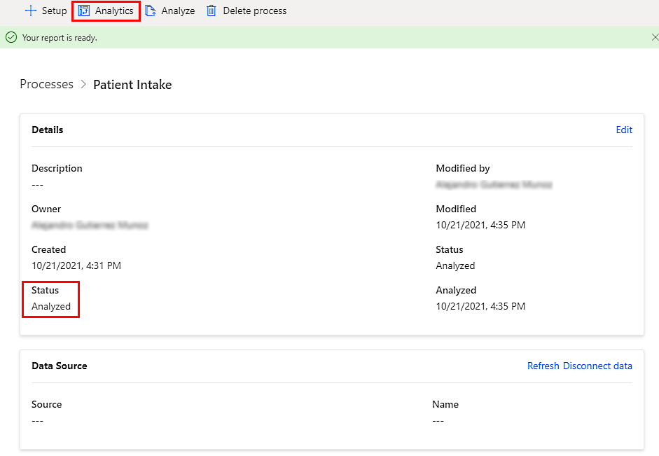

# End-to-end walkthrough with process mining (preview)

[!INCLUDE[cc-beta-prerelease-disclaimer](./includes/cc-beta-prerelease-disclaimer.md)]

This end-to-end walkthrough allows you to experience process mining with sample data. In this walkthrough, you'll create a process, import data, and then analyze it.

Download the sample event log CSV file: [ProcessMiningSampleData.csv](https://go.microsoft.com/fwlink/?linkid=2174463). For task mining demo data, go to [User recording demo data](https://go.microsoft.com/fwlink/?linkid=2175600). <!-- Let's say when/why you need this. -->

> [!IMPORTANT]
> - This is a preview feature.
>
> - [!INCLUDE[cc_preview_features_definition](includes/cc-preview-features-definition.md)]

## Create a process

1. Sign in to [Power Automate](https://preview.flow.microsoft.com/en-us/?processinsights-core.tabularData=true).

1. Select your environment.

1. On the navigation pane to the left, select **Process advisor** > **Create**.

1. Select **Create a new process**.

1. Enter a process name, and then select **Data (preview)**.

    > [!div class="mx-imgBorder"]
    > ")

1. Select **Create**.

## Import data and analyze

1. In your process, select **Setup** in the toolbar. <!-- Is this correct? I added it. -->

1.	Select **Blank table**.

    > [!div class="mx-imgBorder"]
    > 

1. Open the sample event log CSV file that you downloaded in Microsoft Windows Notepad (or any text editor).

1. Select all contents of the CSV file by pressing **Ctrl** + **A**.

1. Copy the selection by pressing **Ctrl** + **C**. 

1. Paste the selection you copied into the blank table in process advisor by pressing **Ctrl** + **V**. 

1. Select **Use first row as headers**. 

    > [!div class="mx-imgBorder"]
    > 

1. Upload your event log, select your file from the list, and choose **Select** to continue. <!-- We should say how you do this. -->

1. Select **Next** twice to open the Power Query editor.

1. Validate that your fields are correct in the table view.

1. On the toolbar, select **Map to entity**.

    > [!div class="mx-imgBorder"]
    > 

1. On the left pane, select the **Event log** entity.

1. On the right pane, map the three required columns by selecting **Auto map**.

1. Return to the Power Query editor by selecting **OK**.

    > [!div class="mx-imgBorder"]
    > 

1. Return to the process details page by selecting **Save**.

1. On the toolbar, select **Analyze**, and then select **Confirm** when the dialog opens.

1. Wait for the analysis to complete. After the process is analyzed, select **Analytics** in the toolbar to view the process map.

    > [!div class="mx-imgBorder"]
    > 

1. For a description of the how to analyze the process map and a short video, go to [Visualize and analyze processes with process mining (preview)](process-mining-visualize.md).
