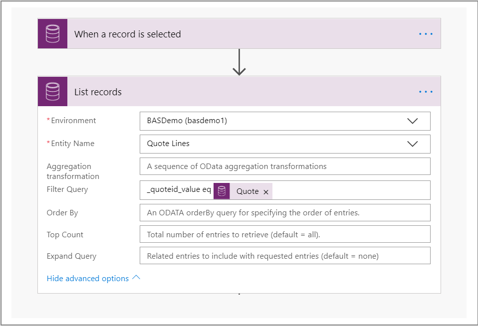
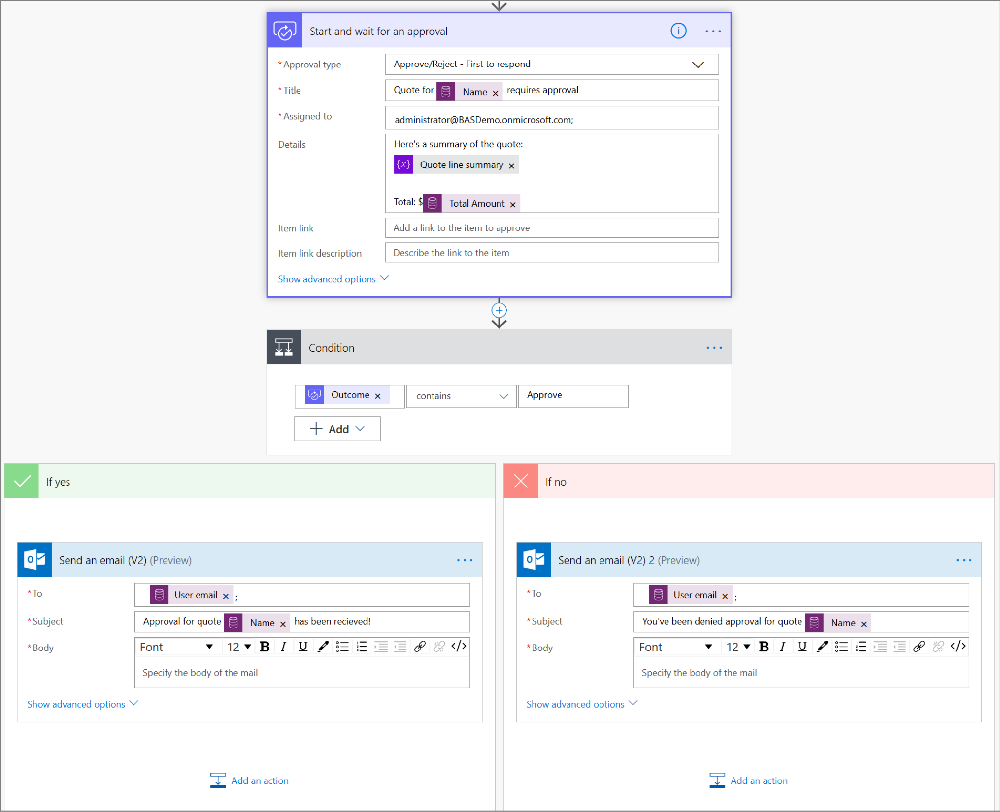
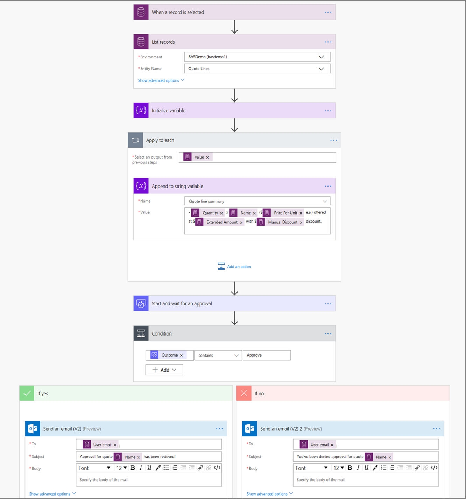

# Replace classic Common Data Service workflows with flows

This topic compares Power Automate capabilities with classic workflow.

Power Automate has significant advantages over the classic background workflow model; you should consider using Power Automate to automate your processes instead of classic workflow.

Create flows instead of classic Common Data Service workflows to build new automation processes. Additionally, you should review your existing classic background workflow processes and consider replacing them with flows.

## Feature capability comparison

This table summarizes a comparison between Power Automate and classic workflows capabilities.

*We are continuously adding new capabilities to Power Automate. We'll update information in this table as Power Automate gains capabilities; check back often! For information about upcoming capabilities that will help you replace classic background workflows with flows, see [What's new and planned for Power Automate](https://docs.microsoft.com/power-platform-release-plan/2020wave2/power-automate/planned-features).*

<table>
<tr>
<th colspan="2">Capability</th>
<th>Power Automate</th>
<th>Classic Workflow</th>
</tr>
<tr>
<td rowspan="5">Modeling</td>
<td>Conditional branching</td>
<td>Yes</td>
<td>
                    
   Yes
                    
                </td>
            </tr>
            <tr>
                <td>
                    
   Looping
                    
                </td>
                <td>
                    
   Yes
                    
                </td>
                <td>
                    
   No
                    
                </td>
            </tr>
            <tr>
                <td>
                    
   Wait conditions on fields
                    
                </td>
                <td>
                    
   No
                    
                </td>
                <td>
                    
   Yes
                    
                </td>
            </tr>
            <tr>
                <td>
                    
   Parallel branch
                    
                </td>
                <td>
                    
   Yes
                    
                </td>
                <td>
                    
   No
                    
                </td>
            </tr>
            <tr>
                <td>
                    
   Out-of-the-box connectors to external systems (trigger and
   perform actions in external services)
                    
                </td>
                <td>
                    
   Yes
                    
                </td>
                <td>
                    
   No
                    
                </td>
            </tr>
            <tr>
                <td rowspan="7">
                    
   Composition
                    
                </td>
                <td>
                    
   Dynamic content
                    
                </td>
                <td>
                    
   Yes
                    
                </td>
                <td>
                    
   Yes
                    
                </td>
            </tr>
            <tr>
                <td>
                    
   Access to pre-image of event data
                    
                </td>
                <td>
                    
   No
                    
                </td>
                <td>
                    
   Yes
                    
                </td>
            </tr>
            <tr>
                <td>
                    
   Run child workflows
                    
                </td>
                <td>
                    
   Yes
                    
                </td>
                <td>
                    
   Yes
                    
                </td>
            </tr>
            <tr>
                <td>
                    
   Run Common Data Service actions (including custom)
                    
                </td>
                <td>
                    
   Yes
                    
                </td>
                <td>
                    
   Yes
                    
                </td>
            </tr>
            <tr>
                <td>
                    
   Run custom background workflow activities
                    
                </td>
                <td>
                    
   No
                    
                </td>
                <td>
                    
   Yes
                    
                </td>
            </tr>
            <tr>
                <td>
                    
   Group steps to run in a transaction
                    
                </td>
                <td>
                    
   Yes (changesets)
                    
                </td>
                <td>
                    
   No
                    
                </td>
            </tr>
            <tr>
                <td>
                    
   Approval workflows
                    
                </td>
                <td>
                    
   Yes
                    
                </td>
                <td>
                    
   No
                    
                </td>
            </tr>
            <tr>
                <td rowspan="7">
                    
   Execution
                    
                </td>
                <td>
                    
   Trigger on field changes
                    
                </td>
                <td>
                    
   Yes
                    
                </td>
                <td>
                    
   Yes
                    
                </td>
            </tr>
            <tr>
                <td>
                    
   Trigger conditionally on field values (For example, on a
   certain date in a date field)
                    
                </td>
                <td>
                    
   No
                    
                </td>
                <td>
                    
   No
                    
                </td>
            </tr>
            <tr>
                <td>
                    
   Trigger on multiple Common Data Service entity events
                    
                </td>
                <td>
                    
   Yes
                    
                </td>
                <td>
                    
   Yes
                    
                </td>
            </tr>
            <tr>
                <td>
                    
   Run on-demand
                    
                </td>
                <td>
                    
   Yes
                    
                </td>
                <td>
                    
   Yes
                    
                </td>
            </tr>
            <tr>
                <td>
                    
   Run-as scopes
    
   (for example, organization, business unit, user)
                    
                </td>
                <td>
                    
   Yes
                    
                </td>
                <td>
                    
   Yes
                    
                </td>
            </tr>
            <tr>
                <td>
                    
   Run on a schedule
                    
                </td>
                <td>
                    
   Yes
                    
                </td>
                <td>
                    
   No
                    
                </td>
            </tr>
            <tr>
                <td>
                    
   Run synchronously (real-time)
                    
                </td>
                <td>
                    
   No
                    
                </td>
                <td>
                    
   Yes
                    
                </td>
            </tr>
            <tr>
                <td rowspan="2">
                    
   History
                    
                </td>
                <td>
                    
   Auditing
                    
                </td>
                <td>
                    
   Yes
                    
                </td>
                <td>
                    
   Yes
                    
                </td>
            </tr>
            <tr>
                <td>
                    
   Run analytics
                    
                </td>
                <td>
                    
   Yes
                    
                </td>
                <td>
                    
   No
                    
                </td>
            </tr>
            <tr>
                <td rowspan="3">
                    
   Authoring and portability
                    
                </td>
                <td>
                    
   Solution support
                    
                </td>
                <td>
                    
   Yes
                    
                </td>
                <td>
                    
   Yes
                    
                </td>
            </tr>
            <tr>
                <td>
                    
   Modern designer
                    
                </td>
                <td>
                    
   Yes
                    
                </td>
                <td>
                    
   No
                    
                </td>
            </tr>
            <tr>
<td>AI-assisted authoring</td>
<td>Yes</td>
<td>No</td>
</tr>
</table>

## Example scenario: Replace a background workflow with a cloud flow

Imagine a sales scenario where you have put together a quotation for a customer and now you need to request approval from your management team before you send the quotation to the customer. With classic workflows, this isn't easy and most solutions to this require a developer to write custom background workflow activities to retrieve quote line items.

With flows, this scenario is easier to build, as demonstrated in the walkthrough later that covers some of the Power Automate capabilities. These capabilities include:

- Creating a cloud flow that runs on demand.
- Getting a list of records that are related to a Dataverse entity.
- Looping over a list of records.
- Sending approval requests.

To allow the sales person to trigger the approval request on demand:

1. Sign in to [Power Automate](https://flow.microsoft.com/) and [create a cloud flow in a solution](create-flow-solution.md). 

1. From the list of triggers, select **Common Data Service (Current Environment) – When a record is selected**, and then select **Quotes** as the entity. 

   This trigger allows a cloud flow to run on-demand on a record or set of records.

1. With the trigger configured, add actions to run in the flow. This provides the approver with the summary detail that they need to identify the quoted items and values. Begin by adding the **Common Data Service (Current Environment) – List records** action. The goal is to get the individual items from a Quote, so set the **Entity name** to **Quote lines**. To ensure the list contains only those quote line items that belong to the Quote for which the flow was triggered, we’ll specify an OData style filter criterion. In the **Filter Query** field, type *\_quoteid_value eq* and then select **Quote** from the list of dynamic values that appear.

    

1. Because we want to summarize quote line items for the approval, add the **Initialize variable** action. Set the **Name** field to **Quote line summary**, and **Type** to **String** (from the drop-down list), and leave the **Value** field empty.

1. Add the **Append to string variable** action and then select the **Quote line summary** variable we created earlier. In the **Value** field, select **Quantity**, **Name**, **Price Per Unit**, **Extended amount**, and **Manual discount** from the list of dynamic values. The Power Automate designer identifies that these values are from a list of quote line items, and adds this action in an **Apply to each** loop to ensure information from each line item is added to this summary.

    

1. To request approval on the quote summary we’ve created, add the **Approval – Start and wait for an approval** action. Select an **Approval type** (for example, **Approve/Reject – First to respond**), give the approval request a **Title** (for example, the name of the quote for which approval is being requested, picked from the list of dynamic values), and enter the email address for the person who needs to review and approve the quote in the **Assigned to** field. In the **Details** field, add the **Quote line summary** variable, along with any other information that might be relevant using the dynamic value picker (for example, **Total Amount**).

1. To determine what happens once an approval is accepted or rejected, add the **Condition** action. Select **Outcome** from the list of dynamic values from the first field in the condition, **contains** from the drop-down list in the second field, and enter **Approve** in the third field of the condition. Finally, add actions based on the outcome of the approval (for example, send a notification email).

    

We now have the approval structure created so the approver has all of the information needed to make a decision on next steps. Here's the full example: 

When you run this flow against your quote, it summarizes quote line items for that quote and sends an approval request that the approver can respond to from Power Automate, or the actionable email they receive. Here's an example of the display:

## Recommended patterns

- **Workflows with complex else-if conditional logic**  

  Instead of using conditions, we recommend using the [switch action](https://docs.microsoft.com/azure/logic-apps/logic-apps-control-flow-switch-statement#add-switch-statement).

- **Workflows that run from plug-in/code**  

  We recommend redesigning the flow to start with triggers:

  - Use Common Data Service triggers to run flows based on events in it.

  - To run flows based on events in an external service, leverage more than 260 out-of-the-box connectors.

  - For scenarios where a connector you need isn’t available out-of-the-box, easily create your own custom connector. More information: [Create a custom connector from scratch](https://docs.microsoft.com/connectors/custom-connectors/define-blank)

  - Finally, if there are scenarios where you cannot trigger your flow using Common Data Service connector, one of the out-of-the-box connectors, or by creating a custom connector, leverage the [When an HTTP request is received trigger](https://docs.microsoft.com/azure/connectors/connectors-native-reqres) to invoke the flow.

- **Workflows that run recursively**

  Use the [do-until](https://docs.microsoft.com/azure/logic-apps/logic-apps-control-flow-loops#until-loop) or [apply to each](https://docs.microsoft.com/azure/logic-apps/logic-apps-control-flow-loops#foreach-loop) loop in flows instead.

- **Workflows that need a list of records**  

  Use the **list records** action. When using this action, define the record filtering criteria using OData syntax to optimize the action by minimizing the number of records you want to retrieve.

- **Workflows that sleep to run on a schedule**  

  Use the **recurrence** trigger to run business logic at periodic intervals.

- **Workflows for which runs were managed to ensure activities were executed in a single transaction**  

  Use the [changeset action](https://docs.microsoft.com/business-applications-release-notes/april19/microsoft-flow/automated-flows-support-change-sets-common-data-service) to ensure that all actions within it are performed as a single, atomic unit in which either all succeed, or fail as a group. If any one of the actions in a change set fails, changes made by completed operations are rolled back.

- **Monitor background workflow runs for failures**  

  In Power Automate, use the **run-after setting** on an action to configure it to run when the previous action fails. For example, send a Power Automate mobile notification when the **update a record** action fails, or times out.

## FAQs

- **I have a Dynamics 365 license. Can I use Power Automate?**

  Every Dynamics 365 user is entitled to use Power Automate. [Review our licensing information.](https://flow.microsoft.com/pricing/)

- **How often can my flows be triggered?**

   Dynamics 365 (or Common Data Service) flows run near real-time after the trigger because they use webhooks (no polling required).

  - As with direct API access, there are throttles/limits in the system. More information: [Limits and configuration in Power Automate](limits-and-config.md)
  - Specifically, there is a limit of 100,000 actions per 5 minutes, per flow. A single loop in a cloud flow cannot process more than 100,000 items at once.
  - Maximum of 6 GB of throughput per 5 minutes.

- **How long can a single flow run?**  

  A single flow run times out after 30 days.

- **How do I move my flows between environments?**  

  Just like classic workflows, you can create flows in solutions to support the full application lifecycle for processes.

- **Are Power Automate dependencies tracked in Common Data Service?**  

  Similar to other components in a solution, all dependencies for flows in solutions are tracked in Common Data Service.

- **What about synchronous workflows?**

  We've seen feedback that synchronous workflows are a significant contributor to end-user performance issues. We recommend that you evaluate whether your objective, or parts of the background workflow, can be built using a cloud flow. If you can split actions out as asynchronous, the user can continue their activity while Power Automate completes the action.

- **Using Power Automate, will my data stay within region (that is, the same region as my Dynamics 365 or Common Data Service environment)?**  

  Yes, Power Automate always uses the same region as Common Data Service.

- **Do I need to make proxy/firewall changes?**  

  Refer to the [IP address configuration reference](limits-and-config.md#ip-addresses) to determine whether you need to make any proxy/firewall changes.
