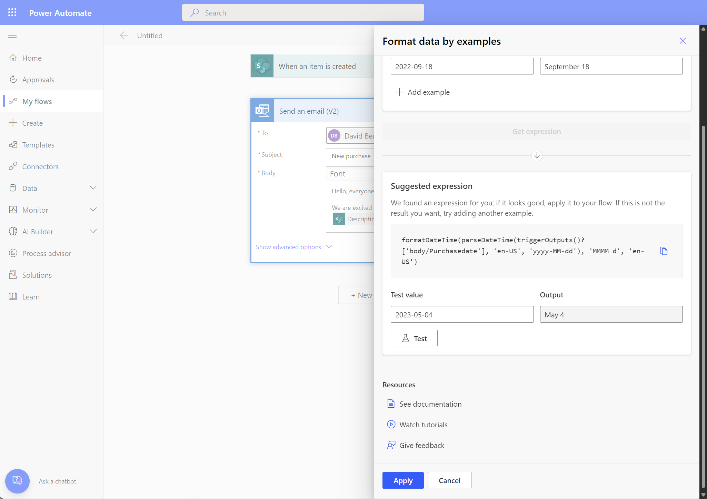

# Format data by examples (preview)

[This article is pre-release documentation and is subject to change.]

[Expressions](./use-expressions-in-conditions.md) in Power Automate is a powerful way to perform operations over data. You can use the *Format data by examples* feature to access these expressions without knowing the different functions and corresponding syntax that's needed to create the expressions that you want. To format text, dates, and numbers, you can just provide examples of the output format that you want the flow to produce, and Power Automate will automatically generate the expression formula to use.

> [!IMPORTANT]
>
> - This is a preview feature.
> - [!INCLUDE[cc_preview_features_definition](includes/cc-preview-features-definition.md)]

## Format dates by examples

In this sample scenario, there's a Microsoft list with products that we've purchased. We want to send an email when the list gets updated with new products. By default, the SharePoint formats dates like this: *2022-09-18*, but we’d like it to display as *September 18* in the email notification message. Let’s see how to change the format of the date with format data by examples.

> [!NOTE]
> While the following example details the steps needed to format a date by example, you can use similar steps to format text and numbers too.

1. Edit your flow in the Power Automate designer, select the action into which you want to insert the formatted date.
1. On the window that opens, select **Expression** > **Format data by examples**.

   A list displays all items in your flow that can be formatted.

   

    <!-- [format-data-by-examples-step-1.png](https://microsoft.sharepoint.com/:i:/t/PARIS/EUnsMzVFjYtKoikuw31uPscBVIWpRh7JACaRJCrnws_84Q?e=gJ2tpv)
    (Alt: Screenshot showing the option to open ‘Format data by examples in the ‘Expression’ menu)   -->

1. Select the item that you want to transform.
1. Provide an example of the original data for the item that you've selected in the previous step.

   >[!TIP]
   >You can go to the original data source or review a previous flow run to copy an example value for the previous step.

1. Provide a sample of how you’d like the flow to transform the example.  

    

    <!-- [format-data-by-examples-enter-examples.png](https://microsoft.sharepoint.com/:i:/t/PARIS/ETpGBVP2HAtBvWjLng6sCkwBP63PB56pZ7u53UzvwMmAXg?e=vIApGi)
    (Alt: Screenshot showing where to enter an example value and its desired
    transformation) -->

1. select **Get expression** after you enter an example value and the output that you want.

   Power Automate displays the expression that it recommends you use to get the output you want. You can test it with another value to confirm that the expression does what you expect.

   >[!TIP]
   >If the expression that Power Automate recommends isn't what you expect, you can add more examples to refine the expression that it recommends.

   

    <!-- [format-data-by-examples-flow-test.png](https://microsoft.sharepoint.com/:i:/t/PARIS/EeoYXJ2ERmdBisSR0YnSIq8BkuMiLgdfrDzDTnpXKJEvyA?e=4FoTyk) (Alt: Screenshot showing the suggested expression and how to test it) -->

1. Select **Apply** when the results of the expression match your expectations.

   Power Automate adds the expression to the flow.

Congratulations! You’ve built an expression by providing examples.  

<!-- [format-data-by-examples-expression-in-flow.png](https://microsoft.sharepoint.com/:i:/t/PARIS/EQXwKsxhs8JDl4c4zx3qDvYBCIXj9-1ZouSiEYox7RVQ7A?e=1Qy8OE) (Alt: Screenshot showing the suggested expression applied to an action in the cloud flow) -->

## Limitations

- Format data by examples can format one text, number, or date at a time. More complex structures like arrays aren't supported.
- Format data by examples isn't available in environments based in South Africa, GCC, GCC High, and DoD.

### See also

[PROSE](https://www.microsoft.com/research/project/prose-framework/), a technology that enables programming by example, powers format data by examples.
