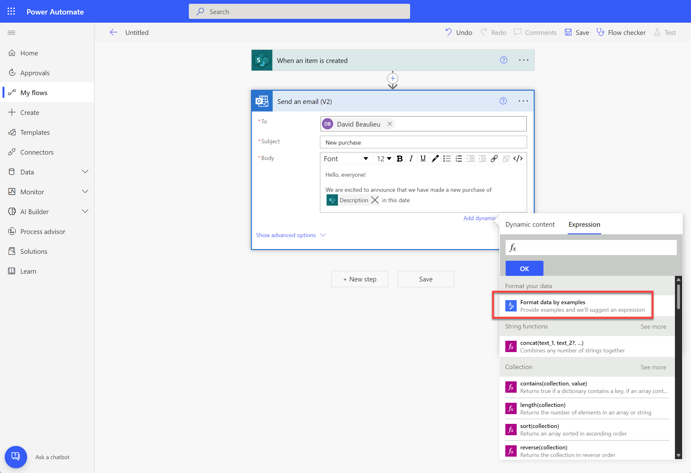

# Provide examples to format data expressions

[Expressions]() in Power Automate are powerful ways to perform operations over data. You can use these expressions without knowing the different functions available and how to put them together in an expression. To format text, dates and numbers, you can just provide examples of the output format that you want the flow to produce, and Power Automate will automatically generate the expression formula to use.

## Format a text, dates, or numbers by examples

In this sample scenario, there's a Microsoft list with products we have purchased. We want to send an email when the list gets updated with new product purchase. By default, the date from SharePoint comes formatted like this: *2022-09-18*, but we’d like it to display as *September 18** in the email notification message. Let’s see how to change the format of the date with format data by examples.

1. In the Power Automate designer, select the action into which you want to insert the formatted date. 
1. On the window that opens, select **Expression** > **Format data by examples**.

    

    <!-- [format-data-by-examples-step-1.png](https://microsoft.sharepoint.com/:i:/t/PARIS/EUnsMzVFjYtKoikuw31uPscBVIWpRh7JACaRJCrnws_84Q?e=gJ2tpv)
    (Alt: Screenshot showing the option to open ‘Format data by examples in the ‘Expression’ menu)   -->

   A list displays all items in your flow that can be formatted.

1. Select the item that you want to transform.
1. Provide an example of the original data for the item you have selected in the previous step.

   >[!TIP]
   >You can go to the original data source or review a previous flow run to copy an example value for the previous step.
1. Provide how you’d like the flow to transform the example.  

    

    <!-- [format-data-by-examples-enter-examples.png](https://microsoft.sharepoint.com/:i:/t/PARIS/ETpGBVP2HAtBvWjLng6sCkwBP63PB56pZ7u53UzvwMmAXg?e=vIApGi)
    (Alt: Screenshot showing where to enter an example value and its desired
    transformation) -->

1. After you enter an example value and the output that you desire, select **Get expression**.

   Power Automate displays the expression that it suggests. You can test it with another value to make sure the expression does what you expect.

   >[!TIP]
   >If the expression that Power Automate suggests isn't what you expect, you can add more examples to refine the expression that it suggests.

   

    <!-- [format-data-by-examples-flow-test.png](https://microsoft.sharepoint.com/:i:/t/PARIS/EeoYXJ2ERmdBisSR0YnSIq8BkuMiLgdfrDzDTnpXKJEvyA?e=4FoTyk) (Alt: Screenshot showing the suggested expression and how to test it) -->

1. If all looks good, select **Apply**.

   Power Automate adds the expression to the flow.

Congratulations! You’ve built an expression by providing examples.  

    

<!-- [format-data-by-examples-expression-in-flow.png](https://microsoft.sharepoint.com/:i:/t/PARIS/EQXwKsxhs8JDl4c4zx3qDvYBCIXj9-1ZouSiEYox7RVQ7A?e=1Qy8OE) (Alt: Screenshot showing the suggested expression applied to an action in the cloud flow) -->

## Behind the tech

Format data by examples is powered by [PROSE](https://www.microsoft.com/research/project/prose-framework/), a technology that enables programming by example.

## Limitations

- Format data by examples can format one text, number, or date at a time. More complex structures like arrays aren't supported.
- Format data by examples is currently not available in environments based in South Africa, GCC, GCC High and DoD.
