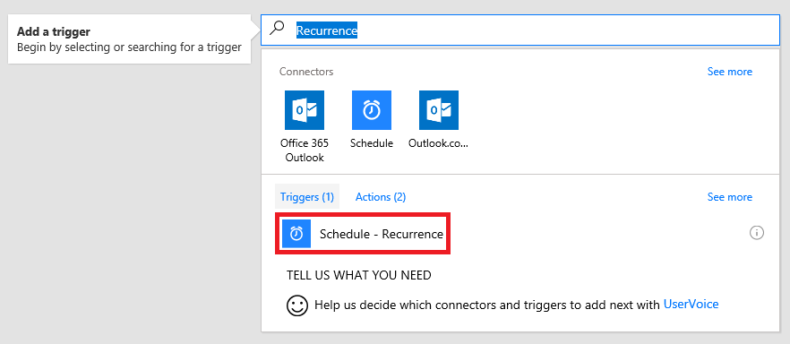
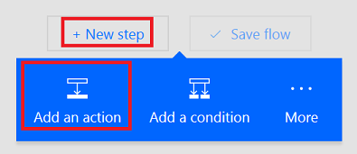

<properties
    pageTitle="Run flows on a schedule | Microsoft Flow"
    description="Automate recurring tasks by running flows on a schedule, such as every day or every hour."
    services=""
    suite="flow"
    documentationCenter="na"
    authors="stepsic-microsoft-com"
    manager="anneta"
    editor=""
    tags=""/>

<tags
   ms.service="flow"
   ms.devlang="na"
   ms.topic="article"
   ms.tgt_pltfrm="na"
   ms.workload="na"
   ms.date="09/14/2017"
   ms.author="stepsic"/>

# Run flows on a schedule #
Create a flow that performs one or more tasks (such as sending a report in email):

- once a day, an hour, or a minute
- on a date that you specify
- after a number of days, hours, or minutes that you specify

## Create a recurring flow ##

1. Sign in to [Microsoft Flow](https://flow.microsoft.com), and then select **My flows** in the top navigation bar.

	

1. Select **Create from blank**.

	

1. Select **Search hundreds of connectors and triggers**.

1. In the **Search all connectors and triggers** box, type **Recurrence**, and then select **Schedule - Recurrence**.

	

1. In the **Recurrence** dialog box, specify how often you want the flow to run.

	For example, specify **Day** under **Frequency** and **2** under **Interval** if you want the flow to run every two days.

	

1. (optional) Select **Show advanced options**, and then specify a **Time zone**, a **Start time**, or both.

	
	

1. Add the action or actions that you want the flow to take, as [Create a flow from scratch](get-started-logic-flow.md) describes.

## Delay a flow ##

1. Sign in to [Microsoft Flow](https://flow.microsoft.com), and then select **My flows** in the top navigation bar.

	

1. Select **Create from blank**.

	

1. Select **Search hundreds of connectors and triggers**.

1. Specify an event as [Create a flow from scratch](get-started-logic-flow.md) describes.

1. Select **New step**, and then select **Add an action**.

	

1. In the list of actions, do either of the following:
	- Select **Delay**, specify a **Count**, and specify a **Unit** of time such as second, minute, or hour.
	- Select **Delay until**, and then specify a date in the specified timestamp format.

	
	
	
