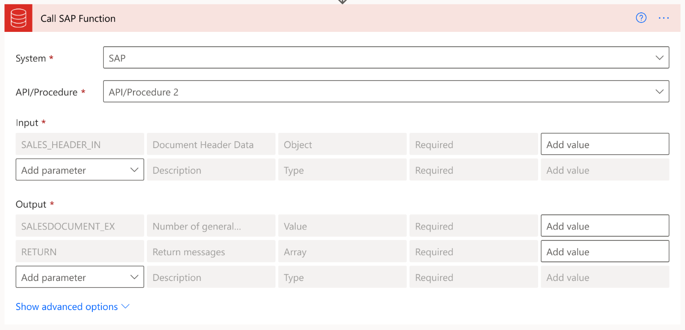

---
title: Configure complex APIs and verify the SAP integration (preview)
description: Learn about the different complex API action screens, the configuration parameters for the available action screens, and verify the SAP integration with Power Platform.
services: ''
suite: flow
documentationcenter: na
author: EllenWehrle
manager: jongilman
editor: ''
tags: ''
ms.devlang: na
ms.subservice: cloud-flow
ms.topic: article
ms.tgt_pltfrm: na
ms.workload: na
ms.date: 09/19/2022
ms.author: ellenwehrle
ms.reviewer: ellenwehrle
search.app: 
  - Flow
search.audienceType: 
  - flowmaker
  - enduser
contributors:
 - EllenWehrle
 - tapanm-msft
---

# Manage complex APIs with new function detail screen (preview)

[This article is pre-release documentation and is subject to change.]

Enterprise software systems like SAP have very complex APIs, often with 30-50 arguments and several hundred fields per argument. In some cases, an API can have 2,000 – 4,000 fields in the definition. 

 The new action screens improve the user experience in Power Automate by establishing the complex API function details to prevent API exceptions being thrown by the flow maker. This will prevent administrators from having manually research and fill in the arguments in raw JSON. 

## New function detail screen

The new function detail screen requires the following four fields to be completed:

- System – the system to be called
- API/Procedure – the API or published stored procedure to be called
- Inputs – a tabular list of parameters to be passed to the API/Procedure
- Outputs – a tabular list of parameters to be returned the API/Procedure. The purpose here is to allow the maker to prune unnecessary data returned by the system of record.

    

### Access new screen

To access the function screen, select **Actions**:

SAP ERP > Call SAP Function
    

### Select System

Click on the **System** field to see a dropdown appear with options to select.

### Select API

Click on the **API** field to see a list of APIs that match the first three letters entered. Select the API

    

### Load API

Once you have selected the API, the definition of the API should be queried and the required Input and Output parameters should be loaded by default. 

### Select Parameter

When you select **Add New Parameter**, display a list of valid parameters for the API, filtering out parameters that have already been added to the table. Depending on the system of record, use the following logic:

- If using SAP API, use the SAP function RFC\_GET\_FUNCTION\_INTERFACE and set parameter FUNCNAME = '**&lt;API/Procedure&gt;**'. The valid parameters are returned in the PARAMS parameter.

- If using Oracle Stored Procedure, use the following SQL: SELECT \* FROM ALL\_ARGUMENTS WHERE OBJECT\_NAME = '**&lt;API/Procedure&gt;**' ORDER BY POSITION.

    

### Enter Value

Within the Value column, the user needs to have the ability to use expressions, static values, dynamic values, and the following data operations:

- Select
- Filter
- Compose

    

### Completed State

The following example shows a state where a user has selected all the parameters needed to invoke the complex API:

### See also

- [Prepare and set up SAP integration with Power Platform (preview)](set-up-prepare.md)
- [Understand prebuilt solution available for integrating SAP with Power Platform (preview)](solutions.md)
- [Overview of SAP integration with Power Platform (preview)](overview.md)
