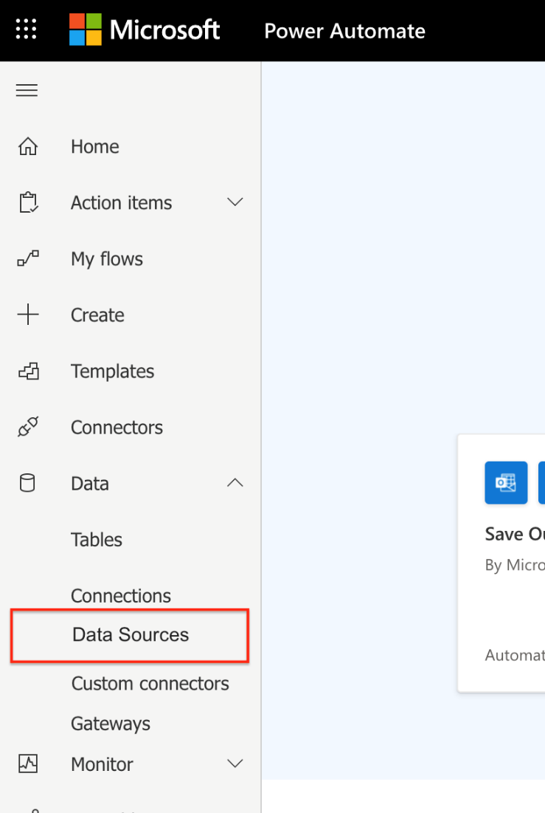
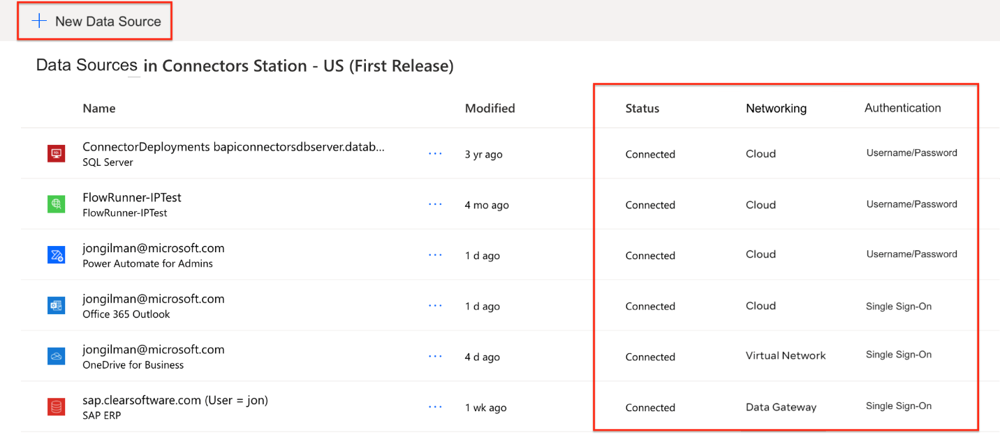
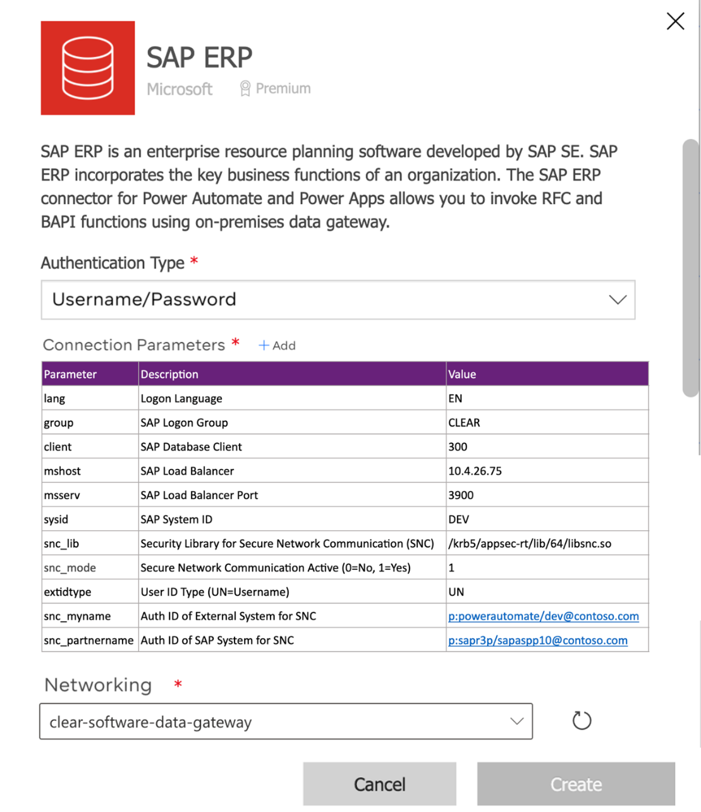

---
title: Understand the Data sources pane in Power Automate for SAP integration (preview)
description: Learn about the Data sources pane in Power Automate to configure SAP integration
services: ''
suite: flow
documentationcenter: na
author: EllenWehrle
manager: jongilman
editor: ''
tags: ''
ms.devlang: na
ms.subservice: cloud-flow
ms.topic: article
ms.tgt_pltfrm: na
ms.workload: na
ms.date: 09/19/2022
ms.author: ellenwehrle
search.app: 
  - Flow
search.audienceType: 
  - flowmaker
  - enduser
---

[This article is pre-release documentation and is subject to change.]

# TO BE REMOVED - Understand the Data sources pane in Power Automate for SAP integration (preview)

Currently, connections in Power Automate are attached to specific users and cannot be shared across Flow makers. This makes it difficult for large organizations who have several Flow makers accessing the same enterprise systems. Additionally, when adding a new SAP data connection, many of the key connection parameters are missing for enterprise customers. In order to support Single Sign On and load balanced connections, some changes will need to be made. We are proposing a new page called Data Sources that allows IT admins to configure connection attributes as environment variables that can be shared across many Flow makers.

> [!IMPORTANT]
> - This is a preview feature.
> - [!INCLUDE[cc_preview_features_definition](../includes/cc-preview-features-definition.md)]

## Navigation Menu

Add a sub-menu item beneath the Data menu item called Data Sources. On click of the menu item, the user should be navigated to the Data Sources page, where environment variables matching the following conditions will be displayed:

-   Type is JSON

## Data Sources Page

Create a new Data Sources page that mirrors the layout of the Connections page, but with some key differences:

- **Status (Nice to Have, Not Required)** - change the status column to indicate if the connection is up or down. Specifically in the case of SAP, a successful telnet to the following ports would indicate that the SAP system is up:

    -   If SNC is active, port 39XX, where XX is the SAP system number

    -   If SNC is not active:

        -   If ASHOST is used, port 33XX

        -   If MSHOST is used, port 36XX

- **Networking** - add a column that indicates the type of network connectivity

- **Authentication Type** – indicates whether SSO or Username/Password is used

## Data Source Detail Page

Copy the Connection Detail page but add some additional features:

- **Authentication Type** – this drop-down should be changed to have the values **Username/Password** and **Single Sign On**.

- **Connection Parameters** – this new table will allow the user to add one or more system connection parameters from a drop-down list. Specifically for SAP, the available connection parameters can be found [here](https://help.sap.com/SAPhelp_nw73/helpdata/en/48/a88d7f5134307de10000000a42189b/content.htm?no_cache=true) and [here](https://www.ibm.com/docs/en/sia?topic=csncbasnaa-setting-optional-rfc-connection-parameters-adapter-2).

- **Networking** – this drop-down should contain a list of data gateways and VNETs, along with the ability to create a new VNET or new data gateway. New entries would follow the standard Azure screen sequence.

When the user clicks Create or Save, the data from the System Detail Page should be saved to a JSON-type environment variable.

## Merging Connection Parameters at Run-Time

Depending on the type of authentication used by an SAP customer, there will be session variables passed from Power Apps that need to be merged with the server-side connection parameters at run-time:

- **Username/Password** - the username and password sent in from Power Apps should be assigned to the SAP connection parameters USER and PASSWD and then merged with the server-side connection parameters. For example, the following from Power Apps and Data Source:

    -   Power Apps

{

"username": "jongilman",

"password": "reallygoodpassword"

}

-   Data Source

{

"lang":"EN",

"group":"CLEARSSO",

"client":"300",

"mshost":"10.4.26.75",

"msserv":"3900",

"r3name":"R3P"

}

-   Would Be Merged to the following sent to SAP

{

"lang":"EN",

"group":"CLEARSSO",

"client":"300",

"mshost":"10.4.26.75",

"msserv":"3900",

"r3name":"R3P",

**"user":"jongilman",**

**"passwd":"reallygoodpassword"**

}

- **SSO** - the username sent in from Power Apps should be assigned to the SAP connection parameter EXTIDDATA and then merged with the server-side connection parameters. For example, the following from Power Apps and Data Source:

    -   Power Apps

{

"username": "jongilman",

}

-   Data Source

{

"lang":"EN",

"group":"CLEARSSO",

"client":"300",

"mshost":"10.4.26.75",

"msserv":"3900",

"r3name":"R3P",

"snc\_lib":"/home/ubuntu/sec/libsapcrypto.so",

"snc\_sso":"0",

"snc\_mode":"1",

"snc\_myname":"p:CN=gateway@redmond.corp.microsoft.com",

"snc\_partnername":" p:CN=ehpsdv6@redmond.corp.microsoft.com",

"extidtype":"UN"

}

-   Would Be Merged to the following sent to SAP

{

"lang":"EN",

"group":"CLEARSSO",

"client":"300",

"mshost":"10.4.26.75",

"msserv":"3900",

"r3name":"R3P",

"snc\_lib":"/home/ubuntu/sec/libsapcrypto.so",

"snc\_sso":"0",

"snc\_mode":"1",

"snc\_myname":"p:CN=gateway@redmond.corp.microsoft.com",

"snc\_partnername":" p:CN=ehpsdv6@redmond.corp.microsoft.com",

"extidtype":"UN",

**"extiddata":"jongilman"**

}
