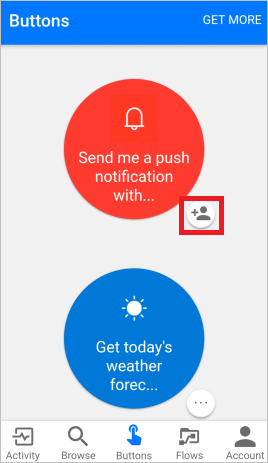
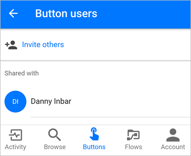
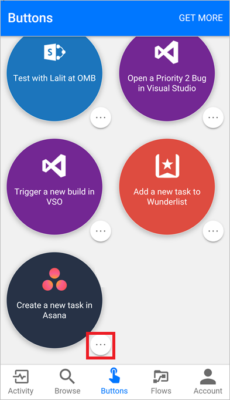

<properties
    pageTitle="Share your buttons with others. | Microsoft Flow"
    description="Share your buttons with others so they can use your buttons and save time."
    services=""
    suite="flow"
    documentationCenter="na"
    authors="msftman"
    manager="anneta"
    editor=""
    tags=""/>

<tags
   ms.service="flow"
   ms.devlang="na"
   ms.topic="article"
   ms.tgt_pltfrm="na"
   ms.workload="na"
   ms.date="03/22/2017"
   ms.author="deonhe"/>

# Share button flows in Microsoft Flow

In the mobile app for Microsoft Flow, you can share [button flows](./introduction-to-button-flows.md) (buttons) with other users or groups within your organization. When you share a button, the person or group with whom you share can trigger and run your button, the same way they run their own buttons. You can stop sharing your buttons at any time.

>The screenshots used in this document were taken from an Android device. If you're using an iPhone, the images may appear differently, but the functionality is the same.

Follow [these steps](share-buttons.md/#use-shared-buttons) to use a button that someone shared with you.

## Prerequisites

To share buttons, you need:

- An account with access to [Microsoft Flow](https://flow.microsoft.com).
- A flow to share.
- A mobile device with the Microsoft Flow app installed. Microsoft Flow mobile app for [Android](https://aka.ms/flowmobiledocsandroid), [iOS](https://aka.ms/flowmobiledocsios), or [Windows Phone](https://aka.ms/flowmobilewindows).
- A group or user within your organization with whom to share your button.

## Share a button

You can share a button from the **Buttons** tab of the Microsoft Flow mobile app.

1. Tap **...** next to the button you want to share.

     

1. Tap **Share as run-only**.

      

1. Tap **Invite others** from the **Button users** page.

      

1. Search for, and then select the group or person with whom you'd like to share the button.

      

1. Tap **SEND** on the **Invite others** page.

      

      >[AZURE.NOTE]Shared buttons run with their creator's connections. However, nobody else can access these credentials, nor reuse them in any other flow.

1. Tap **OK** to acknowledge that your button will use the *connections* that exist in the button whenever the person or group you've shared it with runs it.

      

1. Tap **DONE** on the page that indicates the button sharing operation completed successfully.

      

## View the list of button users

You can view all groups or users with whom a button is shared by following these steps from the **Buttons** tab:

1. Tap **...** next to the button in which you're interested, and then tap **Share as run-only**.

1. On the **Button users** page, view all groups or users with whom the button is shared.

      

## Stop sharing a button

You can stop sharing a button by following these steps from the **Buttons** tab:

1. Tap **...** next to the button you no longer want to share, and then tap **Share as run-only**.

1. On the **Button users** page, tap the user or group with whom you want to stop sharing the button.

     

1. Tap **Remove user** when the user's page is displayed.

     

1. Wait for the remove operation to complete. Notice the **Button users** list refreshes, and the user or group you removed is no longer listed.

     

## Monitor the run history

All run history, including the runs initiated by a person with whom a button is shared, appear only on the **Activity** tab of the button creator's Microsoft Flow mobile app.

## Use shared buttons

Before you can run a button that someone has shared with you, you must add it to your **Buttons** tab from the **Add buttons** page.

1. Tap **GET MORE** (or the **New buttons are available** banner if it appears) on the **Buttons** tab.

     

1. Tap the button you want to use.

    The tapped button will be immediately added to the **Buttons** tab of the Microsoft Flow app. You can then use the button from the **Buttons** tab, just like any other button that's listed there.

     

## Stop using a shared button

If you no longer want to use a button that was shared with you, remove it from the **Buttons** tab by taking these steps:

1. On the **Buttons** tab, tap **...** next to the button you no longer want to use.

     

1. Tap **Remove** from the menu that appears.

      

That's it. The button will no longer appear on the **Buttons** tab of the Microsoft Flow app.

>[AZURE.NOTE]After you remove a shared button, you can add it back by selecting **GET MORE** from the **Buttons** tab.
