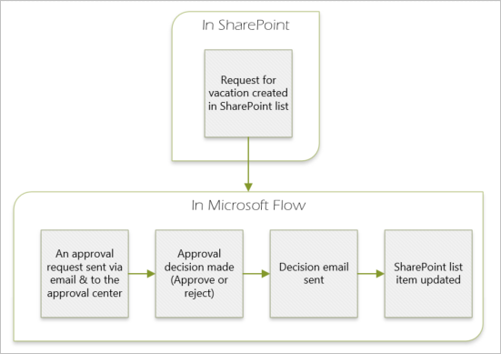
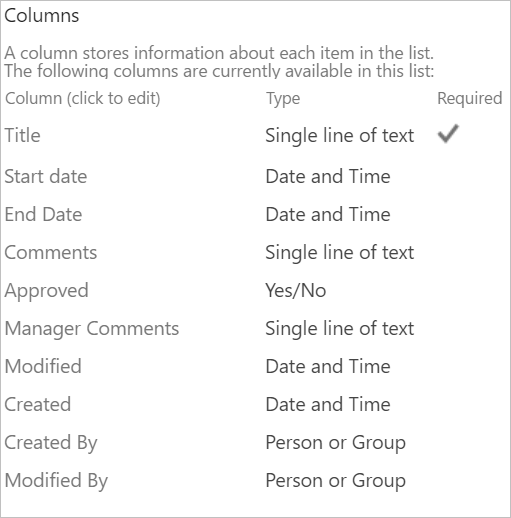
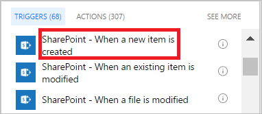
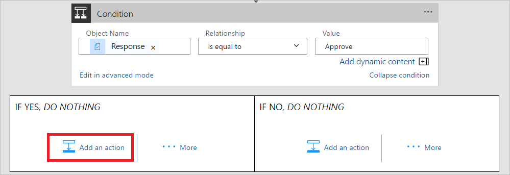
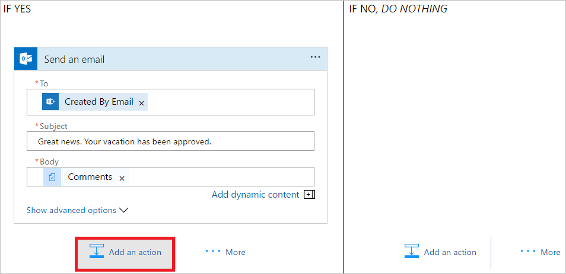
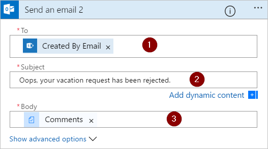
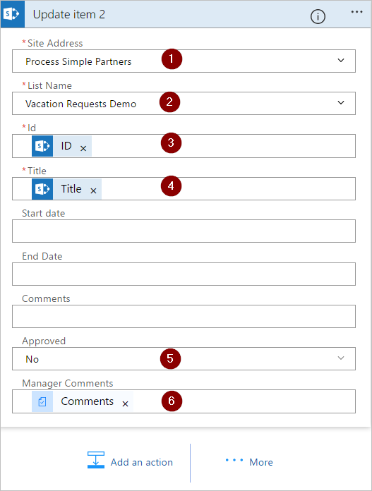
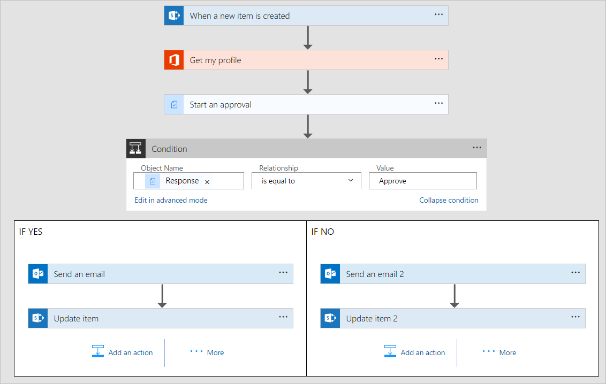

<properties
    pageTitle="SharePoint Approvals. | Microsoft Flow"
    description="SharePoint Approvals."
    services=""
    suite="flow"
    documentationCenter="na"
    authors="msftman"
    manager="anneta"
    editor=""
    tags=""/>

<tags
   ms.service="flow"
   ms.devlang="na"
   ms.topic="article"
   ms.tgt_pltfrm="na"
   ms.workload="na"
   ms.date="04/17/2017"
   ms.author="deonhe"/>

# Manage approvals with Microsoft Flow

You can create a flow that manages the approval of documents or process by integrating with SharePoint, Dynamics CRM, Salesforce, One Drive for Business, Zendesk, or Wordpress.

For example, a document approval flow can be created to approve or reject invoices, work orders or sales quotations. You can create a process approval flow that approves or rejects vacation requests, overtime work or travel plans.

## Create an approval flow

In this walk-through, we'll create a flow that defines a vacation request-approval workflow. Each vacation request is created in a SharePoint Online list. The flow monitors the SharePoint Online list and sends an approval request to a group or user when a new item appears in the list. After the group or user decides, the flow sends an email to the person who requested vacation. Finally, the flow updates the SharePoint Online list with the decision, and any comments from the decision-maker.

This diagram shows the details of the flow we'll create in this walk-through:

   

## Prerequisites

- Access to [Microsoft Flow](https://flow.microsoft.com).

- Access to a SharePoint Online list.

- Access to Office 365 email and Office 365 Users account.

Before you create the flow, create a [SharePoint Online list](https://support.office.com/article/Training-Create-and-set-up-a-list-1DDC1F5A-A908-478B-BB6D-608F34B71F94); we'll use this list to request approval for vacations. The list must include the following fields:

   

Make note of the name and URL of the SharePoint Online list. You'll need these items later when you configure the **SharePoint - When a new item is created** trigger.

### Create your flow from the blank template

1. Sign into [Microsoft Flow](https://flow.microsoft.com).

     

1. Select the **My flows** tab.

     

1. Select **Create from blank**.

     

### Add a trigger

1. Enter **Sharepoint** into the search box.

     

1. Find, and then select the **SharePoint - When a new item is created** trigger.

     

1. Select the **Site Address** and the **List Name** for the SharePoint list that your flow monitors for new items.

     The **Site Address** and the **List Name** are the items you noted earlier in this walk-through.

     

### Add a profile action

1. Select **New step**, and then select **Add an action**.

     

1. Enter **profile** into the **Choose an action** search box.

     

1. Select the **Office 365 Users - Get my profile** action.

     

1. Provide a name for your flow, and then select **Create flow** to save the work we've done so far.

     

### Add an approval action

1. Select **Edit flow**.

     

1. Select **New step**, and then select **Add an action**.

     

1. Enter **approval** into the **Choose an action** search box.

     

1. Select the **Approvals - Start an approval** action.

     

1. Configure the **Start an approval** card to suit your needs.

     Note: **Title** and **Assigned To** are required.

     

### Add a condition

1. Select **New step**, and then select **Add a condition**.

     

1. Select the **Object Name** box, and then enter **response** into the search box on the **Add dynamic content from the apps and services used in this flow** card.

1. Select the **Response** token.

     

1. Select the **Value** box, and then enter **Approve** into the box.

> [AZURE.NOTE]The valid responses to the SharePoint list request are "Approve" and "Reject". These responses are case-sensitive.

1. Your **Condition** card should now resemble this image:

     

## Add an email action for approvals

Follow these steps to send an email if the vacation request is approved:

1. Select **Add an action** on the **IF YES, DO NOTHING** branch of the condition.

     

1. Enter **send email** into the search box on the **Choose an action** card.

     

1. Select the **Office 365 Outlook - Send an email** action.

     

1. Configure the **Send an email** card to suit your needs.

     Note: **To**, **Subject**, and **Body** are required.

     This card is the email template for approved vacation requests.

     

### Add an update action for approved requests

1. Select **Add an action**.

     

1. Enter **update** into the search box on the **Choose an action** card.

     

1. Select **SharePoint - Update item**.

     

1. Configure the **Update item** card to suit your needs.

     Note: **Site Address**, **List Name**, **Id**, and **Title** are required.

     

### Add an email action for rejections

Follow these steps to send an email if the vacation request is rejected:

1. Select **Add an action** on the **IF NO, DO NOTHING** branch of the condition.

1. Enter **Send email** into the search box of the **Choose an action** card.

     

1. Select the **Office 365 Outlook - Send an email** action.

     

1. Configure the **Send an email 2** card to suit your needs.

     Note: **To**, **Subject**, and **Body** are required.

     This card is the email template for rejected vacation requests.

     

### Add update action for rejected requests

1. Select **Add an action**.

     

1. Enter **update item** into the search box on the **Choose an action** card.

     

1. Select **SharePoint - Update item**.

     

1. Configure the **Update item 2** card to suit your needs.

     Note: **Site Address**, **List Name**, **Id**, and **Title** are required.

     

1. Select **Update flow** to save the work we've done.

     

If you've followed along, your flow should look like this screenshot:

## Request an approval

You can request an approval from a SharePoint document library or a SharePoint document list by following these steps:

1. Select the document from the **Flow and approvals** list.

     

1. Select **Get started** from the **Flow and approvals** list.

     

1. Select **Send for approval**:

     You need to accept the terms and conditions if you haven't done so previously. To do so, select the **Accept** button on the **APPROVAL MADE EASY** page.

     

1. Provide the name, email address, or group alias for the approver whom you want to approve the request.

     

1. Optionally, provide a message for the approver.

     

1. Select the **Send for approval** button.

     

1. Confirm that the **Approval status** for the document now shows **Awaiting approval**.

     

## View pending approval requests

1. Sign into [Microsoft Flow](https://flow.microsoft.com):

     

1. Select the **Approvals** tab:

     

1. Select the **Received requests** tab:

     

## Approve a request

If you're the approver in a flow, you'll receive an email or a push notification whenever an approval request is sent to you. The approval request is also sent to the approvals center. You can approve or reject the request from within the email, push notification, or approvals center. The push notification and email show a subset of the approval request's details. Select the link within the push notification or email to launch the approvals center where you can view all details about the approval request.

To approve a request:

### From email or push notification

1. Select the **Approve** button.

     

### From the approvals center

1. Select the **Approve** button

## Reject a request

1. Select the **Reject** button, and optionally provide a reason why you are rejecting the request.

     

## More information
