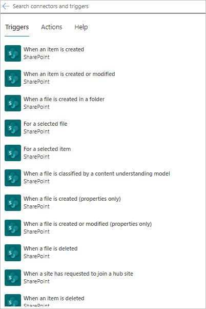
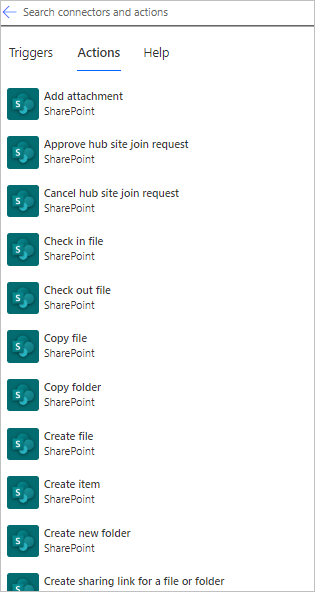

# Use SharePoint and Power Automate to build workflows

Power Automate is deeply integrated with SharePoint. You can start with any of the more than [100 SharePoint templates](https://flow.microsoft.com/templates/), or create your own flow that integrates with SharePoint from scratch.

Learn more about how to use Power Automate with SharePoint in the following video.

>[!VIDEO https://www.microsoft.com/videoplayer/embed/RWL7D9]

## Top SharePoint workflow scenarios

Here are some of the top scenarios in which you can use Power Automate with SharePoint:

- Manage approval flows
- Work with files and lists
- Migrate from workflows to Power Automate

### Manage approval flows

- Customize [SharePoint page approvals](/sharepoint/dev/business-apps/power-automate/guidance/customize-page-approvals) to meet your needs.
- Require [approval of documents](/sharepoint/dev/business-apps/power-automate/guidance/require-doc-approval) in SharePoint by using Power Automate.
- Route finished documents to a [team for approval](./customize-sharepoint-page-approvals.md).

### Work with files and lists

- Manage [list item and file permissions](/sharepoint/dev/business-apps/power-automate/guidance/manage-list-item-file-permissions).
- [Move files to different folders](/sharepoint/dev/business-apps/power-automate/guidance/migrate-from-classic-workflows-to-power-automate-flows) after they're approved in SharePoint.
- [Create an item in SharePoint](/sharepoint/dev/business-apps/power-automate/guidance/migrate-from-classic-workflows-to-power-automate-flows) when a new order is added in Salesforce.
- [Get items from lists, or get files from libraries](/sharepoint/dev/business-apps/power-automate/guidance/working-with-get-items-and-get-files).
- Create a [flow for a list or library in SharePoint or OneDrive](https://support.microsoft.com/office/create-a-flow-for-a-list-or-library-in-sharepoint-or-onedrive-a9c3e03b-0654-46af-a254-20252e580d01).
- [Edit a cloud flow](https://support.microsoft.com/office/edit-a-flow-for-a-list-in-sharepoint-b6678daa-2c82-44eb-be3f-2a9cb56301e8).

### Other top scenarios

- Use [HTTP requests](/sharepoint/dev/business-apps/power-automate/guidance/working-with-send-sp-http-request) to manage lists and libraries.
- Create [SharePoint reminder flows](create-sharepoint-reminder-flows.md).

## SharePoint triggers and actions

You can use SharePoint triggers to start flows that monitor changes made to a SharePoint list or library. For a full list, go to [SharePoint triggers](/sharepoint/dev/business-apps/power-automate/sharepoint-connector-actions-triggers#sharepoint-triggers).

As soon as your flow starts, you can use any of the more than [40 *actions*](/sharepoint/dev/business-apps/power-automate/sharepoint-connector-actions-triggers#sharepoint-actions) to manipulate your SharePoint lists.

## Migrate from workflows to Power Automate

-  Migrate from [classic workflows to Power Automate flows](/sharepoint/dev/business-apps/power-automate/guidance/migrate-from-classic-workflows-to-power-automate-flows) in SharePoint.

## Next steps

- Get started with [Power Automate and SharePoint](/sharepoint/dev/business-apps/power-automate/get-started/create-your-first-flow). 
- Get started with [approvals](./get-started-approvals.md).
- Create modern [approval flows](use-expressions-in-conditions.md) in conditions in advanced mode.

[!INCLUDE[footer-include](includes/footer-banner.md)]