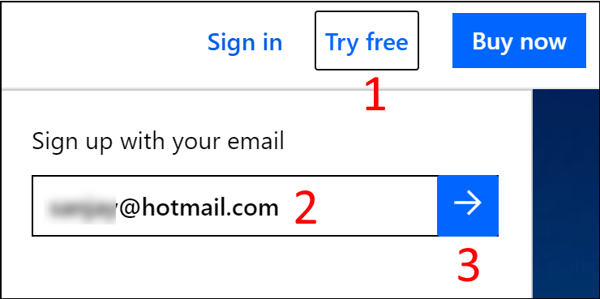

<properties
    pageTitle="Sign up and sign in | Microsoft Flow"
    description="Sign up and sign in to Microsoft Flow, and troubleshoot issues with this process."
    services=""
    suite="flow"
    documentationCenter="na"
    authors="anjlic"
    manager="erikre"
    editor=""
    tags=""/>

<tags
   ms.service="flow"
   ms.devlang="na"
   ms.topic="article"
   ms.tgt_pltfrm="na"
   ms.workload="na"
   ms.date="04/08/2016"
   ms.author="anjlic"/>

# Sign up and sign in for Microsoft Flow #
Before you can create a flow, sign up by using an email address from your work or school. If you've never used an online Microsoft product with that account, you'll need to take a few moments to register it. Select **Sign up free**. After signing up, start to discover the power of flows.

If you've used an online Microsoft product with your account, select **Sign in**.

**Note**: As of this writing, Microsoft Flow doesn't support personal email addresses, such as those that end in **@outlook** or **@gmail**. If you really want to use that kind of account, [tell us why](http://go.microsoft.com/fwlink/?LinkID=787467).

## Sign up ##

1. In [flow.microsoft.com](https://flow.microsoft.com), select **Sign up free** in the upper-right corner of the website.

	

1. Enter your work or school email address, and then select **Go**.

## Sign in ##
1. In [flow.microsoft.com](https://flow.microsoft.com), select **Sign in** in the upper-right corner of the website.

	

1. Provide your work or school credentials.

## Next steps ##
- [Start with a template](get-started-logic-template.md), which is a pre-built flow that's set up for you.
- [Start from blank](get-started-logic-flow.md) if you already have a process in mind and can't find a template for it.
