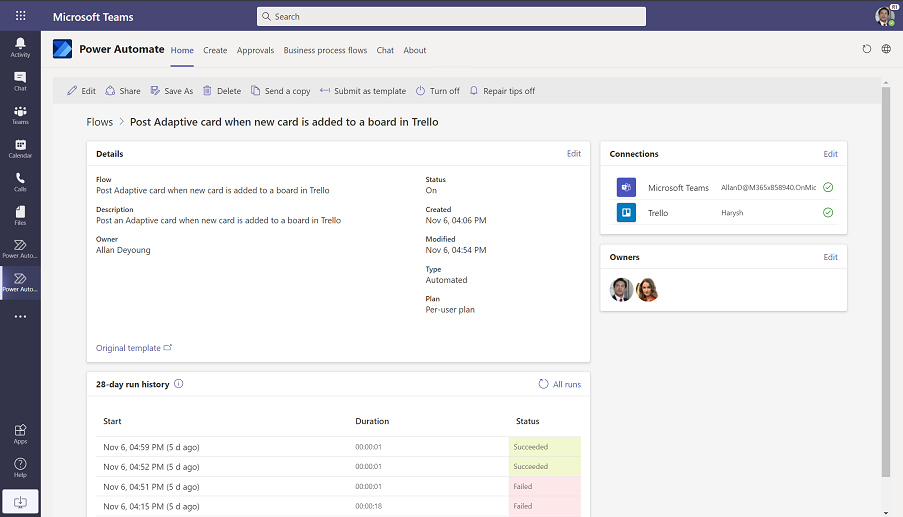

# Manage your flows in the Home tab

The Home tab is where you get an overview of the flows you created or are a part of.

>[!NOTE]
>Currently the app only shows flows from your default environment

By default we optimize for the Teams experience and filter to show you flows that use Teams connectors and actions. But you can always change the filter on the top right to see all your flows instead.

The following 6 columns help provide an overview of your different flows
1. Flow name: The name that you have provided for the flow
2. Status: The status of the flow i.e. is it enabled of disabled. You can also toggle flows directly from the list
3. Owners: Provides an overview of the different users who own the flow
4. Type: The type of flow i.e. Automated, Instant, Scheduled
5. Team and channel: If your flow reads from or writes to any Team or channel that information is provided here so you can get a quick glance of the Teams your flow impacts

You can click on any flow to drill into the details of the flow right within Teams. 

## Known issues
The Power Automate App in Teams only shows flows from your tenants default environment. 

## Related articles

[Create flows in Teams](./power-automate-teams-app-create.md)

[Teams connector documentation](https://docs.microsoft.com/connectors/teams/)
