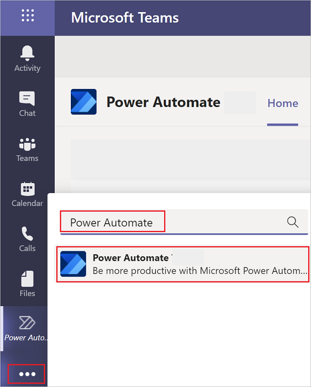
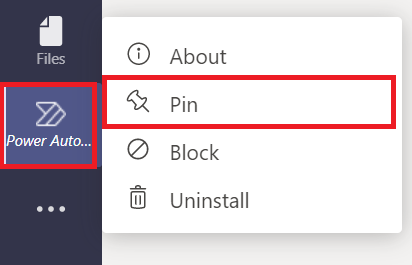

# Create and manage flows from the Power Automate App in Teams

Use the Power Automate app in Teams to quickly create flows from templates or manage flows that you have already created all from directly within Teams. The Power Automate app lets you automate your Teams activities or and connect Teams to other apps and services. 

## Install the Power Automate App in Teams

You can install the Power Automate app from the More Apps menu in Teams or the Teams App store. 

[Here is a direct link to install the app in Teams](https://teams.microsoft.com/l/app/c3a1996d-db0f-4857-a6ea-7aabf0266b00?source=store-copy-link) or alternately you can follow the instructions below to install the app.

1. Open Microsoft Teams and select **More Added Apps (...)**
2. Search for Power Automate

3. Select Add for me

Optionally you can also choose to pin the app in Teams allowing you to access it more easily

Power Automate is now added to Teams. You can access the app in Teams from the left pane.

## Getting started with the Power Automate App
The Power Automate App consists of 6 tabs:

1. Home tab: The Home tab is where you can see an overview of the flows you've created or are a part of
2. Create tab: The create tab is where you can create flows from templates or from scratch
3. Chat: The chat is where you can use the Flow bot to list or run flows
4. Approvals: The Approvals tab lets you manage your approvals
5. Business Process Flows: This tab lets you manage your Business Process Flows
6. About Tab: Where you can get some general information about the app

## Known issues
The Power Automate App in Teams only shows flows from your tenants default environment. Any flow you create from within the app is also tied to the defaul environment

## Next Steps

[Create flows in Teams](./power-automate-teams-app-create.md)

[Manage your flows in Teams](./power-automate-teams-app-home.md)
