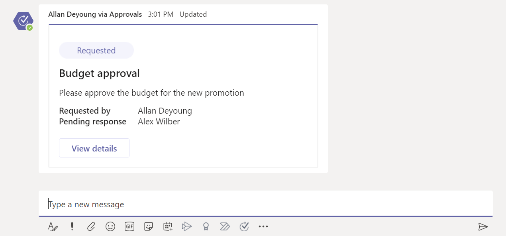
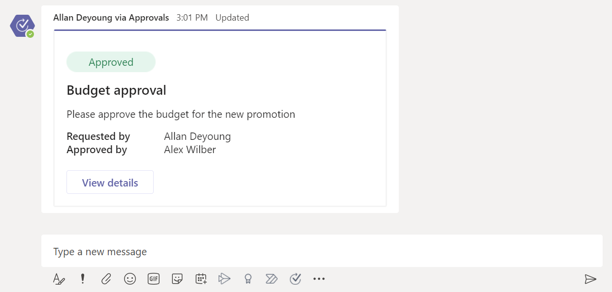

# Respond to an approval from a chat or channel

If a user sends you an approval in a chat or channel message or using the approvals app. You can respond to it directly from within Teams from the chat or channel you received the approval in or the Approvals app.

Note that the approvals app will also show you any approval that was sent using a flow in the same environment as well. This way you can use the Approvals app in Teams to manage all your approvals in a single place.

## Approve or reject an request in Microsoft Teams

Follow these steps to respond to an approval in a chat or channel in Microsoft Teams.

1. Sign into [Microsoft Teams](https://teams.microsoft.com)

2. Navigate to the chat or channel in which you were sent an approval, you should see a card with the approval if it was sent in a chat or channel.

Alternately you can also view open the Approvals app in Teams and navigate to the Received tab

3. Click on View details on the card or click the approval in the app to bring up the Approval form

4. From here you can approve or reject the approval as applicable. You can also optionally include comments to go with your decision. Once approved the state will be reflected in the card or the app.

## Known issues

Currently only approvals sent in your organizations default environment are listed within the Approvals app in Teams.
