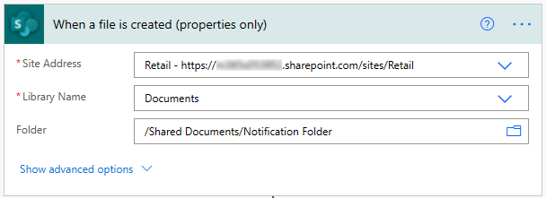
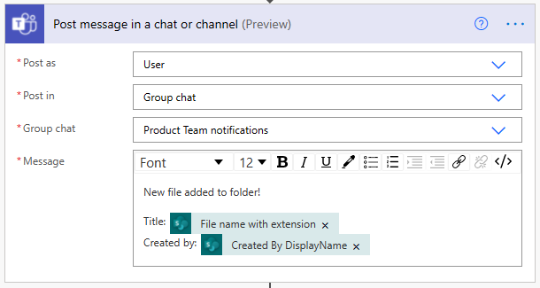
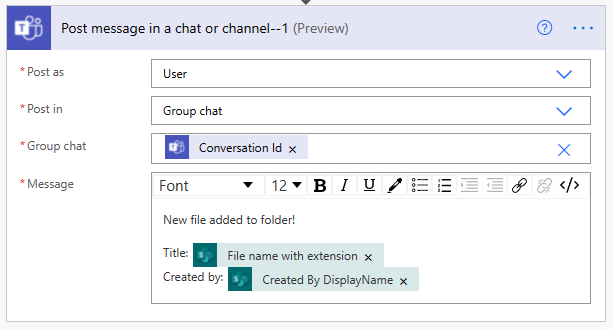
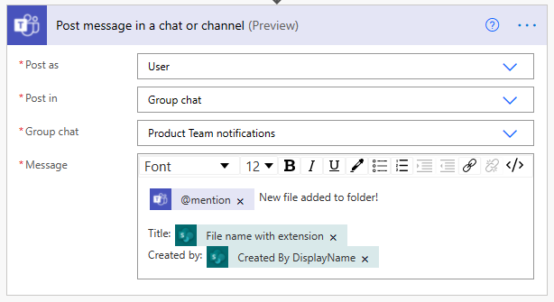

# Send a message in Teams using Power Automate

You can use Power Automate to set up a flow that sends messages to a Teams Channel or group chat using the Microsoft Teams connector. Messages can be posted either as the user who's signed into the connector in the flow or by using the flow bot. 

This article covers all the different ways in which you can send a message in Teams.

## Flow setup

For the purposes of this document, we're using a scenario where a flow is used to notify a Channel or a Group chat, but the same principles can be used to apply to any flow where the **Post a message in a chat or channel** is used.

1. Sign in to [Power Automate](https://flow.microsoft.com).
2. Select **My flows** > **New** > **Automated cloud flow**.
3. Enter a name for your flow.
4. Select the **When a file is created (properties only)** trigger.

   

1. Select **Create**.

1. Set up your trigger by choosing a SharePoint site and Folder ID that you want to monitor

1. Select the + New Step to add an action to this flow, and search for the **Post a message in a chat or channel** action and select it

## Message sender options

The **Post a message in a chat or channel** action can send a message in the following two ways:

1. As the flow bot: In this method, the message gets sent as the Flow bot instead of any individual users. Use this sender option if you didn't want to tie the message to any specific user and just want to use a generic sender instead. 

2. As a User: In this method, the message gets sent as the user who's signed in to the Teams connector in the Flow (generally the Flow owner). This method can be used when the message needs to get sent as a regular user.

The **Post as** and **Post in** options within the action control all the different combinations of how messages can be posted in Teams.

## Posting a message as the flow bot in a Teams channel

To send a message as the flow bot in a Teams Channel select the **Post as** option as **Flow bot** and the **Post in** option as Channel. Once you do two more dynamic inputs show up, which allows you to specify the Team and Channel in which to send the message and add your message in the message field.

## Posting a message as the flow bot in an existing named group chat

To send a message as the Flow bot in a group chat select the **Post as** option as **Flow bot** and the **Post in** option as **Group chat**. Once you do an additional option will show up that lets you select the Group chat to post in. Choose a group chat to post the message in and add your message in the message field.

> [!IMPORTANT]
> By default Teams only lists the 50 most recent **named** group chats in the drop down. If you want to send a message to a new group chat use the option below.

## Create a new group chat and post a message to it as the flow bot

The **Post message in a chat or channel** action can be combined with the **Create a chat** action to create a new group chat and post a message to it. This is useful in scenarios where a chat might not already exist for this topic and one needs to be created. 

In order to create a new group chat add the **Create a chat** action *before* the **Post message in a chat or channel** action. Add the members who need to be in the chat using their emails. Separate multiple emails with a semi-colon and enter the title for the chat if needed.

To send a message as the Flow bot in the new created group chat select the **Post as** option as **Flow bot** and the **Post in** option as **Group chat**. Once you do an additional option will show up that lets you select the Group chat to post in. In the Group chat field, choose **Enter custom value** and select the **Conversation id** from the **Create a chat** action in the dynamic token picker.

## Posting a message as the flow bot directly to a user

When sending a message as the Flow bot you have the additional option of posting directly to a user. This is useful in notification scenarios where you want to reach out to an individual user using the Flow bot. For this select the **Chat with Flow bot** option and specify the user you want to message and the specific message you want to send.

## Posting a message as the user in a Teams Channel

To send a message as the user in a Teams Channel select the **Post as** option as **User** and the **Post in** option as **Channel**. Once you do two additional dynamic inputs show up, which allows you to specify the Team and Channel in which to send the message and add your message in the message field.

## Posting a message as the user in an existing named group chat

To send a message as the user in a group chat select the **Post as** option as **User** and the **Post in** option as **Group chat**. Once you do an additional option will show up that lets you select the Group chat to post in. Choose a group chat to post the message in and add your message in the message field.

>[!IMPORTANT]
>By default Teams only lists the 50 most recent **named** group chats in the drop down. If you want to send a message to a new group chat use the option below.

## Create a new group chat and post a message to it as the fFlow bot

The **Post message in a chat or channel** action can be combined with the **Create a chat** action to create a new group chat and post a message to it. This is useful in scenarios where a chat might not already exist for this topic and one needs to be created. 

To create a new group chat add the **Create a chat** action *before* the **Post message in a chat or channel** action. Add the members who need to be in the chat using their emails. Separate multiple emails with a semi-colon and enter the title for the chat if needed.

To send a message as the Flow bot in the new created group chat select the **Post as** option as **User** and the **Post in** option as **Group chat**. Once you do an additional option will show up that lets you select the Group chat to post in. In the Group chat field, choose **Enter custom value** and select the **Conversation id** from the **Create a chat** action in the dynamic token picker.

## Mention a user in any message

Mentions are a great way to get the attention of a user in Teams. You can combine any of the above actions and add a mention in the message of to a user or channel. 

To mention a user, use the **Get @mention token for a user** action and specify the email of the user you want to mention in the **User** field. The **User** field only accepts a single user input, if you want to mention multiple users you will need to add multiple instances of this action within the flow.

Then add the mention token generated from that action in any of the **Post a message in chat or channel** action scenarios above.

>[!IMPORTANT]
>The **Get @mention token for a user** action only supports mentioning users and not channels or Teams at the moment. 

## Known issues and limitations

- By default Teams only lists the 50 most recent **named** group chats in the drop-down list. If you want to send a message to a new group chat use the option below.
- The **Get @mention token for a user** can only be used for mentioning users, mentioning channels/teams is currenlty not supported.

