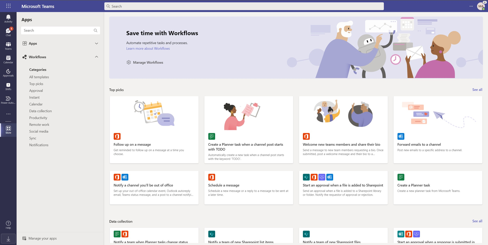
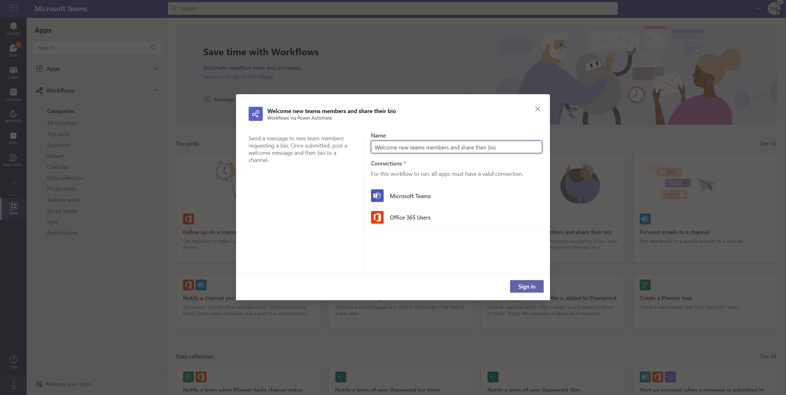
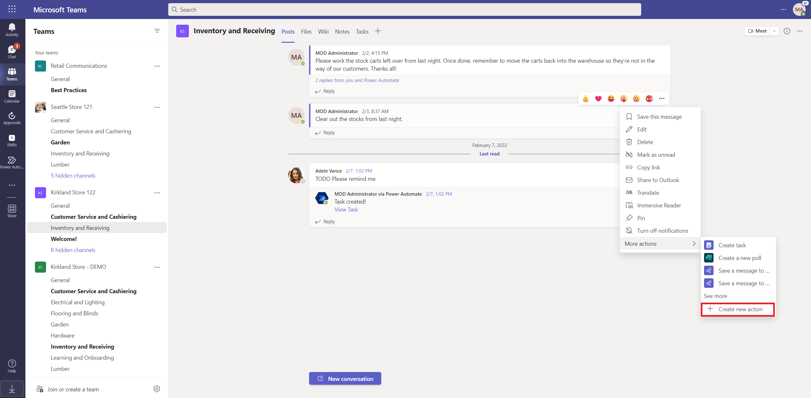
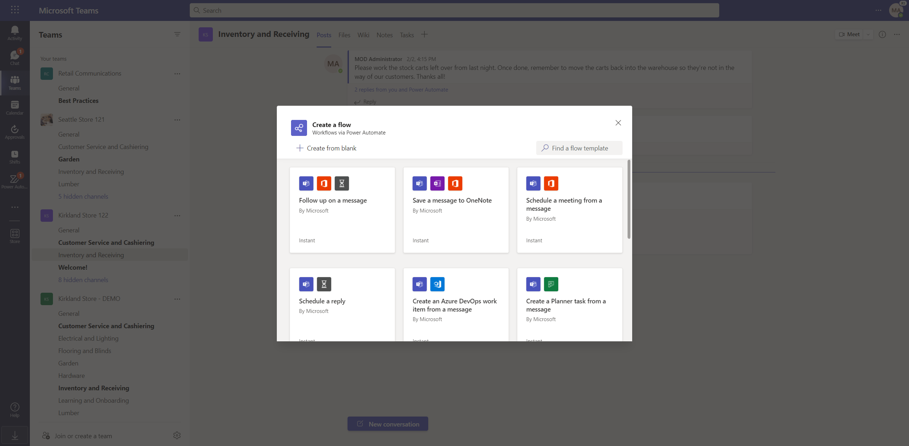
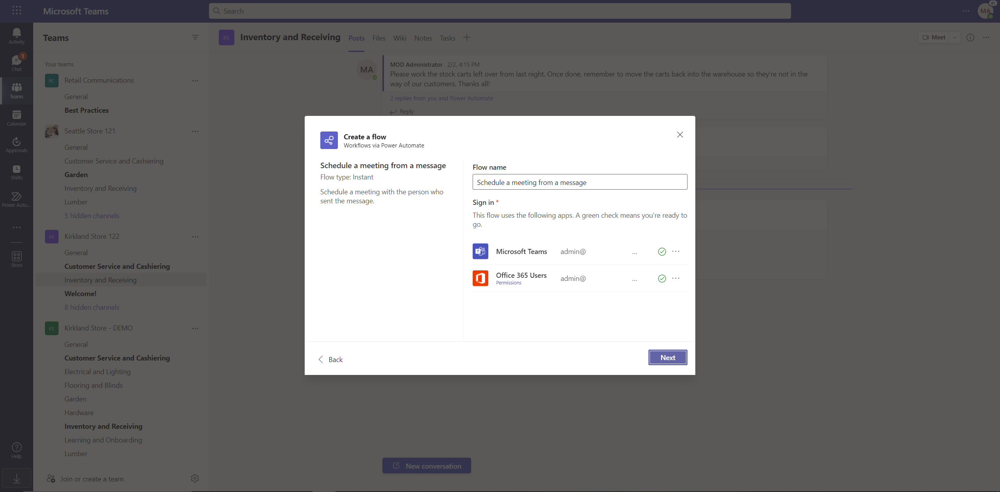
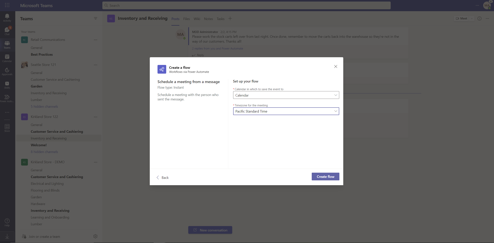
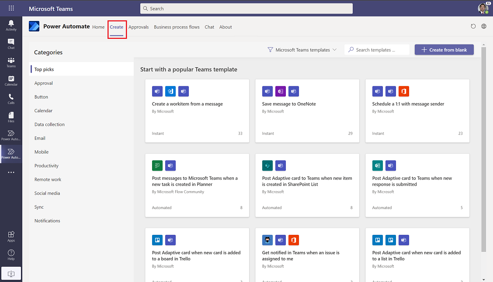
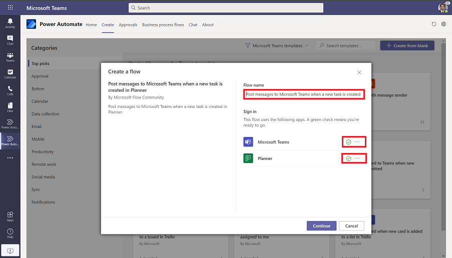
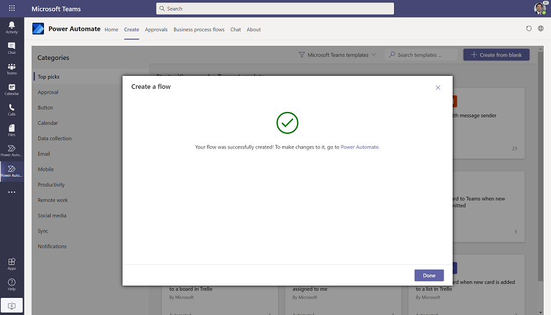
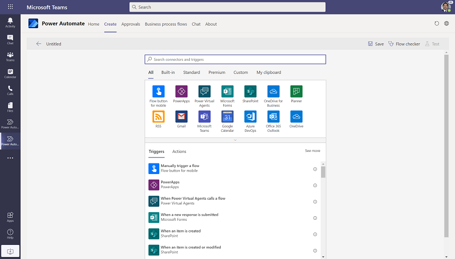

# Create flows in Microsoft Teams

There are multiple ways in which you can create flows within Microsoft Teams.

- Power Automate flow templates - The Microsoft Teams store has templates directly integrated, making it easy for you to get flow templates to get started quickly.
- Team overflow messages - You can also create flows from the overflow menu of Teams message.
- Power Automate app - You can also use the [Power Automate app](./install-teams-app.md) to create flows from a template or from scratch.

You can manage all flows you create from any of these entry points directly within Power Automate or from within the [Power Automate app](./install-teams-app.md) in Teams.

## Prerequisites

To use the Power Automate app, you need an account with access to [Microsoft Teams](https://teams.microsoft.com).

## Create a cloud flow from the Microsoft Teams store

Follow these steps to create a flow from the Microsoft Teams store.

1. Sign into Microsoft teams.

1. Select **Store** from the left hand side in Teams.

   

1. Select **Workflows** in the bottom left hand corner of the screen.

   

   You will see a list of templates that are relevant to Microsoft Teams.

1. You can select any of the templates to build your flow.

   

   When you select a template, a new dialog opens. Name the flow and then sign into the apps and services the flow uses (if you are not already signed into them).

   

1. Select **Next** after all the connections are setup.

   

1. Provide the parameters that the flow requires, and then select **Add workflow** to create the flow.

   

1. You will see a confirmation page that states that your flow was created successfully.

   

1. You can manage your flows from within the Power Automate app in Teams or via Power Automate. Select **Manage workflows** in the **Workflows** section to quickly open the Power Automate app in Teams to manage your flows.

   

## Create a flow from the message menu in Microsoft Teams

Microsoft Teams users can also create manually triggered flows from the overflow menu of a Microsoft Teams message.

Follow these steps to create a manually triggered flow from the Microsoft Teams store

1. Sign into Microsoft Teams.

1. Select the ellipses (…) menu of any message in Teams.

   

1. Select **More actions**.

   

1. Select **Create new action**.

   

   You now see list of templates that use the **For a selected message** manual trigger.

   

1. Select any template to set up the connections you need.

   

1. Select **Next** to setup the parameters that the template needs.

   

1. You will see a confirmation page once your flow is created successfully.

   

## Create a cloud flow from a template in the Power Automate app

>[!NOTE]
>By default, the Power Automate app shows you templates that have been created for Microsoft Teams. You can switch filters on the top right to view all Power Automate templates, if desired.
 

Follow these steps to create a cloud flow from a Microsoft Teams template.

1. Sign into [Microsoft Teams](Https://Teams.Microsoft.com).

   >[!TIP]
   >You may also use the Microsoft Teams app.

1. Select **Apps** on the right side on the screen.
1. Search for, and then select the **Power Automate** app.

   

1. Select the **Create** tab, and then select the template on which you'd like to base your flow.

   

1. If the template that you selected is optimized for Microsoft Teams, a dialog that lets you rename the flow and authenticate with the apps necessary for the flow displays.
   

   >[!NOTE]
   >You must login to all connectors so that your flow can run successfully. A green check indicates that you've authenticated.

1. Set up the connections as needed.

1. Select **Continue** to get a list of parameters that are necessary for the flow to run successfully. Provide the parameters that are needed.
   
   

   If you wish to see the full flow, select **Edit in advanced mode**.
   
   

1. You're all set! You will get a confirmation screen showing that your flow was successfully created. After you create your flow, you can find it on the **Home** tab.

   

>[!IMPORTANT]
>When you create flows from within the Power Automate app in Microsoft Teams, they are always created in your organization's default environment. You can also access these flows from [Power Automate](https://flow.microsoft.com).

## Create a cloud flow from scratch

If you want full control over the flow that you create, select **Create from blank** from the top right side of the screen, instead of using a template.

   

This brings up the full Power Automate designer experience within Microsoft Teams where you can [create a fully customized flow](../get-started-logic-flow.md).

   

## Known issues

- All flows that you create from within the Power Automate app are located in your organization's default environment.

- The Power Automate app and Power Automate Actions app must be  enabled in the [Microsoft Teams admin center](https://admin.teams.microsoft.com/policies/manage-apps) in order for this functionality to work.

## Related articles

- [Manage your flows in Microsoft Teams](./teams-app-home.md).

- Visit the [Microsoft Teams connector documentation](/connectors/teams/).

[!INCLUDE[footer-include](../includes/footer-banner.md)]
