# Trigger approvals from a SharePoint document library

This article shows you how to create an approval flow for new documents (invoices) when they are added to a SharePoint document library and how to attach the document to the approval request.  
  
In the approval process, every time a new invoice is added to a SharePoint library, a request is sent for somebody to reviews its contents. If the request is approved, the invoice files are then moved to a folder.

Follow these steps to complete this tutorial.

1. Create two folders, for example: **Incoming Invoices** and **Reviewed Invoices**.

   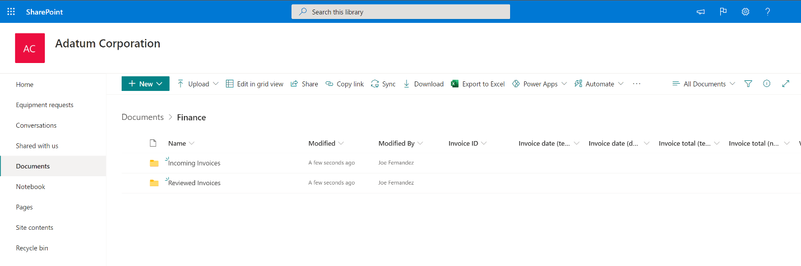

1. Go to the [Start an approval for new file to move it to a different folder](https://us.flow.microsoft.com/galleries/public/templates/d0ffe4d14c9c418e8f8ad49c3a6afcf6/start-an-approval-for-new-file-to-move-it-to-a-different-folder/) template. This template provides us a flow that's configured to setup an approval process for a SharePoint document library. Confirm that all the connections listed have a green check, and then select continue.  
  
   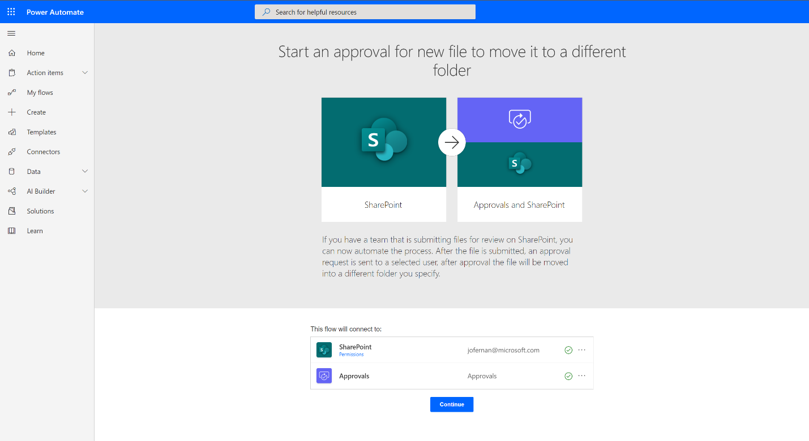

1. Once the flow is created, configure these items.

   - **Site address** - On the trigger card, select the SharePoint site that contains your list. If the SharePoint site doesn’t appear on the list, just write in your SharePoint site URL. 
   
   - **Folder id:** - Select the folder where you will put the incoming files to be reviewed with an approval.

   - On the **Create file** card enter the same **Site address** as before, and then select the folder where you would like the files to be moved once they have been approved.

   - On the **Delete file** card, enter the same **Site address** as before. This action will delete the file from the first folder once it has been approved and copied to the new folder.

     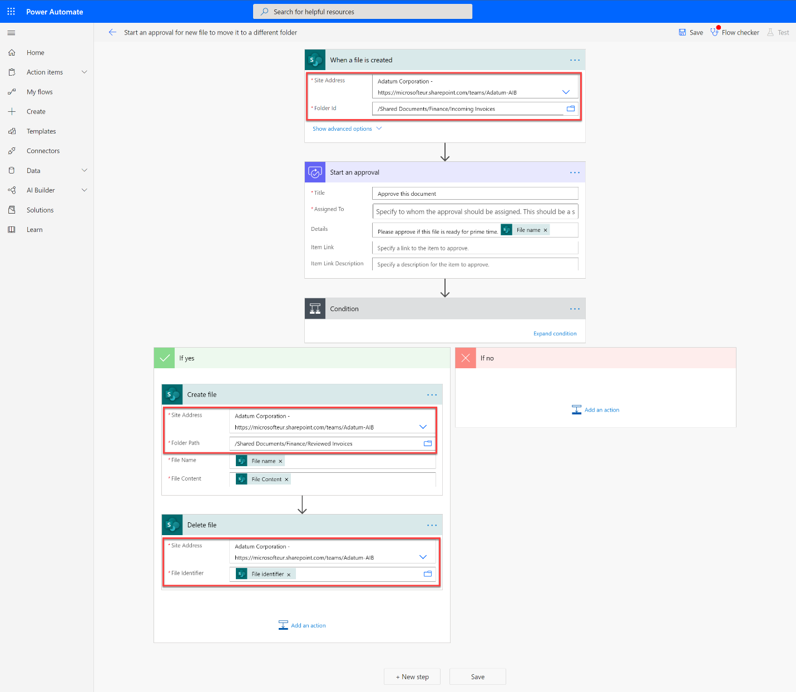

1. Replace the **Start an approval** action with another approval action that will let you attach files to it.

   - Delete the **Start an approval** action from the flow. 

        

   - Where the approval action used to be, select the vertical line to add a new action.

       

   - Search for, and then select **Start and wait for an approval**.

       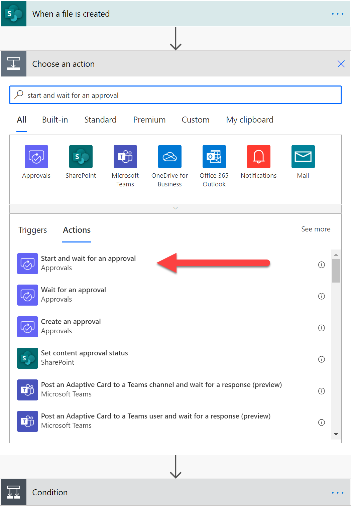

   - Select **Approve/Reject – First to respond** as the approval type. 
      
       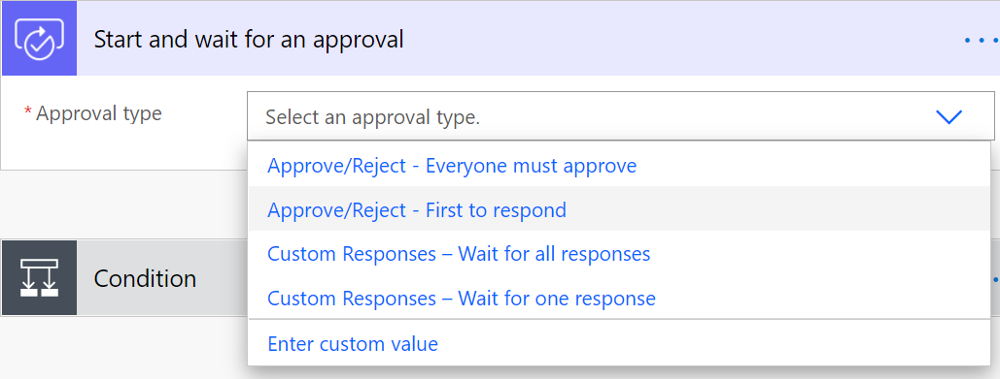

   - Give the approval request a title, and then assign it to the approver. The approver can even be you!

       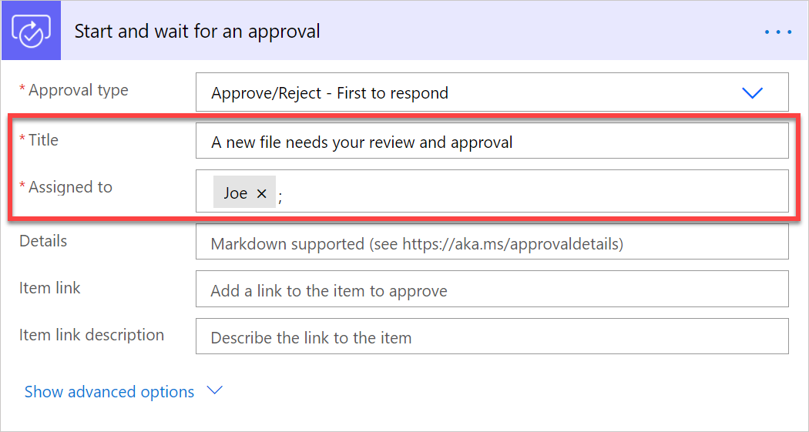

   - Select **Show advanced options**, and then select **Attachment Name – 1**. 
   
      A floating panel opens on the right where you will see all the data you can get from the SharePoint trigger. 
   
   - Select **File name**.
       
       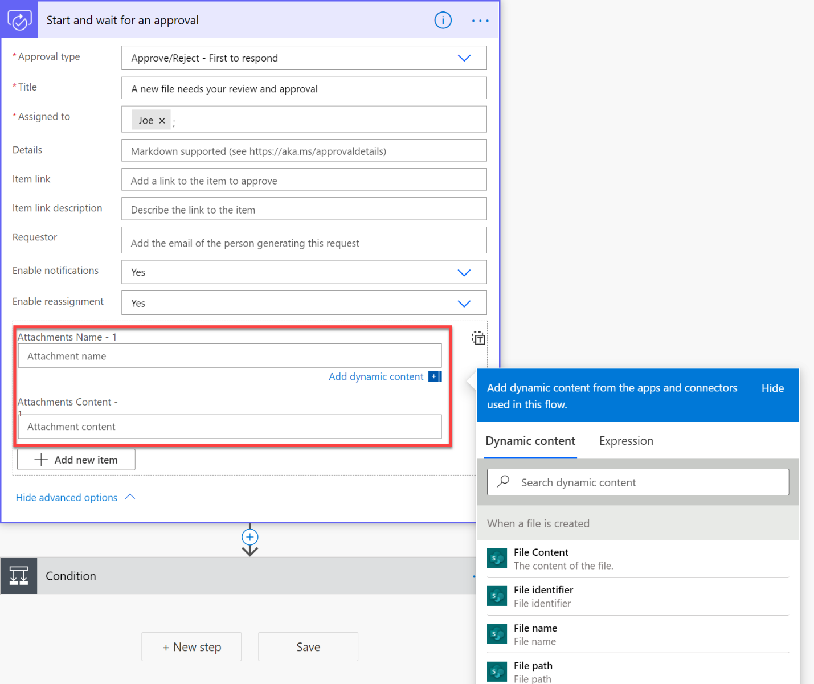

   - Select **Attachments Content – 1**, and then select **File Content**.  
      
       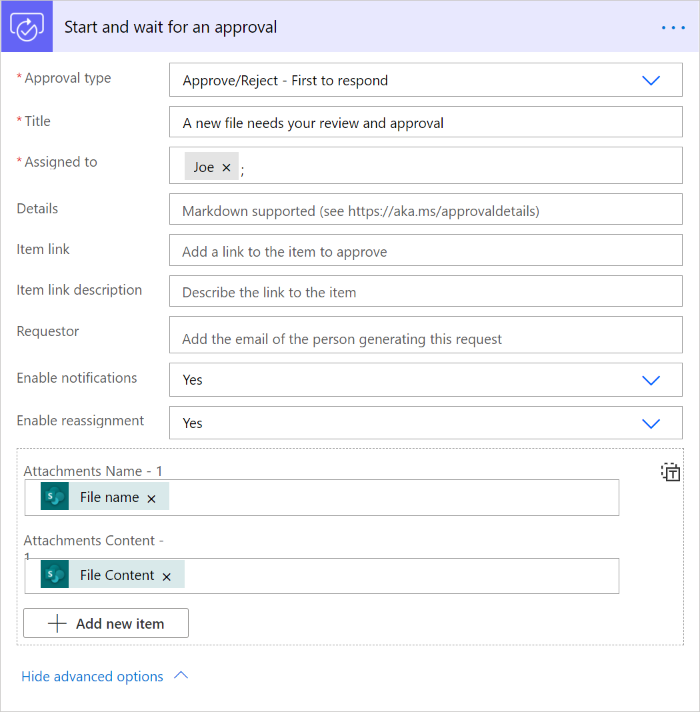

1. Expand the **Condition** card, and on the left text box, select **Outcome**. 

   This way if the approver approves the request, the action to copy the file to the second folder runs.  
  
   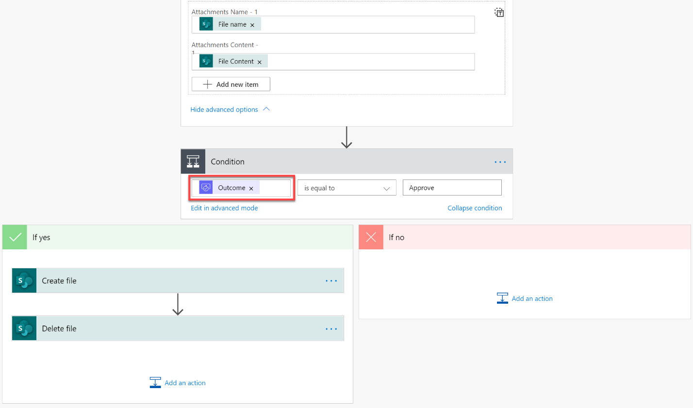

We’re done configuring the flow. Now let’s test it. 

1. Select the **Save** button on the top right. 
   
   You might get a warning message from the Flow checker. It is safe to dismiss it.  
  
   

1. Once the flow is saved, select the **Test** button.
  
   

1. Select, **I’ll select the trigger action**, and then select **Save and test**.  

   

1. Power Automate indicates to you when the flow is in test mode. When it is, add a new file to the incoming files folder in the SharePoint document library that you specified earlier.  
  
   

1. Now, you can see the flow is running.

   

The person to whom you have assigned the approval now receives the approval request in various places where they can approve or reject it. The file to review is attached to the approval request for easy reference.

**By email**  
  
   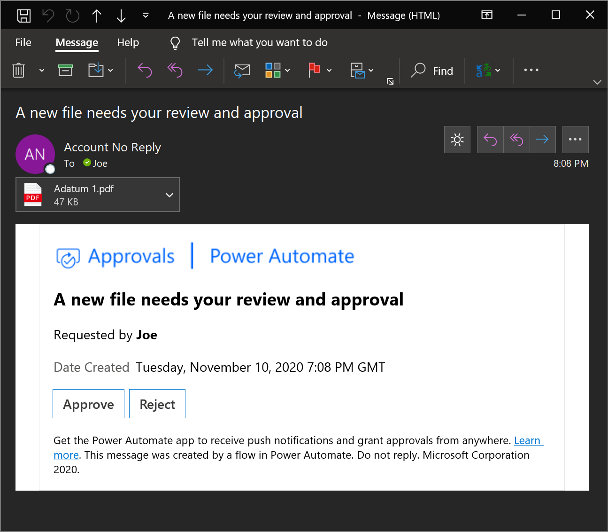

If you are not seeing the email displayed correctly, make sure you have the latest updates in your Outlook app or use the web version of Outlook.

**In Power Automate, on the Action items Approvals section**  
  
   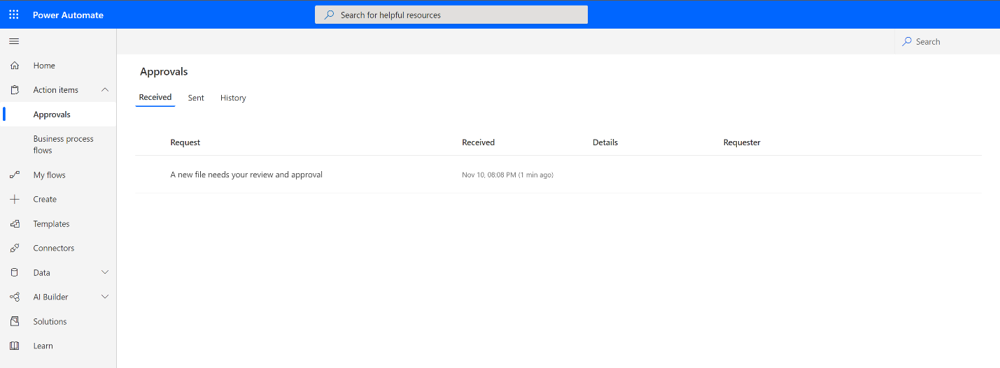

Once the the request is approved or rejected, the flow execution continues. If the request was approved, the file you put in the incoming folder will be moved to the other folder.

   

Congratulations! You have successfully run your flow with approval capabilities. Now that you know the basics, you can build on top of this flow to tailor it to your specific business needs.

## Next steps

- Create [approval flows](modern-approvals.md)

 

[!INCLUDE[footer-include](includes/footer-banner.md)]