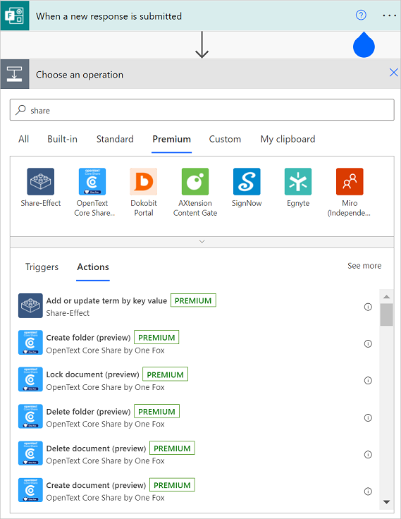

# Get started with triggers

## What is a trigger?

A **trigger** is the event that starts a flow. For example, if you want to get notification in Microsoft Teams when someone sends you an email, in this case you receiving an email is the **trigger** that starts this flow.

Power Automate offers connectors (apps/services like SharePoint, Outlook, /.) and most connectors
offer prebuilt triggers that you can use to start your flows. Here's a partial look at the triggers that Office 365 Outlook connector provides by default.

   

## Choose the right trigger

Triggers can be started instantly or manually, on a schedule, or automatically when some other even occurs.

### Triggers for instant/manual flows

If you'd like to run a flow with a tap of a button on your mobile device, to remind your team to join the daily team meeting, create an instant flow (button flow). You can trigger these flows manually from any device. 

[Learn more about instant flows](https://docs.microsoft.com/power-automate/introduction-to-button-flows#trigger-an-instant-flow).

### Triggers for scheduled flows

If you'd like to run a flow on a schedule, for example, to send a weekly project report, create a [scheduled flow](). In scheduled flows, you can choose when (date and time) and frequency (monthly/daily/hourly, etc.). 

Learn more about [scheduled flows](https://docs.microsoft.com/power-automate/run-scheduled-tasks).

### Triggers for automated flows

If you'd like to create a flow that performs tasks automatically after an event, for example, create a flow that notifies you by email when someone tweets keyword you specify, create an automated flow. 

Learn more about [automated flows](https://docs.microsoft.com/power-automate/get-started-logic-flow)

## Add a trigger to an existing flow 

1. Add a new step

1. Search for the connector and select the app icon.

   

1. Once selected, the corresponding triggers and actions will be shown. Choose
    the trigger that best suits your need.

   

>[!IMPORTANT]
>The trigger must be the first step of the flow.

## Licensing for premium connectors

You need a standalone [Power Apps license](https://powerapps.microsoft.com/pricing/) or [Power Automate license](https://flow.microsoft.com/pricing/) to access all premium, on-premises, and custom connectors. Microsoft 365 plan licensees can use standard connectors but cannot use premium connectors.

To find your license:

1. Go to [flow.microsoft.com](https://preview.flow.microsoft.com/)

1. Select **My flows**.

1. Select a flow.

1. Go to the **Details** section, and then select **Plan**.  

   Your current license plan is displayed.

## Customize a trigger by adding conditions

Sometimes, you may need to customize a trigger so that it fires only when certain conditions are met. For example, you may be using SharePoint’s **When an item is created or modified** trigger in Power Automate. This trigger fires for every
change to SharePoint items but you might want the flow to only trigger when an item is
created or the status is marked as *Approved*. While you can filter other events by
adding conditions to the flow, the flow still runs and the calls are
counted as an API request, causing you to reach your API request limits faster.
To avoid it, you can write expressions in trigger conditions, avoiding a *run* if the condition in trigger isn't met.

Here's a [community article of how to use trigger conditions](https://www.timlinenterprises.com/microsoft-power-automate-flow-trigger-conditions/).

You may also need to secure the trigger inputs/outputs in the run history of a flow. To do this, you can turn on the secure input and/or secure output setting in the trigger. A great community article of how to do it is [here](https://d365demystified.com/2019/12/19/secure-input-output-in-power-automate-run-history/).

