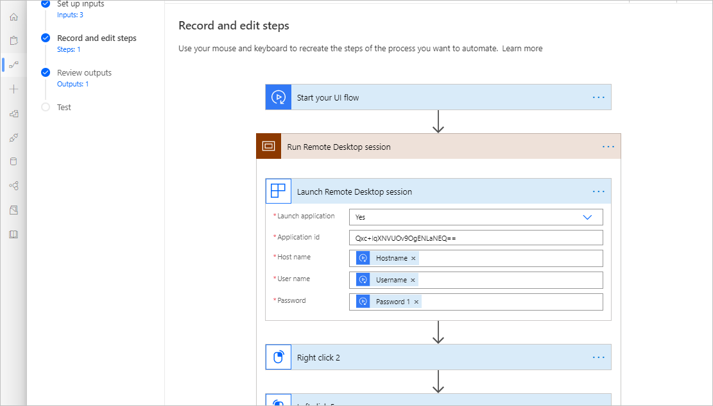

# Create and test Remote Desktop UI flows

TODO: Addt this content to the edit a desktop ui flow and link to it from within this doc.

Note: Proposed location for “Add a recording of a remote computer using image recognition” is part of the Edit Desktop UI flows page:

<https://docs.microsoft.com/power-automate/ui-flows/edit-desktop>

## Add a recording of a remote computer using image recognition

*{{Placeholder for disclaimer – this functionality is in preview and subject to
change.}}*

 

What is image recognition?
--------------------------

Currently, desktop UI flows are primarily recorded using accessibility APIs (UI
Automation and WinAppDriver) to detect the controls in the Windows UI tree.​ The
UI tree is not always available, such as with web-based or Java apps, and may be
unreliable, such as when the IDs of a control change frequently or between
sessions. With image recognition, click locations and other details are visually
matched during playback, greatly expanding the range of applications that can be
automated. Image recognition in UI flows is a preview feature and currently
available when recording a remote computer through the Remote Desktop Connection
(RDC) app.

### To record a remote computer using image recognition: 

 
1. In a new or existing UI flow, go to the Inputs tab and create two new **sensitive text** inputs for the username and password that will be used to log in to the remote device. Sensitive text inputs allow you to pass in the values dynamically when testing or calling the UI flow from another flow, without them being stored in or logged by the UI flow itself.

1.  Follow the steps in **Add a recording** to launch the recorder control for a new or existing UI flow

1.  Connect to the remote computer using the Remote Desktop Connection (RDC) app, and expand the window to full screen.

1.  Select **Record** from the recorder control and click on "Got it" in the popup

1.  Perform the steps on the remote computer, and then select **Done** on the recorder control.

1.  Locate the Launch Remote Desktop action within your recording.

1.  Add the sensitive text inputs for the username and password.

1.  Select **Save**, and then test your UI flow.

1. When calling this UI flow from an automated flow, it is recommended to use a key management solution such as [Azure Key Vault](https://azure.microsoft.com/services/key-vault/) to retrieve the username and password and pass them to the sensitive text inputs of the UI flow dynamically, rather than storing them in the flow itself. 

1. Additionally, enable Secure Inputs in the Settings menu for the "Run a UI flow for desktop" action in the flow that is calling the UI flow to ensure that the the inputs are not stored in the run history.

### To retrieve an output from a remote computer, use the Extract Text from Image action while recording: 

1.  While recording, navigate to the location of the text that you wish to
    capture.

1.  Select Outputs -\> Extract Text from Image from the recorder control

1.  Follow the prompts to select an **anchor area** (a section of the screen
    that is not expected to change, such as the label next to a field)

    

1.  Select the **target area** (the area from which text will be extracted using OCR)

    

1.  Enter a name for the output

1.  Select **Done** on the recorder control

1.  Select **Save**, and then test your UI flow.

### Known issues and limitations

1.  Ensure that all required inputs (computer name, username, and password) are
    filled in and saved before recording further steps in the same UI flow.

1.  To attach to an existing remote desktop session, the session must have been
    launched earlier in the same UI flow

1.  The recommend way to launch the Remote Desktop Connection (RDC) when recording is from the Remote Desktop Connection app (mstc.exe) in the Start menu. If Windows Security actions are recorded in addition to the Launch Remote Desktop action, they should be removed in the designer so that playback is not interrupted (this can happen when the Remote Desktop session is launched from a shortcut)

1.  Playback can fail if the UI flow was recorded on a screen with screen
    scaling (Windows Settings -\> Display -\> Screen Scaling) set to a value
    other than 100%. As a workaround, ensure that screen scaling is set to 100%
    prior to recording.