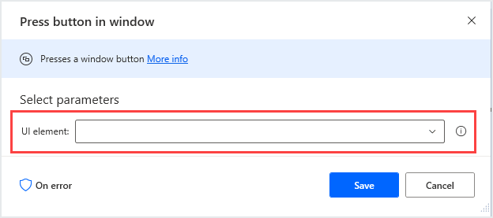
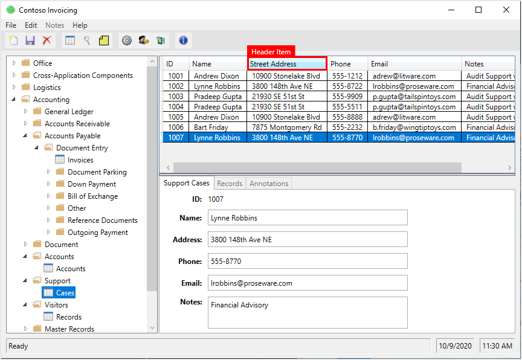
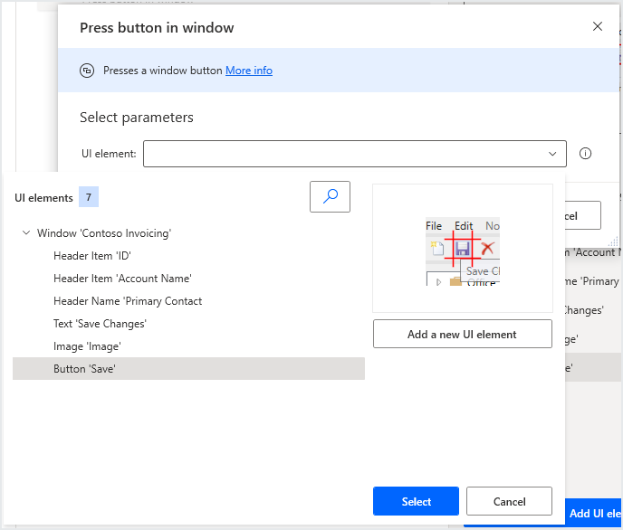
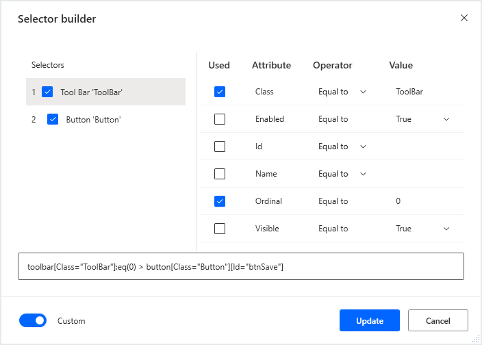
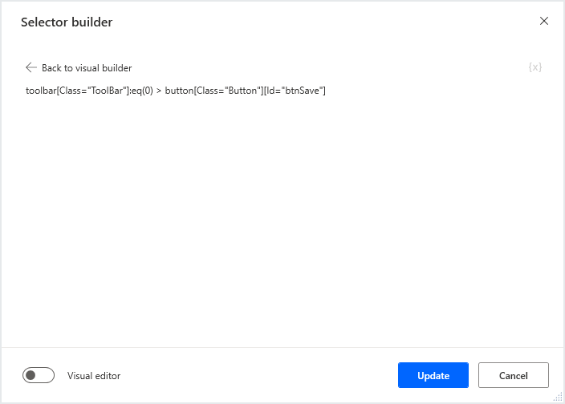

# Automate using UI elements

[!INCLUDE [cc-beta-prerelease-disclaimer.md](../../includes/cc-beta-prerelease-disclaimer.md)]

Actions under the **UI automation** group are designed to directly interact with windows and applications. To achieve this result without resorting to image recognition or absolute coordinates, Power Automate Desktop utilizes **UI elements** to identify windows and their elements.

## UI elements
When using a UI automation action, a UI element will have to be provided as input:

Add a new UI element either directly from the action properties, or from the UI elements pane on the right-hand side of the designer:

To add an element to the flow, highlight it and press **Ctrl & Left click**:

When finished, press **Done**. Any UI elements captured will be added to the UI elements pane. Elements can be sorted alphabetically by selecting the **Sort** icon.

To rename or delete UI elements, right-click on an item and select the appropriate function.

To use a captured element in an action, simply select it from the drop-down list:

## Element Types

Captured elements are divided into two main categories, based on the type of application they were captured from: **UI controls** and **Web controls**.

Any captured elements that are part of a web page displayed in a compatible web browser (Internet Explorer, Microsoft Edge, Firefox, Google Chrome) are automatically saved as web controls, and may be used as input to **Web automation** actions. All other elements are considered UI controls, and may be used in the respective actions.

## Element properties

Manage an element’s selectors by right-clicking any UI element and selecting **Edit selector**. This brings up the Selector builder, where the selector can be edited with a visual editor.

To manually enter the selector’s value, toggle off Visual editor, and the text value of the selector will become editable:

