# Edit desktop UI flows

Desktop UI flows automate Windows desktop applications. Please refer to the [Known issues](create-desktop.md#known-issues-and-solutions) to learn more about issues you might run into, workarounds for those issues, and scenarios that are not supported in this release.

## Prerequisites
A desktop UI flow. [Create a desktop UI flow now](create-desktop.md#create-and-test-desktop-ui-flows) if you don't have one to edit.

## Edit actions


You can edit your recording to:

-   Modify the value for actions that support it.
-   Delete a step.
-   Delete the recording.
-   Change the order of actions with drag and drop. Do exercise caution with this
    as it may break the consistency of your recording.

Advanced parameters let you change:

-  The delay after the action is performed. For example, you can add a one second delay by changing PT0S to PT1S. This can be useful when the target application has a slow response time that doesn’t complete before the next step of your UI flow.
-   The [selector](edit-desktop.md#set-the-selector) for the target user interface element.


## Add a recording

You may want to record your UI flow in multiple sessions. After you've completed your first recording you can proceed as follows:

1. Sign into [Power Automate](https://flow.microsoft.com).
1. Select **My flows** > **UI flows**.
1. Select the UI flow that you want to edit.

   

1. Select **Edit**. 
1. Select **New step**.

   

1. Select **Record app** from the list of actions.

   

1. Select **Launch recorder**.

   

   The recorder control displays at the top of your screen.

   

1. Start the app that you want to record.

     >[!TIP]
     >As your mouse hovers over controls in the app, you'll notice that a blue outline highlights each control. Always wait for the blue highlight before you select a control.
     >
     >If the blue highlight doesn't display around the element, it might not be recorded properly.

1. Select **Record** from the recorder control.

1. Perform the steps in the user interface of the app you are recording, and then select **Done** on the recorder control.
1. Select **Save**, and then test your UI flow.

## Add a loop

UI flows have support for arrays. Use an array, to add a loop to perform repetitive steps in a UI flow. You can pass in different types of arrays from a flow to your UI flow, including complex arrays from a SharePoint list, for example.

>[!NOTE]
>You must edit an existing UI flow to add a loop.

Here are the steps to create a loop in a UI flow:

1. Edit the UI flow to which you want to add the loop.

   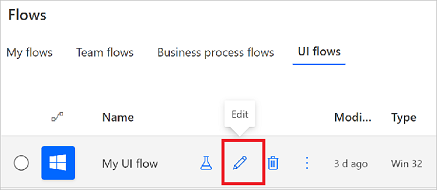

1. Navigate to input section of the wizard, and then select **Set up inputs**.

   
   

1. Select **Array** to indicate that you want to create an array input type.

   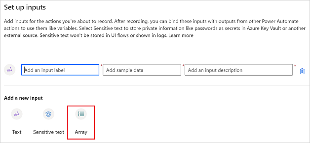

1. Enter the details for the array including a name, the array in JSON format, and a description for the array.

   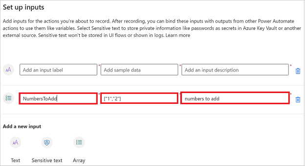

   >[!TIP]
   >If you are using a complex array from a SharePoint list, you don't have to create the array manually. You can copy the array from a flow and paste it into the middle box.

1. Select **Next**.

1. Select **Add an action** .

1. Search for "to each" > **Built-in** > and then select **Apply to each**.

   

1. Select **Select an output from previous steps**, select the array you defined earlier from the Dynamic content.

   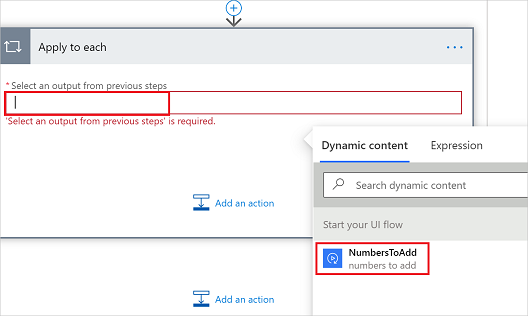

1. Drag the actions you want to repeat and drop them onto the **Apply to each** card.

   For example, I've dropped the **LeftClick 4** onto the **Apply to each** card in the following image.

   

1. Replace the input tokens created during the recording with the array input values as needed. 

>[!TIP]
>If the array is a simple string or integer array, you can use the **Current item** directly from the Dynamic content, like the following image. You can also use expressions.


### Known Limitations:
1.	Loops require static selectors. This means that the user interface (UX) element on which the repetitive action happens must not change. 
1.	Output operations are not currently supported.
1.	For complex array objects that need to be passed from a flow, like a Sharepoint list, provide an example payload of that object. To get the payload, you can run the flow without the UI flow step, and then copy the output of the action into the middle (Add sample data) text box when you define the array.
1.	You must use expressions for complex array object types. For example, use the expression **items(‘Apply to each’)[‘<value>’]**, where <value> is name of the specific object within the input array.


## Add a retry policy

By default, UI flows retries failed UI automation steps using the default retry settings and timeout value.

Follow these steps to set your own retry policy on specific steps after you've recorded your UI flow.

1. Select **...** on the step that you want to change the retry policy.
1. Select **Settings**.

   The settings card for the step opens.

   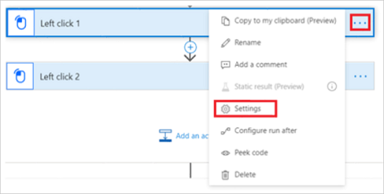
   

1. Add a timeout value in the **Duration** box. 

   The timeout duration can be between one minute and 24 hours. For example, you must enter the timeout duration in this format: **PT1M** to represent a timeout duration of one minute or **PT24H** to represent a timeout of 24 hours.

   

   The timeout is a value you can specify to set the length of time the UI flow should try to perform an action that it’s unable to complete before canceling it. Once the action is canceled, the retry policy begins. The default timeout value is five minutes. 

   There are three types of retries in UI flows.

   - Default
   - None 
   - Custom
   
The **Default** option is selected by default. This default value is set to retry 9 times. Including the initial attempt, this means a total of 10 attempts. There is a 1 second interval between retries.

If you select the **None** option, then no retry attempts are done for this step.

If you want to specify a custom retry policy, then select the **Custom** option, and enter value for **Number of retries** and **Length of intervals**.                    


>[!NOTE]
>The retry policy isn't available for all steps. If you don't see the retry options, it means that the policy isn't available for the specific step.

## Add a manual action

Once you've recorded an application with at least one action, you can manually add
any of the following actions for that application.

| **Action**          | **Comment**                                                       |
|---------------------|-------------------------------------------------------------------|
| Close application   |                                                                   |
| Right click         |                                                                   |
| Send keys           | Send keys and key combinations, such as CTRL + C.                             |
| Left click          |                                                                   |
| Get text            | Read the text from a user interface element and then use it as an output. |
| Enter text          |                                                                   |
| Get element enabled | Check if a user interface element is enabled or disabled.         |
| Clear element       | Clear the value in an editable user interface element.             |
| Wait for seconds    | Wait before continuing to the next step.                           |

Follow these steps to add a manual action:

1. Sign into [Power Automate](https://flow.microsoft.com).
1. Select **My flows** > **UI flows**.
1. Select the UI flow that you want to edit.

   

1. Select **Edit**. 
1. Select the recording card that contains the steps to which you want to add a new step.
   The card expands and displays the recorded steps.

   

1. Select **Add an action** on the recording card, just below the last recorded step.
   You'll see the list of manual actions listed earlier in the walkthrough. 

1. Select the action you want to add. Here, I've selected **Get element enabled**, but you can select any action that makes sense for your scenario.

   

Once the action is added, you will need to set the **Selector** in the action’s
advanced options.


### Set the selector

The selector identifies the user interface element onto which the action is performed during playback. We recommend that you copy/paste this information from a separate step targeting the same user interface element, if possible.

The format of the selector is:

```json
{  
   "type":"WinUIA",
   "parameters":{  
      "elementStack":[  

      ],
      "elementXPath":""
   }
}
```

You need to provide the data for the the **elementStack** and **elementXPath** fields of the  selector element.

Here is an example of what the **elementStack** might look like.


You can capture the **elementXPath** using the [WinAppDriver UI
Recorder](https://blogs.windows.com/windowsdeveloper/2018/06/20/introducing-winappdriver-ui-recorder/).


Remove the first element (everything before /Window) before using the result in **elementXPath** of the selector.

Test your UI flow to confirm that your selector works correctly.

## Use advanced controls

You can incorporate advanced controls such as **conditions**, **switch cases**, and **terminate** actions within your UI flows.

You can perform these advanced operations by performing the following steps on an existing UI flow.

1. Select the UI flow you have created > **More commands** (...) > **Edit**.

1. Select **+** > **Add an action** on the down arrow of UI flow step to which you want to add logic.

   

1. Select **Built-in**, and then select one of the control actions available.

   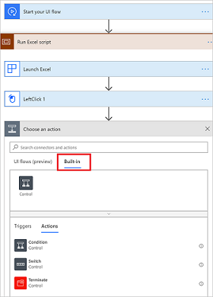

1. Complete the expression that needs to be evaluated. You may use dynamic content and expressions to evaluate your condition and switch controls. Additionally, you can use any output that's generated from the previous UI flow steps.

   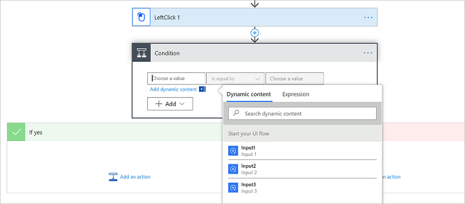


## Add a recording of a remote computer using image recognition (Preview)

[!INCLUDE[cc-beta-prerelease-disclaimer](../includes/cc-preview-features-expect-changes.md)]

Image recognition in UI flows is a preview feature and currently
available when recording a remote computer through the Remote Desktop Connection
(RDC) app.
 

## What is image recognition?

Currently, desktop UI flows are primarily recorded using accessibility APIs (UI
Automation and WinAppDriver) to detect the controls in the Microsoft Windows UI tree.​ Sometimes, the UI tree isn't available, such as with Web-based or Java apps. The UI tree may may be unreliable, such as when the IDs of a control change frequently or between
sessions. 

With image recognition, click locations and other details are visually
matched during playback, greatly expanding the range of applications that can be
automated. 

## Use image recognition to record a remote computer

 
1. In a new or existing UI flow, go to the Inputs tab and create two new **sensitive text** inputs, one for the username and one for the password that will be used to log in to the remote device. Sensitive text inputs allow you to pass in the values dynamically when testing or calling the UI flow from another flow, without them being stored or logged by the UI flow itself.

   

1. Follow the steps in **Add a recording** to launch the recorder control for a new or existing UI flow.

1. Use the Remote Desktop app to connect to the remote computer.

1. Expand the Remote Desktop window to full screen.

1. Select **Record** from the recorder control and select **Got it** in the alert that appears.

   

1. Perform the steps on the remote computer, and then select **Done** on the recorder control.

1. Locate the **Launch Remote Desktop** action within your recording, and then enter the sensitive text inputs for the username and password.

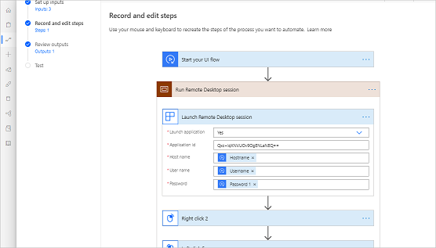

1. Select **Save**, and then test your UI flow.

>[!IMPORTANT]
>When you call this UI flow from an automated flow, it is recommended to use a key management solution such as [Azure Key Vault](https://azure.microsoft.com/services/key-vault/) to retrieve the username and password and then pass them to the **sensitive text** inputs in the UI flow dynamically, rather than storing them in the flow itself. 

>[!TIP]
> Enable **Secure Inputs** in the **Settings** menu for the **Run a UI flow for desktop** action in the flow that is calling the UI flow. This ensures that the inputs are not stored in the run history.

## Use OCR to extract text from images

1. While recording your steps, navigate to the location of the text that you wish to capture.

1. Select **Outputs** > **Extract Text from Image** from the recorder control.

1. Follow the prompts to select an **anchor area** (a section of the screen that is not expected to change, such as the label next to a field).

    

1.  Select the **target area** (the area from which text will be extracted using OCR).

    

1.  Enter a name for the output.

1.  Select **Done** on the recorder control.

1.  Select **Save**, and then test your UI flow.


### Known issues for Remote Desktop recordings

1. Ensure that all required inputs (computer name, username, and password) are filled in and saved before recording further steps in the same UI flow.

1. To attach to an existing remote desktop session, the session must have been launched earlier in the same UI flow.

1. The recommended way to launch the Remote Desktop Connection (RDC) when recording is from the Remote Desktop Connection app (mstc.exe) from the Start menu. If Windows Security actions are recorded in addition to the **Launch Remote Desktop** action, they should be removed from the designer so that playback is not interrupted (this can happen when the Remote Desktop session is launched from a shortcut).

1. Playback can fail if the UI flow was recorded on a screen with screen scaling (Windows Settings > Display > Screen Scaling) set to a value other than 100%. As a workaround, ensure that screen scaling is set to 100% prior to recording.

## Use image recognition to record on Citrix

There are two options to record on Citrix with UI flows.

### Option 1

Record a Citrix application or desktop already open on your machine. 
1.	Follow the steps in [Add a recording](#add-a-recording) to launch the recorder control for a new or existing UI flow.
1.	Use the Citrix app or remote desktop to connect to the remote computer.

   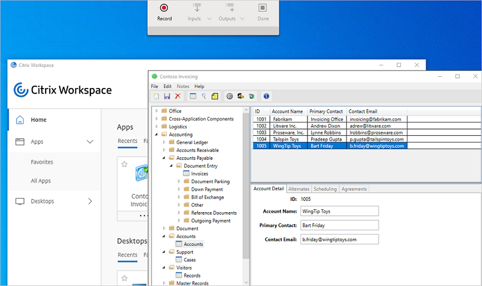

1.	If you are using Citrix remote desktop, expand the window to full screen.
1.	Select **Record** from the recorder control, and then select **Got it** in the alert that appears.
1.	Perform the steps on Citrix, and then select **Done** on the recorder control.

>[!TIP]
>UI flows, you can record several Citrix apps during the same session. Open all applications before you start recording if you have not recorded the launch of your Citrix workspace.

### Option 2

Record the launch of your Citrix application / desktop from your Citrix workspace.
1.	Follow the steps in [Add a recording](#add-a-recording) to launch the recorder control for a new or existing UI flow.
1.	Open the Citrix workspace from the taskbar.
1.	Enter your password, and then and select **Log on**.
   
   >[!TIP]
   >If you don’t want to select **Remember my password**, use a **Sensitive text** input. 

   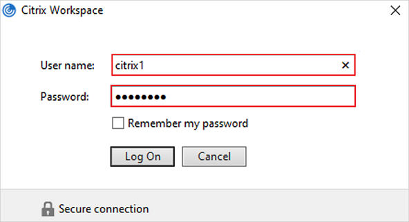

If you have problems using sensitive text in the login window:
1. Open the input menu from the recorder.
1. Select the password field.
1. Select your sensitive text (in this example “password”) in the input menu.

   

1. Select the App or the Desktop you want to record.

   

1.	Perform the steps on Citrix, and then select **Done** on the recorder control.

   >[!IMPORTANT]
   >If you recorded the log-on step, the designer displays three Citrix scope applications. This is expected because the log-on window is a different application from the Citrix workspace.

   >[!TIP]
   >In test and attended mode, confirm that your Citrix workspace is closed before you playback your UI flow. From the notification bar, right-click on the Citrix icon and the select **Exit** to close the workspace.


## Handle error conditions

Unexpected conditions can arise during playback. These conditions can cause your UI flows to fail. You can use advanced error handling capabilities to create alternate steps when unexpected conditions arise. 

Here are the steps to do so.

1. Sign into [Power Automate](https://powerautomate.microsoft.com) with your school or work account.
1. Select **My flows** > **UI flows**.
1. Select **More commands** (the three vertical dots for the UI flow you want to edit).
1. Select **Edit**.
1. Select the down arrow that's located immediately before the UI flow step to which you want to add error handling, and then select **+** (Insert new step).
   
   In the following image, we're inserting the new step before the **PostElementText 1** step. This means that if **PostElementText 1** fails, the alternate steps that you define next, run.

      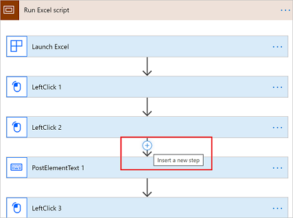 

1. Select **Add a parallel branch**.

    

1. Select the action that you want to perform in the parallel branch if there's a failure when the UI flow runs.

   You can select **Record app** to do a new recording for the parallel branch or select  **Terminate** from the **Built-in** actions to exit the UI flow exit gracefully if there's a failure.

    

   >[!NOTE]
   >By default, the action that you add in the parallel branch runs only if the previous step fails. You can select **...** on the parallel branch > **Configure run after** to change the default behavior. 

      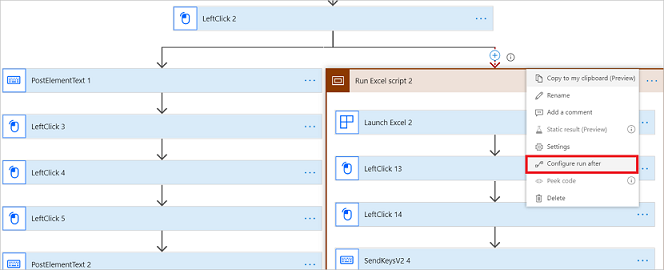

1.  From this screen, you can select the condition on which you want the parallel branch to execute. You can select from one of the four options available.

    

    Note: You will not be able to save a UI flow that has both the main branch
    and parallel branch set to execute on the same condition.


## Enable coordinate-based playback

Coordinate-based playback uses relative screen coordinate offset as a fallback that helps UI flows find target objects that the default Windows UI automation framework is unable to find during playback. 

Here are some of the reasons why the default Windows UI automation framework might not find target objects during playback:

- The legacy application that you're automating might not use  programming technologies that support the Windows UI automation framework.
- The application or its controls may not have a unique UI automation XPath, name, or IDs. 
- The application has dynamic controls whose names or IDs could change. 
- The application has controls that do not have names, IDs, unique identifiers, etc.

>[!TIP]
>Use the same scale and resolution and also maximize the target application during recording to improve the accuracy of coordinate-based playback.

Follow these steps after you've recorded a UI flow script:

1. Expand the step that launches or attaches the application.
   
   This is usually the first step of the recording script.
1. Select **Show advanced options**.
1. Find **Use coordinate playback** properties.
1. Select **Yes** from the list to enable coordinate-based playback.

>[!TIP]
> You can enable or disable **Use coordinate playback** for each application to apply the setting to all steps performed on that application.  


>[!WARNING]
>With coordinate-based playback, the automation may select controls that are not part of the target application due to a variety of reasons, for example, when the UI of the target applications changes dramatically.


## Next steps

- Learn how to [run the UI flow](run-ui-flow.md) you just edited.

- If you want to do more with UI flows, you can also try out UI flows with [input and output](inputs-outputs-web.md) parameters.

