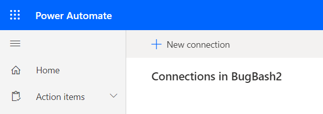

# Set up UI flows

Before you can use your device to create UI flows, you'll need to ensure it meets the requirements outlined here.

> [!TIP]
> Before you create a UI flow, check the [list of connectors](https://flow.microsoft.com/connectors/) to see if the application you want to automate already has a connector. If it does, consider creating a flow instead of a UI flow. You might also build your [own connector](https://docs.microsoft.com/connectors/custom-connectors/).

## Prerequisites

- Either a [paid](https://flow.microsoft.com/pricing/) or [trial](https://flow.microsoft.com/manage/) Power Automate plan.

- A work or school account to sign into your Windows device with administrator privileges and Power Automate.

- A device that runs Windows 10 Pro, Windows Server 2016, or Windows Server 2019.

- The [Microsoft Edge](https://www.microsoft.com/edge/) (version 80 or later)
    or Google Chrome browser.

- An [environment](https://docs.microsoft.com/power-platform/admin/environments-overview) with a [Common Data Service database](https://docs.microsoft.com/power-platform/admin/create-database).

- A supported keyboard attached.

## Limitations

You must have the latest versions of each component to record, test, or run UI flows.

The following are not supported:
- Windows 10 Home installations are not supported.

-   Desktop UI Flows

    -   Multiple monitors
    -   Double click, mouse hover, touch/pen input
    -   Interactions on Windows (File explorer, startup menu, task bar, etc.)

-   Web UI Flows

    -   Right click.
    -   User session information (for example: cookies) will not be reused during
        playback. You will have to edit the script to embed sign in information when required by websites.

You'll find feature-specific limitations included in the documentation for each feature.

## Install UI flows on your device

The UI flows installer contains all the components needed to record, edit, and test UI flows for desktop. 

>[!IMPORTANT]
>The UI flows installer installs the Webdriver component and the UI flows browser extension. Both of these are needed to record, test, and run UI flows for desktop.

Follow these steps to install the UI flows app:

1. [Download the UI flows installer](https://go.microsoft.com/fwlink/?linkid=2102613).
1. Open the **Setup.Microsoft.PowerAutomate.UIflow.exe** file. This file is likely in your **Downloads** folder after you downloaded it in the previous step.
1. Follow the instructions in the **UI flows setup** installer to complete the installation.

### Set data collection options

During installation, you can change the default settings if you do not want to send usage data to Microsoft. To do so, uncheck **Allow Microsoft to collect usage data to improve UI flows**.

> [!WARNING]
> You must uninstall the UI flows app, and then reinstall it if you need to change the data collection settings. UI flows will no longer work if you change the data collection settings without uninstalling the UI flows app first.

## Activate the UI flows browser extension 

Once the UI flows installer completes, you will be prompted by your browser to activate the extension.

- On [Microsoft Edge](https://www.microsoft.com/edge/) (version 80 or later), select each warning icon in the top right of the browser, and then select **Enable extension**.
-   On Google Chrome, select **Enable extension** when prompted.  

> [!TIP]
> If you did not see the prompt in your browser, please check the following:
> - You must use [Microsoft Edge](https://www.microsoft.com/edge/) (version 80 or later) or Google Chrome.
> - You may have to manually enable the extension. For Microsoft Edge, navigate to **edge://extensions** or for Google Chrome, navigate to **chrome://extensions**.
> - If Power Automate's UI flows extension does not appear, you can reinstall it with the [UI flows installer](https://go.microsoft.com/fwlink/?linkid=2102613).

## Install Selenium IDE to automate Web applications

The Selenium IDE is an open source tool that lets you record and playback human interactions on Websites.

With UI flows, you can run Selenium IDE scripts from Power Automate and keep them stored securely (with appropriate IT governance) in Common Data Service.

Follow these steps to install Selenium IDE:

1. [Download and install](https://go.microsoft.com/fwlink/?linkid=2107665) the Selenium IDE for [Microsoft Edge](https://www.microsoft.com/edge/) (version 80 or later) or Google Chrome.

1. On Microsoft Edge (version 80 or later), select **Allow extensions from other stores**, and then select **Add to Chrome**.

## Install the on-premises data gateway

You will need the gateway to trigger your UI flow from an [event, schedule, or button flow.](../getting-started.md#types-of-flows) on a remote device.

>[!TIP]
>The gateway isn't required if you only want to create, edit, and test your UI flows on your device.

[Install the on-premises data gateway](https://docs.microsoft.com/data-integration/gateway/service-gateway-install), if you need it.

>[!IMPORTANT]
>When you install the gateway, it defaults to the region that Power Automate uses.

## Setup UI flows connections and machine credentials

1. Sign into [Power Automate](https://powerautomate.microsoft.com).
1. Expand **Data** on the left side of the screen.
1. Select **Connections**.

   

1. Select New connection.

   

1. Search for *UI flow*, and then select **UI flows**.

   

1. Provide the gateway information and device credentials for *each* gateway: 

    - **Domain and Username**: Provide your device account. You can use a local account by using the name of the user (for example, “MACHINENAME\\User” or “local\\User”), or an Active Directory account such as “DOMAIN\\User”.
    - **Password**: Your account’s password.
    - **Choose a gateway**: Select one of the gateways you want to configure.

      

1. Select **Create**.

## Troubleshoot missing gateway

You might not find the gateway in the list while creating the connection for the following reasons:

- The gateway may be installed in a different region than your Power Automate region. To resolve this issue, uninstall the gateway from the device, and then reinstall it, selecting [the correct Power Automate region](../regions-overview.md#region-mappings-for-power-automate-and-gateways).
- The gateway was deleted by its owner.

## Supported keyboard layouts

- US keyboard – English (United States)
- US keyboard – English (Australia)
- US keyboard – English (Canada)
- Microsoft Pinyin – Chinese (Simplified Han, China)
- German keyboard – German (Germany)
- Microsoft IME – Japanese (Japan)
- United Kingdom keyboard – English (United Kingdom)
- French keyboard – French (France)
- Russian keyboard – Russian (Russia)
- Portuguese (Brazilian ABNT) keyboard – Portuguese (Brazil)
- Portuguese (Brazilian ABNT2) keyboard – Portuguese (Brazil)
- Microsoft IME – Korean (South Korea)
- Spanish keyboard – Spanish (Spain)
- Italian keyboard – Italian (Italy)
- Latin American keyboard – Spanish (Mexico)
- Polish (Programmers) keyboard – Polish (Poland)
- United States-International keyboard – Dutch (Netherlands)
- Turkish Q keyboard – Turkish (Turkey)
- India keyboard – English (India)

## Supported languages

Here are the languages that UI flows supports, in additional to English:

|||||
----|-----|-----|--------
Basque	| French	| Latvian	| Slovak
Bulgarian	|	Galician	|	Lithuanian	|	Slovenian
Catalan	|	German		|Malay	|	Spanish
Chinese (Simplified)	|	Greek	|	Norwegian	|	Swedish
Chinese (Traditional)	|	Hindi	|	Polish	|	Thai
Croatian	|	Hungarian	|	Portuguese (Brazil)	|	Turkish
Czech	|	Indonesian	|	Portuguese (Portugal)		|Ukrainian
Danish	|	Italian	|	Romanian	|	Vietnamese
Dutch		|Japanese	|	Russian	
Estonian 	|Kazakh	|	Serbian (Cyrillic, Serbia)	
Finnish		|Korean		|Serbian (Latin, Serbia)

## Uninstall UI flows

1. Open the **start** menu > **Settings** > **Apps**.
1. Search for **UI flows**, and then select it.
1. Select **Uninstall**.

## Learn more

- [Upgrade your UI flows](upgrade.md) from previous releases
- Learn to [create desktop UI flows](create-desktop.md).
- Learn to [create Web UI flows](create-web.md).
- Learn how to run [UI flows](run-ui-flow.md).
- Learn to [manage UI flows](manage.md).
- Learn more about the [on-premises gateway](../gateway-reference.md#use-a-gateway)
