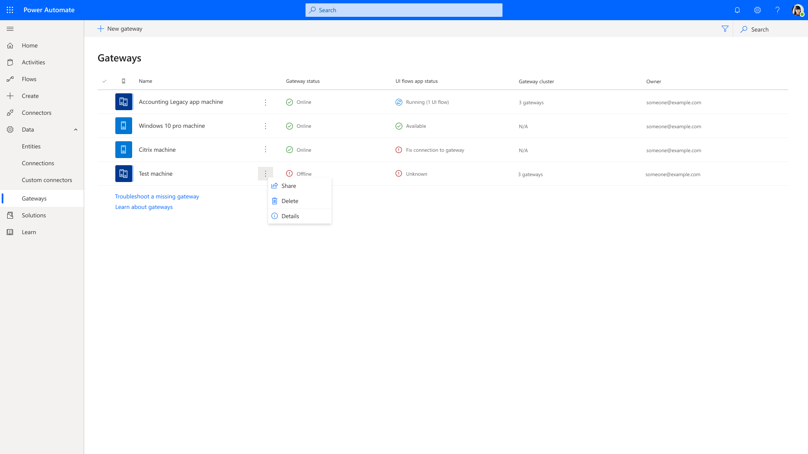

# Update UI flows app and connections from preview to GA

We modified several underlying components and added several features to make UI flows generally available. You'll need to update your local UI flows app and your gateway connections to use these new features, including the unattended features.

### What does it mean for my existing UI flows?

No action is required if you simply want to keep using your existing UI flows. However, we recommended that you upgrade and use the latest version of the UI flows.

### How do I upgrade?

1.  Download the [latest UI flows app](https://go.microsoft.com/fwlink/?linkid=2102613&clcid=0x409) and install it on your device(s).

1.  For each device on which you have installed the UI flows app:

    1. Sign into [Power Automate](https://powerautomate.microsoft.com).
    1. Expand **Data** on the left side of the screen.
    1. Select **Connections**.
    1. Select the UI flows connection(s) that target that your device.
    1. Re-enter your credentials for the connection.

    >[!IMPORTANT]
    >Be sure you use the right credentials as outlined in [Setup UI flows connections and machine credentials](setup.md). Using the correct credentials ensures that your connection updates and uses the code paths for the generally available UI flows.

**Scheduling multiple UI flows on the same device**

With the new unattended UI flows capability, you can schedule multiple UI flows to run on one or more devices. If more than one UI flow runs trigger on the same device, the UI flows backend orchestrates the runs by following these rules:

1.  Sends the first UI flow to the target device.

1.  Queues other UI flows and displays them as **waiting** in the UI flows or gateway details page.

1.  Sends the next UI flow when each run completes.

    >[!NOTE]
    >These orchestration rules apply to both UI flows that are scheduled by the same user or by different users on the same device.

    >[!IMPORTANT]
    >If there too many UI flows in the execution queue a timeout might occur. UI
    >flow runs will currently fail if they don’t run within 30 minutes after being triggered.

**Rerun failed UI flows**

If a UI flow run fails, you can try running it either after correcting the cause of that failure or in certain cases to troubleshoot the failed run.

1. Go to the UI flows details page and identify the failed run you want to rerun.

1. Select the parent flow of the run in which you are interested.

   This leads you to the parent flow run where the UI flow failed.

1. Select resubmit button from the action menu.

**Troubleshoot failed UI flows**

1. If your unattended UI flow fails with **cannot create new session** error message, follow these steps to resolve the issue:

    1.  On Windows 10, confirm that you don’t have an active user session locked or unlocked on your target device.
    1.  On Windows Server 2016 or Windows Server 2019, confirm you haven’t reached the maximum number of active user sessions that's configured for your machine, otherwise UI flows won’t be able to create new sessions to run new UI flows.

**Troubleshoot the UI flows app status**

The UI flows app is the software that you install on your local machine that manages and executes UI Flow runs. It enables our UI Flow cloud services to communicate and orchestrate UI Flows on your machine.

In the gateway list and gateway details pages you see the current UI flows app status for each device.

Your UI flows app can be in on of the following states:

1. **Available**: The UI flows app is online and ready to run UI flows.

1. **Running**: One or more UI flows are running on the machine. Any other UI flows that the backend sends to the target device will queue and wait its slot to run.

1. **Fix connection to gateway**: The UI flow cloud service can’t reach the target device, likely because there is a problem with the gateway connection. To resolve this issue, go to the connection and confirm that the credentials
    you use are correct.

1. **Unknown**: This status means that the backend cannot reach the UI flows app.

    1. If the **gateway status** is **offline**, confirm that the device is turned on and connected to the Internet. You may also [troubleshoot the gateway](https://docs.microsoft.com/data-integration/gateway/service-gateway-tshoot)

    1. If the **gateway status** is **online**, try the following actions:

        1. Confirm the UI flows app and services are running on your device.

        1. Restart the UI flow service on your device.

 <!-- todo      1. See (Managing UI flows app (Install, update, versions…)) for more
            details. -->

## Next steps

- Learn how to [set up UI flows](setup.md). 
- Learn more about the [different types of flows](..\getting-started.md#types-of-flows) you can use to automate your workflows.

