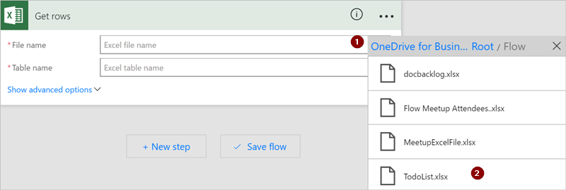
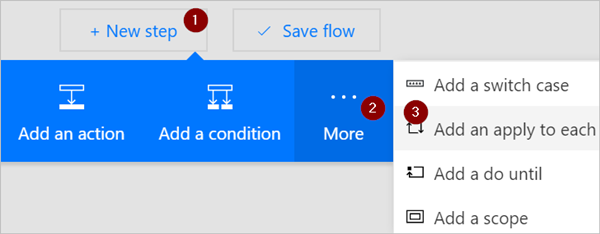

<properties
    pageTitle="Use functions with conditions. | Microsoft Flow"
    description="Use advanced functions such as ""and"", ""or"", ""empty"", ""less"" and ""greater"" with Microsoft Flow conditions."
    services=""
    suite="flow"
    documentationCenter="na"
    authors="msftman"
    manager="anneta"
    editor=""
    tags=""/>

<tags
    ms.service="flow"
    ms.devlang="na"
    ms.topic="article"
    ms.tgt_pltfrm="na"
    ms.workload="na"
    ms.date="08/01/2017"
    ms.author="deonhe"/>

# Use functions in conditions to check multiple values

In this walkthrough, you'll learn to use functions and **Conditions** to compare multiple values in **Advanced mode**.

When you create a flow, you can use the [**Condition**](./add-a-condition.md/) card in basic mode to quickly compare a single value with another value. However, there're times when you need to compare multiple values. For example, you may want to check the value of a few columns in a spreadsheet or database table.

You can use any combination of the following logical functions in your conditions.

Function|Description|Example
--------|-----------|-------
|<a href="#use-the-and-function">and</a>|Takes two arguments and returns true if both values are true.<br><b>Note</b>: Both arguments must be Booleans.|This function returns false: <br>and(greater(1,10),equals(0,0))
|<a href="#use-the-or-function">or</a>|Takes two arguments and returns true if either argument is true. <br><b>Note</b>: Both arguments must be Booleans.|This function returns true:<br>or(greater(1,10),equals(0,0))
|equals|Returns true if two values are equal.|For example, if parameter1 is someValue, this function returns true:<br>equals(parameters('parameter1'), 'someValue')
|<a href="#use-the-less-function">less</a>|Takes two arguments and returns true if the first argument is less than the second argument. <br><b>Note</b>: The supported types are integer, float, and string.|This function returns true:<br>less(10,100)
|lessOrEquals|Takes two arguments and returns true if the first argument is less than or equal to the second argument. <br><b>Note</b>: The supported types are integer, float, and string.|This function returns true:<br>lessOrEquals(10,10)
|<a href="#use-the-greater-function">greater</a>|Takes two arguments and returns true if the first argument is greater than the second arument. <br><b>Note</b>: The supported types are integer, float, and string.|This function returns false:<br>greater(10,10)
|greaterOrEquals|Takes two arguments and returns true if the first argument is greater than or equal to the second argument. <br><b>Note</b>: The supported types are integer, float, and string.|This function returns false:<br>greaterOrEquals(10,100)
|<a href="#use-the-empty-function">empty</a>|Returns true if the object, array, or string is empty.|This function returns true:<br>empty('')
|not|Takes two arguments and returns true if the arguments are false. <br><b>Note</b>: Both arguments must be Booleans.|This function returns true:<br>not(contains('200 Success','Fail'))
|if|Returns a specific value if the expression results in true or false.|This function returns "yes":<br>if(equals(1, 1), 'yes', 'no')

## Prerequisites

- Access to Microsoft Flow.
- A spreadsheet with the tables described later in this walkthrough. Be sure to save your spreadsheet in a location such as Dropbox or Microsoft OneDrive so that Microsoft Flow can access it.
- Microsoft Office 365 Outlook (While we use Office 365 Outlook, you can use any supported email service in your flows.)

## Use the or function

Sometimes your workflow needs to take an action if the value of an item is valueA **or** valueB. For example, you may be tracking the status of tasks in a spreadsheet table. Assume that the table has a column named *Status* and the possible values in the *Status* column are:

- **completed**
- **blocked**
- **unnecessary**
- **not started**

Here's a example of what the spreadsheet might look like:


Given the preceding spreadsheet, you want to use Microsoft Flow to remove all rows with a *Status* column that's set to *completed* or *unnecessary*.

Let's create the flow.

### Start with a blank flow

1. Sign into [Microsoft Flow](https://flow.microsoft.com).

    

1. Select the **My flows** tab.

    

1. Select **Create from blank**.

    

### Add a trigger to your flow

1. Search for **Schedule**, and then select the **Schedule - Recurrence** trigger

    

1. Set the schedule to run once daily.

    

### Select the spreadsheet and get all rows

1. Select **New step** > **Add an action**.

    

1. Search for **rows**, and then select **Excel - Get rows**.

    Note: Select the "get rows" action that corresponds to the spreadsheet that you are using. For example, if you are using Google Sheets, select **Google Sheets - Get rows**.

    

1. Select the folder icon in the **File name** box, browse to, and then select the spreadsheet that contains your data.

    

1. Select the table that contains your data from the **Table name** list.

    

### Check the status column of each row

1. Select **New step** > **More** > **Add an apply to each**.

    

1. Add the **Value** token to the **Select an output from previous steps** box.

    

1. Select **Add a condition** > **Edit in advanced mode**.

1. Add the following **or** function. This **or** function checks the value of each row in the table (a row is known as an item when accessed in a function). If the value of the **status** column is *completed* **or** *unnecessary*, the **or** function evaluates to "true".

    The **or** function appears as shown here:

    ````@or(equals(item()?['status'], 'unnecessary'), equals(item()?['status'], 'completed'))````

    Your **Condition** card resembles this image:

    

### Delete matching rows from the spreadsheet

1. Select **Add an action** on the **IF YES, DO NOTHING** branch of the condition.
1. Search for **Delete row**, and then select **Excel - Delete row**.

    
1. In the **File name** box, search for, and select the spreadsheet file that contains the data you want to delete.

1. In the **Table name** list, select the table that contains your data.

1. Place the **Row id** token in the **Row id** box.

    

### Name the flow and save it

1. Give your flow a name and then select the **Create flow** button.

    

### Run the flow with the or function

The flow runs after you save it. If you created the spreadsheet shown earlier in this walkthrough, here's what the it looks like after the run completes:


Notice all data from rows that had "completed" or "unnecessary" in the Status column were deleted.

## Use the and function

Assume you have a spreadsheet table with two columns. The column names are Status and Assigned. Assume also that you want to delete all rows if the Status column's value is "blocked" and the Assigned column's value is "John Wonder".  To accomplish this task, follow all steps earlier in this walkthrough, however, when you edit the **Condition** card in advanced mode, use the **and** function shown below:

````@and(equals(item()?['Status'], 'blocked'), equals(item()?['Assigned'], 'John Wonder'))````

Your **Condition** card resembles this image:


### Run the flow with the and function

If you followed along, your spreadsheet resembles this image:


After your flow runs, your spreadsheet resembles this image:


## Use the empty function

Notice that there are several empty rows in the spreadsheet now. To remove them, use the **empty** function to identify all rows that don't have any text in the Assigned and Status columns.

To accomplish this task, follow all steps listed in **Use the and function** section earlier in this walkthrough, however, when you edit the **Condition** card in advanced mode, use the empty function this way:

````@and(empty(item()?['Status']), empty(item()?['Assigned']))````

Your **Condition** card resembles this image:


After your flow runs, the spreadsheet resembles this image:


Notice extra lines are removed from the table.

## Use the greater function

Imagine you've bought baseball tickets for your coworkers and you're using a spreadsheet to ensure you're reimbursed by each person. You can quickly create a flow that sends a daily email to each person who hasn't paid the full amount.

Use the **greater** function to identify the employees who haven't paid the full amount. You can then automatically send a friendly reminder email to those who haven't paid in full.

Here's a view of the spreadsheet:


Here's the implementation of the **greater** function that identifies all persons who have paid less than the amount due from them:

````@greater(item()?['Due'], item()?['Paid'])````

## Use the less function

Imagine you've bought baseball tickets for your coworkers, and you're using a spreadsheet to ensure you're reimbursed by each person by the date to which everyone agreed. You can create a flow that sends a reminder email to each person who hasn't paid the full amount if the current date is less than one day before the due date.

Use the **and** function along with the **less** function since there are two conditions being validated:


Condition to validate|Function to use|Example
------|-----|-----
Has the full amount due been paid?|greater|@greater(item()?['Due'], item()?['Paid'])
Is the due date less than one day away?|less|@less(item()?['DueDate'], addDays(utcNow(),1))

## Combine the greater and less functions in an and function

Use the **greater** function to identify the employees who have paid less than the full amount due and use the **less** function to determine if the payment due date is less than one day away from the current date. You can then the **Send an email** action to send friendly reminder email to those who haven't paid in full and the due date is less than one day away.

Here's a view of the spreadsheet table:


Here's the implementation of the **and** function that identifies all persons who have paid less than the amount due from them and the due date is less than one day away from the current date:

````@and(greater(item()?['Due'], item()?['Paid']), less(item()?['dueDate'], addDays(utcNow(),1)))````

## Learn more

Learn about other [functions](https://docs.microsoft.com/azure/logic-apps/logic-apps-workflow-definition-language#functions)
