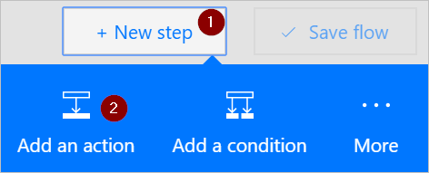
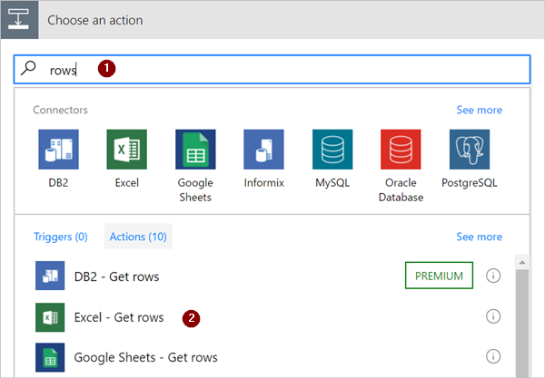
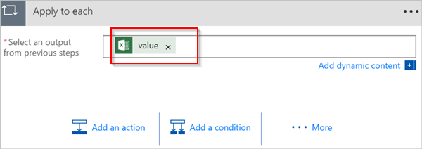
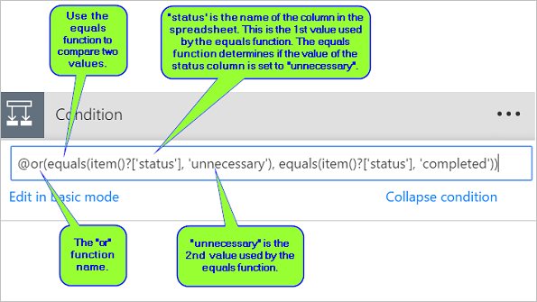
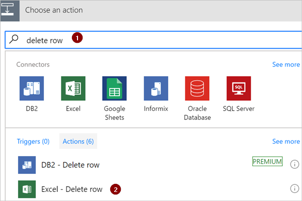

<properties
    pageTitle="Use functions inside conditions. | Microsoft Flow"
    description="Use advanced functions such as ""and"", ""or"",  “empty” and ""greater"" with Microsoft Flow conditions."
    services=""
    suite="flow"
    documentationCenter="na"
    authors="msftman"
    manager="anneta"
    editor=""
    tags=""/>

<tags
    ms.service="flow"
    ms.devlang="na"
    ms.topic="article"
    ms.tgt_pltfrm="na"
    ms.workload="na"
    ms.date="06/19/2017"
    ms.author="deonhe"/>

# Use functions in conditions

You can use the **Condition** card in basic mode to quickly compare a single value with another value. However, there're times when you need to compare multiple values. For example, you may want to check the value of two columns in a spreadsheet or a database table. To compare multiple values, edit the **Condition** card in **Advanced mode** and use any combination of the following logical functions.

<table>
<tr>
    <th>Function</th>
    <th>Description</th>
    <th>Example</th>
</tr>
<tr>
    <td>[and](./use-functions-in-conditions.md/#Use-the-AND-function)</td>
    <td>Returns true if both values are true.<br><b>Note</b>: Both arguments need to be Booleans.</td>
    <td>For example, this function returns false:
and(greater(1,10),equals(0,0))</td>

</tr>
<tr>
    <td>[or](./use-functions-in-conditions.md/#Use-the-or-function)</td>
    <td>Returns true if either parameter is true. <br><b>Note</b>: Both arguments need to be Booleans.</td>
    <td>For example, this function returns true:
or(greater(1,10),equals(0,0))</td>

</tr>
<tr>
    <td>equals</td>
    <td>Returns true if two values are equal.</td>
    <td>For example, if parameter1 is someValue, this function returns true:</td>

</tr>
<tr>
    <td>less</td>
    <td>Returns true if the first argument is less than the second. <br><b>Note</b>: Values can only be of type integer, float, or string.</td>
    <td>For example, this function returns true:
less(10,100)</td>
</tr>
<tr>
    <td>lessOrEquals</td>
    <td>Returns true if the first argument is less than or equal to the second. <br><b>Note</b>: Values can only be of type integer, float, or string.</td>
    <td>For example, this function returns true:
lessOrEquals(10,10)</td>
</tr>
<tr>
    <td>greater</td>
    <td>Returns true if the first argument is greater than the second. <br><b>Note</b>: Values can only be of type integer, float, or string.</td>
    <td>For example, this function returns false:
greater(10,10)</td>
</tr>
<tr>
    <td>greaterOrEquals</td>
    <td>Returns true if the first argument is greater than or equal to the second. <br><b>Note</b>: Values can only be of type integer, float, or string.</td>
    <td>For example, this function returns false:
greaterOrEquals(10,100)</td>
</tr>
<tr>
    <td>not</td>
    <td>Returns true if the parameters are false. <br><b>Note</b>: Both arguments need to be Booleans.</td>
    <td>For example, this function returns true:
not(contains('200 Success','Fail'))</td>
</tr>
<tr>
    <td>if</td>
    <td>Returns a specified value based on whether the expression resulted in true or false.</td>
    <td>For example, this function returns "yes":
if(equals(1, 1), 'yes', 'no')</td>
</tr>
</table>

## Prerequisites

- Access to Microsoft Flow.
- A spreadsheet with a table described later in this walkthrough. Save your spreadsheet in a location such as Dropbox or Microsoft OneDrive so that Microsoft Flow can access it.
- Access to SharePoint (you can use any service in your own flows).

## Use the OR function

Sometimes your workflow needs to take an action if the value of an item is valueA or valueB. For example, you may be tracking the status of tasks in a spreadsheet table. The table has a column named *Status*. The possible values in the *Status* column are:

- **completed**
- **Blocked**
- **Unnecessary**
- **In progress**

Here's a example of what the spreadsheet might look like:


You want to remove any rows with a *Status* column that's set to *completed* or *unnecessary*.

Let's create the flow.

## Start with a blank flow

1. Sign into [Microsoft Flow](https://flow.microsoft.com).

     

1. Select the **My flows** tab.

     

1. Select **Create from blank**.

     

## Add a trigger to your flow

1. Search for **Schedule**, and then select the **Schedule - Recurrence** trigger

    

1. Set the schedule to run once daily.

    

## Select the spreadsheet and get all rows

1. Select **New step** > **Add an action**.

   

1. Search for **rows**, and then select **Excel - Get rows**.

    Note: Select the "get rows" action that corresponds to the spreadsheet that you are using. For example, if you are using Google Sheets, select **Google Sheets - Get rows**.

   

1. Select the folder icon in the **File name** box, browse to, and then select the spreadsheet that contains your data.

   

1. Select the table that contains your data from the **Table name** list.

   

## Check the status column of each row

1. Select **New step** > **More** > **Add an apply to each**.

   

1. Add the **Value** token to the **Select an output from previous steps** box.

   

1. Select **Add a condition** > **Edit in advanced mode**.

1. Add the **or** function. This function checks the value of each row (a row is known as an item when accessed in a function). If the value of the status column is *completed* or *unnecessary*, the **or** function evaluates to "true".

    The **or** function appears as shown here:

    ````@or(equals(item()?['status'], 'unnecessary'), equals(item()?['status'], 'completed'))````

    Your **Condition** card resembles this image:

   

## Delete matching rows from the spreadsheet

1. Select **Add an action** on the **IF YES, DO NOTHING** branch of the condition.
1. Search for **Delete row**, and then select **Excel - Delete row**.

   
1. In the **File name** box, search for, and select the spreadsheet file that contains the data you want to delete.

   

## Name the flow and save it

1. Give your flow a name and then select the **Create flow** button.

   

## Run the flow with the OR function

The flow runs after you save it. If you created the spreadsheet shown earlier in this walkthrough, here's what the it looks like after the run completes:

   

   Notice all rows that had "completed" or "unnecessary" in the Status column have been deleted.

## Use the AND function

Assume you have a spreadsheet table with two columns. The column names are Status and Assigned. Assume also that you want to delete all rows if **both** the Status column's value is "blocked" and the Assigned column's value is "John Wonder".  To accomplish this task, follow all steps earlier in this walkthrough, however, when you edit the **Condition** card in advanced mode, use the **and** function. In this scenario, the and function appears as shown here:

````@and(equals(item()?['Status'], 'blocked'), equals(item()?['Assigned'], 'John Wonder'))````

Your **Condition** card resembles this image:

   

## Run the flow with the AND function

If you followed along, your spreadsheet resembles this image:

   

After your flow runs, your spreadsheet resembles this image:

   

## Check empty values

Notice that there are several empty rows in the spreadsheet now. To remove them, use the **empty** function to identify all rows that don't have any text in the Assigned and Status columns.

To accomplish this task, follow all steps listed in **Use the AND function** section this walkthrough, however, when you edit the **Condition** card in advanced mode, use the empty function:

````@and(empty(item()?['Status']), empty(item()?['Assigned']))````

Your **Condition** card resembles this image:

   

After your flow runs, the spreadsheet resembles this image:

   

   Notice extra lines are removed from the table.

## Use the GREATER function

Imagine you've bought baseball tickets for your co-workers and you're using a spreadsheet to ensure you're reimbursed by each person. You can quickly create a flow that sends a daily email to each person who hasn't paid the full amount.

Use the **greater** function to identify the employees who haven't paid the full amount. You can then automatically send a friendly reminder email to those who haven't paid in full.

Here's a view of the spreadsheet:

   

Here's the implementation of the **greater** function that identifies all persons who have paid less than the amount due from them:

````@greater(item()?['Due'], item()?['Paid'])````

