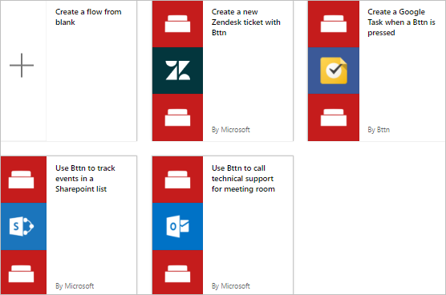
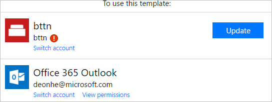
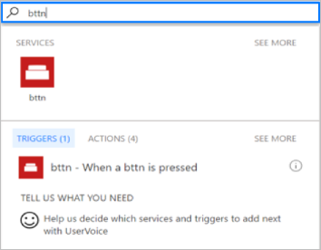

<properties
    pageTitle="Start button flows with physical buttons | Microsoft Flow"
    description="Start button flows with physical buttons from bttn and Flic."
    services=""
    suite="flow"
    documentationCenter="na"
    authors="msftman"
    manager="anneta"
    editor=""
    tags=""/>

<tags
   ms.service="flow"
   ms.devlang="na"
   ms.topic="article"
   ms.tgt_pltfrm="na"
   ms.workload="na"
   ms.date="04/24/2017"
   ms.author="deonhe"/>

# Start button flows with physical buttons

It's easy to trigger Microsoft Flow buttons from the Microsoft Flow mobile app on [Android](https://play.google.com/store/apps/details?id=com.microsoft.flow) and [iOS](https://appsto.re/us/5M0qbb.i), or from [Microsoft Flow](https://flow.microsoft.com). Now, you can also trigger your flows by touching a physical button. That's right, you can call your helpdesk, send an email to your team, block your calendar, reorder supplies, or even order a pizza, by pressing a physical button that executes a flow. Any button flow can be launched using a physical button from one of the two leading physical button manufacturers. Currently, Microsoft Flow partners with [bttn](https://my.bt.tn/) and [Flic](https://flic.io/), two of the leading physical button manufacturers. Visit their websites to learn more about their products, and then integrate your phsical buttons with your button flows.

## Prerequisites

To use physical buttons with Microsoft Flow, you must have:

- Access to [Microsoft Flow](https://flow.microsoft.com).

- Access to [bttn](https://my.bt.tn/) or [Flic](https://flic.io/)

- Registered one or more physical buttons on [bttn](https://my.bt.tn/) or [Flic](https://flic.io/).

Note: You must register your physical buttons and follow the instructions provided by the physical button's manufacturer before you can create flows that use the connectors from bttn and flic.

## Create a flow that uses a bttn physical button

In this walk-through, we use a helpdesk template to create a flow that's triggered by a signle touch of a [bttn](https://my.bt.tn/). When the flow gets triggered, it generates a support request to the helpdesk. The support request provides the helpdesk with location information about the room where help is needed.

Note: While we use a template to create this flow, you are free to use the blank template, which gives you full control over all aspects of your flow.

This screenshot displays some of the bttn templates that are available for you to get started quickly building flows for your bttn. Templates are available for your flows to easily connect to Zendesk, Google, and SharePoint, among others:

Before you get started creating your flow, you must register, and then configure your bttn on the bttn website. For the purposes of this walk-throuh, give your bttn a name that represents a conference room in a typical office building.

The settings for your bttn should resemble this screenshot (from the bttn website):

Now that you've configured your bttn, let's get started creating our flow.

1. Sign into [Microsoft Flow](https://flow.microsoft.com).

     

     Note: Alternatively, you can create your flow from the Microsoft Flow mobile app, which is available on Android, iOS and Windows Phone (Beta).

1. Enter **bttn** into the search box, and then select the search icon.

   After you select the search icon, all templates that use bttn are displayed.

   

1. Select a template to create your flow.

   Here, I have selected the **Use Bttn to call technical support for meeting room** template.

   

1. Provide your credentials for the services that your selected template uses.

     

     You must provide valid credentails to connect to the Office 365 Outlook and the bttn services in order to use this template.

1. Enter **bttn** into the search box, and then select the **bttn - When a bttn is pressed** trigger.

     

1. Select the **bttn ID** list, and then select the **bttn ID** of the bttn you want to use from the **When a bttn is pressed** card.

     

1. Your flow should now resemble this screenshot.

     

1. Now, just press the button on your bttn, and then confirm that your flow ran as expected by viewing its run history on the Microsoft Flow website or on your mobile device.

## Create a flow that uses a flic physical button

Create flows that integrate with flic physical buttons by using an existing template or the blank template:

     

1. Sign into [Microsoft Flow](https://flow.microsoft.com).

     

1. Enter **flic** into the search box.

     

1. Select a template to create your flow.

     

1. Provide your credentials for the services that your selected template uses.

For example, if you select a template that uses Zendesk, you must provide valid credentails to connect to the Zendesk service.

     

1. Configure your flow by adding triggers, actions, and conditions as you would when you create any other flow.

1. More stuff **blah blah ..I need to be able to register a button in order to see what comes next exactly.*************************

## More information

- [Share button flows](./share-buttons.md)
- Learn to use [button trigger tokens](./introduction-to-button-trigger-tokens.md) to send real-time data when your button flows are executed
- [Install the Flow app for Android](https://play.google.com/store/apps/details?id=com.microsoft.flow)
- [Install the Flow app for iOS](https://appsto.re/us/5M0qbb.i)
