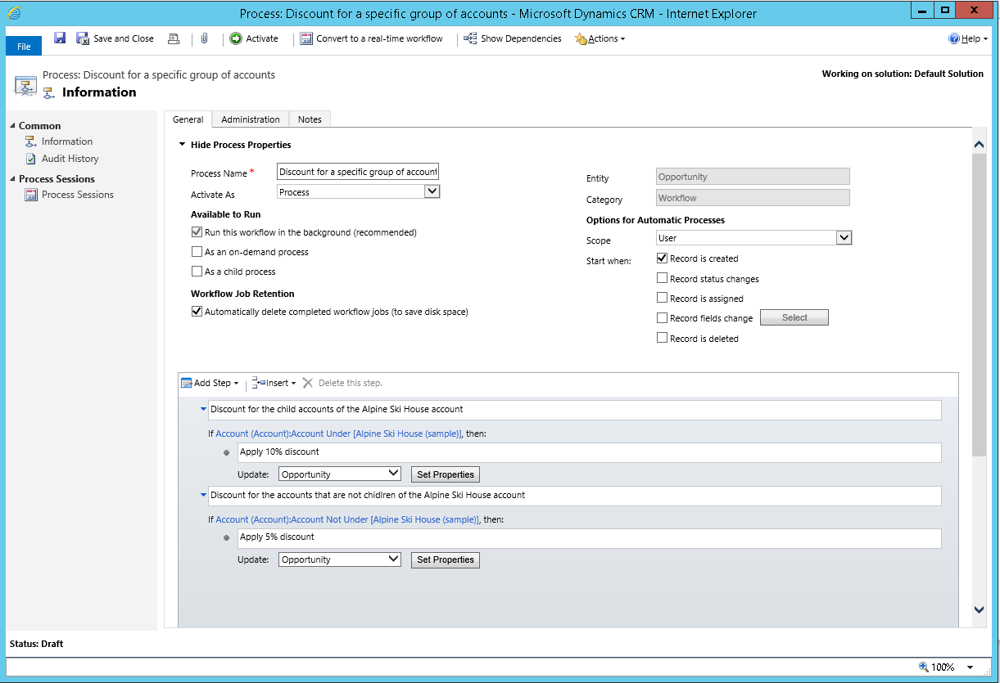

# Classic Dataverse background workflows 

Workflows automate business processes without a user interface. People usually use workflow processes to initiate automation that doesn’t require any user interaction.

There are two types of workflows:
1. Real-time workflows. See the [Power Apps](/powerapps/maker/common-data-service/overview-realtime-workflows) documentation for more details about real-time workflows.
1. Background workflows. 

To create background workflows, you must select the **Run this workflow in the background (recommended)** check box, as displayed in the following image.

See other topics here in the Power Automate documentation to learn more about background workflows.

## Learn more

- [Configure background workflow stages and steps](configure-workflow-steps.md).
- [Monitor and manage background workflow processes](monitor-manage-processes.md)
- [Best practices for background workflow processes](best-practices-workflow-processes.md).
- [Replace background workflows with flows](replace-workflows-with-flows.md)

[!INCLUDE[footer-include](includes/footer-banner.md)]