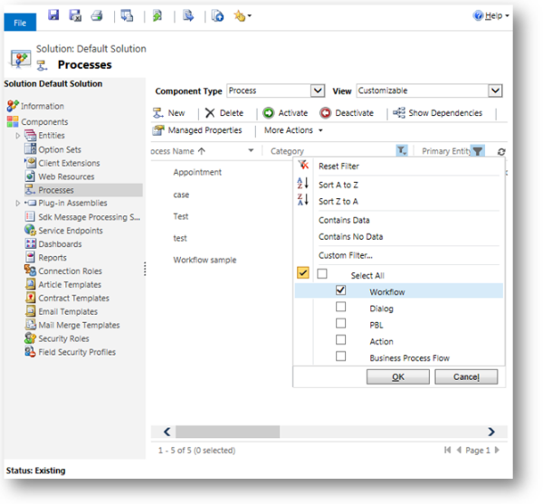
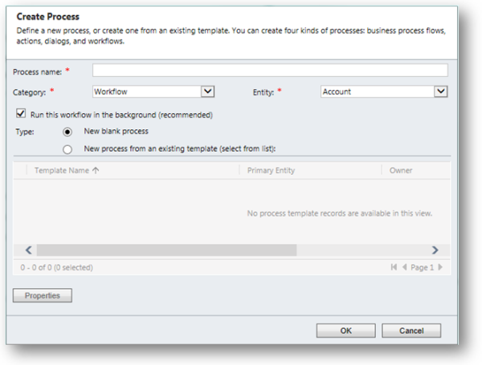
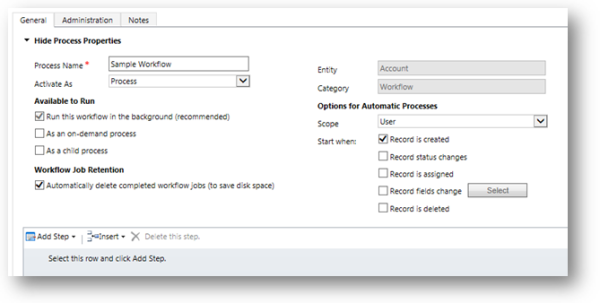

# Classic Common Data Service workflows 

Workflows automate business processes without a user interface. People usually use workflow processes to initiate automation that doesn’t require any user interaction.

There are two types of workflows:
1. Realtime workflows.
1. Background workflows.

##  Realtime workflows

See the Power Apps docs for more information on realtime workflows.

## Background workflows

Check out the [Power Apps docs on dfdf]().

> [!IMPORTANT]
> Use flows instead of classic workflows to automate your business processes. More information: [Replace classic Common Data Service workflows with flows](replace-workflows-with-flows.md)  
  
 Each workflow process is associated with a single entity. When configuring workflows you have four major areas to consider:  
  
-   When to start them?  
  
-   Should they run as a real-time workflow or a background workflow?  
  
-   What actions should they perform?  
  
-   Under what conditions should actions be performed?  
  
 This topic introduces how to find workflow processes and will describe when to start them and if they should run as real time or background. For information about the actions they should perform, and the conditions, see [Configuring Workflow Processes](configure-workflow-steps.md).  
  
   
## Where do you customize workflow processes?  
 You can see the workflows in your organization by viewing the **Processes** node in the **Default Solution** and filtering on processes that have the **Category** **Workflow**.  
  
   
  
 Depending on how the app is built, users can create or modify their workflows in the app. 
 
Developers can create workflows using information in the [Common Data Service Developer Guide](https://docs.microsoft.com/powerapps/developer/common-data-service/workflow/workflow-extensions) and solutions you purchase may include workflows that you may modify.  
  
   
## Workflow properties  
 In the solution explorer, select **Processes** and click **New**.  
  
 When you create a workflow the **Create Process** dialog requires that you set three properties that all processes have:  
  
   
  
 **Process Name**  
 The name of the workflow process does not need to be unique, but if you expect you will have a lot of workflows, you may want to use a naming convention to clearly differentiate your processes. You may want to apply standard prefixes to the name of the workflow. The prefix may describe the function of the workflow or the department within the company. This will help you group similar items in the list of workflows.  
  
 **Category**  
 This property establishes that this is a workflow process.  
  
 **Entity**  
 Each workflow process must be set to a single entity. You can’t change the entity after the workflow process is created.  
  
 **Run this workflow in the background (recommended)**  
 This option appears when you select workflow as the category. This setting determines whether the workflow is a real-time or background workflow. Real-time workflows run immediately (synchronously) and background workflows run asynchronously. The configuration options available depend on your choice for this setting. Background workflows allow for wait conditions that are not available for real-time workflows. As long as you don’t use those wait conditions, at a later time you can convert background workflows to real-time workflows and real-time workflows to background workflows. For more information about wait conditions, see [Setting conditions for workflow actions](configure-workflow-steps.md#BKMK_SettingConditionsForWorkflowActions).  
  
 You also have the **Type** option to specify whether to build a new workflow from scratch or choose to start from an existing template. When you choose **New process from an existing template (select from list)** you can choose from the available Workflows processes that were previously saved as a process template.  
  
 After you create the Workflow or if you edit an existing one, you will have the following additional properties:  
  
   
  
 **Activate As**  
 You can choose **Process template** to create an advanced starting point for other templates. If you choose this option, after you activate the workflow it will not be applied but instead it will be available to select in the **Create Process** dialog if you select **Type**: **New process from an existing template (select from list)**  
  
 Process templates are convenient when you have a number of similar workflow processes and want to define them without duplicating the same logic.  
  
> [!NOTE]
>  Editing a process template does not change the behaviors of any other workflow processes previously created using it as a template. A new workflow created using a template is a copy of the content in the template.  
  
 **Available to Run**  
 This section contains options that describe how the workflow is available to be run.  
  
 **Run this Workflow in the background (recommended)**  
 This check box reflects the option you selected when you created the workflow. This option is disabled, but you can change it from the **Actions** menu by choosing either **Convert to a real-time workflow** or **Convert to a background workflow**.  
  
 **As an on-demand process**  
 Choose this option if you want to allow users to run this workflow from the **Run Workflow** command.  
  
 **As a child process**  
 Choose this option if you want to allow the workflow to be available to be started from another workflow.  
  
 **Workflow Job Retention**  
 This section contains an option to delete a workflow after the workflow execution has completed .  
  
 **Automatically delete completed workflow jobs (to save disk space)**  
 Choose this option, if you want a completed workflow job to be automatically deleted.  
  
> [!NOTE]
>  The workflow jobs are not deleted immediately upon completion, but soon after, through a batch process.  
  
 **Scope**  
 For user-owned entities, options are **Organization**, **Parent: Child Business Units**, **Business Unit**, or **User**. For Organization-owned entities the only option is **Organization**.  
  
 If scope is **Organization**, then the workflow logic can be applied to any record in the organization. Otherwise, the workflow can only be applied to a subset of records that fall within the scope.  
  
> [!NOTE]
>  The default scope value is **User**. Make sure you verify that the scope value is appropriate before you activate the workflow.  
  
 **Start When**  
 Use the options in this section to specify when a workflow should start automatically. You can configure a real-time workflow to be run before certain events. This is a very powerful capability because the workflow can stop the action before it occurs. More information: [Using Real-time Workflows](configure-workflow-steps.md#BKMK_SynchronousWorkflows). The options are:  
  
- **Record is created**  
  
- **Record status changes**  
  
- **Record is assigned**  
  
- **Record fields change**  
  
- **Record is deleted**  
  
> [!NOTE]
>  Keep in mind that the actions and conditions you define for the workflow are not aware of when the workflow is run. For example, if you define a workflow to update the record, this action can’t be performed by a real-time workflow before the record is created. A record that doesn’t exist cannot be updated. Similarly, a background workflow can’t update a record that has been deleted, even though you could define this action for the workflow. If you configure a workflow to perform an action that can’t be performed, it will fail and the entire workflow will fail.  
  
 **Execute As**  
 This option is only available if you unselected the **Run this workflow in the background (recommended)** option when you created the workflow or if you later converted a background workflow to be a real-time workflow.  
  
   
## Security context of workflow processes  
 When a background workflow is configured as an on-demand process and is started by a user using the **Run Workflow** command, the actions that the workflow can perform are limited to those the user could perform based on the privileges and access levels defined by the security role(s) set for their user account.  
  
 When a background workflow starts based on an event the workflow operates in the context of the person who owns it, usually the person who created the workflow.  
  
 For real-time workflows you have the **Execute As** option and you can choose whether the workflow should apply the security context of the owner of the workflow or the user who made changes to the record. If your workflow includes actions which all users would not be able to perform based on security constraints, you should choose to have the workflow run as the owner of the workflow.  
  
   
## Activate a workflow  
 Workflows can only be edited while they are deactivated. Before a workflow can be used manually or be applied due to events it has to be activated. Before a workflow can be activated it must contain at least one step. For information on configuring steps, see [Configuring workflow processes](configure-workflow-steps.md)  
  
 A workflow can only be activated or deactivated by the workflow owner or by someone with the **Act on Behalf of Another User** privilege such as the system administrator.  The reason for this is that a malicious user could modify someone’s workflow without them being aware of the change. You can reassign a workflow you own by changing the owner. This field is on the **Administration** tab. If you are not the system administrator and you need to edit a workflow that is owned by another user, you need them to deactivate it and assign it to you. After you finish editing the workflow, you can to assign it back to them so they can activate it.  
  
 Real-time workflows require that the user have the **Activate Real-time Processes** privilege. Because real-time workflows have a greater risk of affecting system performance, only people who can evaluate the potential risk should be given this privilege.  
  
 Workflows are saved when they are activated, so it is not necessary to save them before activating them.  
  
## Next steps  
 [Configuring workflow processes](configure-workflow-steps.md)   
[Add an on-demand workflow to a business process flow](bpf-add-on-demand-workflow.md) 

