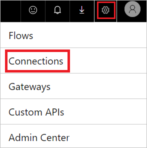
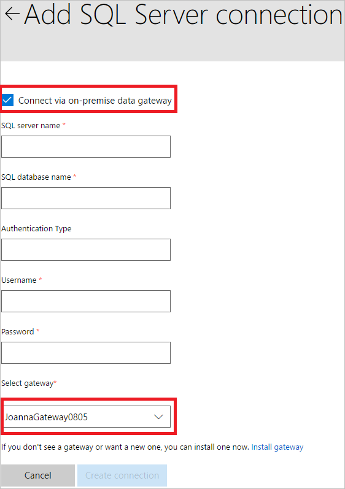
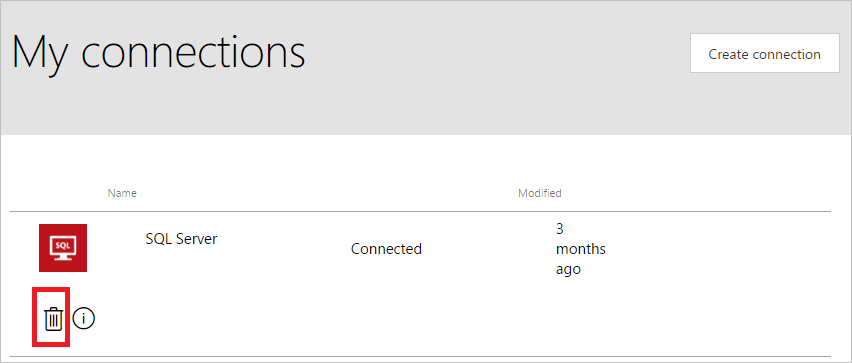
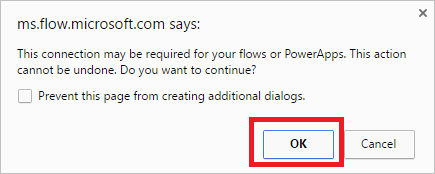

# Manage connections in Microsoft Flow
[!INCLUDE [view-pending-approvals](includes/cc-rebrand.md)]
If you create a connection in Microsoft Flow, you can easily access your data while building a flow. Microsoft Flow includes commonly used connections, including SharePoint, SQL Server, Office 365, OneDrive for Business, Salesforce, Excel, Dropbox, Twitter, and more. Connections are shared with PowerApps, so when you create a connection in one product, the connection shows up in the other.

For example, you can use a connection to perform these tasks:

* Update a SharePoint list.
* Get data from an Excel file in your OneDrive for Business or Dropbox account.
* Send email in Office 365.
* Send a tweet.

You can create a connection in multiple scenarios, such as these:

* Creating a [flow from a template](get-started-logic-template.md)
* Creating a [flow from blank](get-started-logic-flow.md) or updating an existing flow
* Creating a connection in the [Microsoft Flow website][1] directly

This topic shows you how to manage connections in the [Microsoft Flow website][1].

## Add a connection
1. In the [Microsoft Flow website][1], sign in with your work or organization account.
2. Near the upper-right corner, select the gear icon, and then select **Connections**.
   
    
3. Select **Create connection**.
4. In the list of **Available connections**, select the connection that you want to set up, such as SharePoint.
5. Select the **Create connection** button, and then enter your credentials to set up the connection.

When the connection is set up, it's listed in **My connections**.

## Connect to your data through an on-premises data gateway
As of this writing, SQL Server and SharePoint Server support the on-premises data gateway. To create a connection that uses a gateway:

1. Follow the steps earlier in this topic to add a connection.
2. In the list of **Available connections**, select **SQL Server**, and then select the **Connect via on-premise data gateway** check box.
   
    
   
   > [!IMPORTANT]
   > Microsoft SharePoint data gateways support HTTP traffic but not HTTPS traffic.
   > 
   > 
3. Provide the connection's credentials, and then select the gateway that you want to use.
   
    For more information, see [Manage gateways](gateway-manage.md) and [Understand gateways](gateway-reference.md).
   
    When the connection is set up, it's listed in **My connections**.

## Delete a connection
1. Go to the **My connections** page, and then select the trash-can icon for the connection you want to delete.
   
    
2. Select **OK** to confirm that you would like to delete the connection.
   
    

When you delete a connection, it's removed from both PowerApps and Microsoft Flow.

## Update a connection
You can update a connection that isn't working because your account details or your password changed.

1. On the **My connections** page, select the **Verify password** link for the connection that you want to update.
   
    
2. When prompted, update your connection with new credentials.

When you update a connection, it's updated for both PowerApps and Microsoft Flow.

## Troubleshoot a connection
Depending on your organization's policies, you might need to use the same account for signing in to Microsoft Flow and creating a connection to SharePoint, Office 365 or OneDrive for Business.

For example, you might sign in to Microsoft Flow with *yourname@outlook.com* but be blocked when you try to connect to SharePoint with *yourname@contoso.com*. You can instead sign in to Microsoft Flow with *yourname@contoso.com* and you'll be able to connect to SharePoint.

<!--Reference links in article-->
[1]: https://flow.microsoft.com
