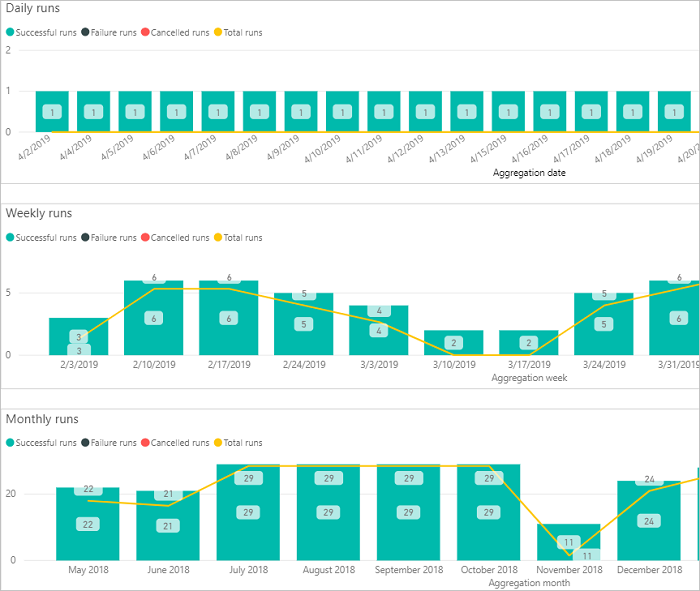
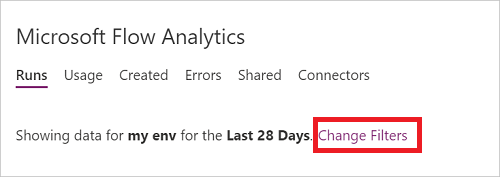
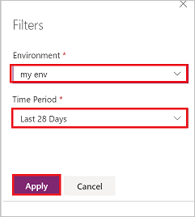

# Sharing and connectors admin analytics reports
[!INCLUDE [view-pending-approvals](includes/cc-rebrand.md)]

Organizations need insights into how apps are used and who's using them. The Admin analytics sharing and connectors reports provide insight into how Microsoft Flow is being used within your tenant. 

From a sharing perspective, you can learn who your app champions are and then empower them to provide even more automated solutions for your organization. The connectors report identifies Microsoft, third-party, and custom connectors that are in use within your organization.

## View shared flows reports

1. Sign in to the [Power Platform Admin Center](https://admin.powerplatform.microsoft.com/).
1. Select **Analytics** from the navigation bar on the left.
1. Select the **Shared** tab and view the list of flows that are shared in your organization.
 
    

## View connectors report

1. Sign in to the [Power Platform Admin Center](https://admin.powerplatform.microsoft.com/).
1. Select **Analytics** from the navigation bar on the left.
1. Select the **Connectors** tab and view the list of connectors in use in your organization.
 
    

## Filter views

The results in these reports are based on the environment you've selected. To change the environment:

1. Select the **Change Filters** link.
    
    

1. Select the **Environment** and the **Time Period** for which you're interested in viewing reports.
1. Select the **Apply** button.

    

## Learn more

[Get started with Microsoft Flow](getting-started.md)

