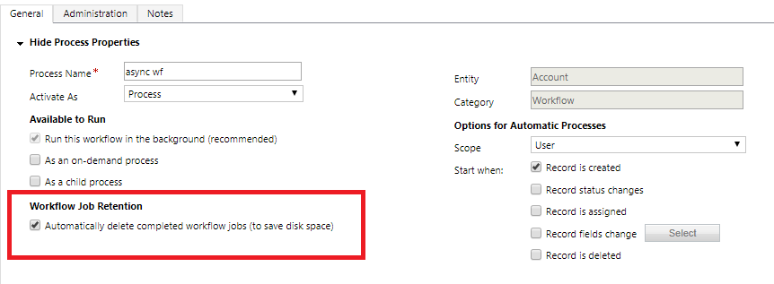

# Best practices for workflow processes

This topic contains best practices for creating and managing workflow processes.  
  
   
## Avoid infinite loops  
 It’s possible to create logic in a workflow that initiates an infinite loop, which consumes server resources and affects performance. The typical situation where an infinite loop might occur is if you have a workflow configured to start when an attribute is updated and then updates that attribute in the logic of the workflow. The update action triggers the same workflow that updates the record and triggers the workflow again and again.  
  
 The workflows you create include logic to detect and stop infinite loops. If a workflow process is run more than a certain number of times on a specific record in a short period of time, the process fails with the following error: **This workflow job was canceled because the workflow that started it included an infinite loop. Correct the workflow logic and try again**. The limit of times is 16.  
  
   
## Use workflow templates  
 If you have workflows that are similar and you anticipate creating more workflows that follow the same pattern, save your workflow as a workflow template. This way, the next time you need to create a similar workflow, create the workflow using the template and avoid entering all the conditions and actions from scratch.  
  
 In the **Create Process** dialog, choose **New process from an existing template (select from list)**.  
  
   
## Use child workflows  
 If you apply the same logic in different workflows or in conditional branches, define that logic as a child workflow so you don’t have to replicate that logic manually in each workflow or conditional branch. This helps make your workflows easier to maintain. Instead of examining many workflows that may apply the same logic, you can just update one workflow.  
  
## Automatically delete completed workflow jobs
For background (asynchronous) workflows, we recommend selecting the **Automatically delete completed workflow jobs (to save disk space)** option in the workflow definition. Checking this box allows the system to delete workflow logs for successful executions to save space. Notice that logs from failed workflow executions will always be saved for troubleshooting.  

   
## Keep logs for workflow jobs that encountered errors  
For workflows that don't run in the background (synchronous), we recommend selecting the **Keep logs for workflow jobs that encountered errors** option in the workflow definition. Selecting this option allows logs from failed workflow executions to be saved for troubleshooting. Logs from successful synchronous workflow executions will always be deleted to save space.   

## Limit the number of workflows that update the same entity
Running more than one workflow that updates the same entity can cause resource lock issues. Imagine several workflows running where every opportunity update triggers an update to the associated account. Multiple instances of these workflows running and attempting to update the same account record at the same time can result in resource locking issues. Workflow failures occur and an error message, such as **SQL Timeout: Cannot obtain lock on resource _resource name_**, is recorded. 

  
   
## Use Notes to keep track of changes  
 When you edit workflows you should use the Notes tab and type what you did and why you did it. This allows someone else to understand the changes you made.  
  
## Next steps  
 [Workflow processes overview](workflow-processes.md)   
 [Configure workflow processes](configure-workflow-steps.md)   
 [Monitor and manage workflow processes](monitor-manage-processes.md)
   
