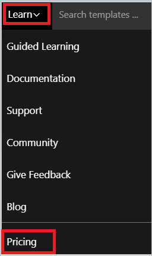

# Billing and metering questions
[!INCLUDE [view-pending-approvals](includes/cc-rebrand.md)]

This article answers frequently asked questions regarding billing and metering in Microsoft Flow.

>[!NOTE]
> PowerApps and Microsoft Flow will use a [new licensing model](https://docs.microsoft.com/power-platform/admin/powerapps-flow-licensing-faq) starting on October 1, 2019. 

## Where can I find out what pricing plans are available?

See the [pricing page](https://flow.microsoft.com/pricing/).

## Where can I find out what my plan is?

See the [pricing page](https://flow.microsoft.com/pricing/).

## How do I switch plans?

In the top navigation menu, select **Learn** > **Pricing**, and then select the plan to which you want to switch.

## How do I know how much I've used?

If you're on a free plan or a trial plan, click or tap the gear icon in the top navigation bar to show your current usage against your plan. 

If you're on a paid plan, runs are pooled across all users in your organization. We're working on features to expose available quota and usage across an organization.

## What happens if my usage exceeds the limits?

Microsoft Flow throttles your flow runs.

## Where can I find more information regarding the usage limits?

On the [pricing page](https://flow.microsoft.com/pricing/), see the **FAQ** section.

## What happens if I try to execute runs too frequently?

Your plan determines how often your flows run. For example, your flows may run every 15 minutes if you're on the free plan. If a flow is triggered less than 15 minutes after its last run, it's queued until 15 minutes have elapsed.

## What counts as a run?

Whenever a flow is triggered, whether by an automatic trigger or by manually starting it, this is considered a run. Checks for new data don't count as runs.

## Are there differences between Microsoft Accounts and work or school accounts for billing?

Yes. If you sign in with a Microsoft Account (such as an account that ends with @outlook.com or @gmail.com), you can use only the free plan. To take advantage of the features in the paid plan, sign in with a work or school email address.

## I'm trying to upgrade, but I'm told my account isn't eligible.

To upgrade, use a work or school account, or create an [Office 365 trial account](https://powerbi.microsoft.com/documentation/powerbi-admin-signing-up-for-power-bi-with-a-new-office-365-trial/).

## Why did I run out of runs when my flow only ran a few times?

Certain flows may run more frequently than you expect. For example, you might create a flow that sends you a push notification whenever your manager sends you an email. That flow must run every time you get an email (from anyone) because the flow must check whether the email came from your manager. This action counts as a run.

You can work around this issue by putting all the filtering you need into the trigger. In the push notification example, expand the **Advanced Options** menu, and then provide your manager's email address in the **From** field.

## Other limits and caveats

* Each account may have as many as:
  * 250 flows.
  * 15 Custom Connectors.
  * 20 connections per API and 100 connections total.
* You can install a gateway only in the default environment.
* Certain external connectors, such as Twitter, implement connection throttling to control quality of service. Your flows fail when throttling is in effect. If your flows are failing, review the details of the run that failed in the flow's run history.
