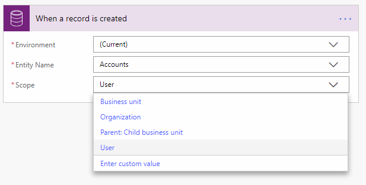
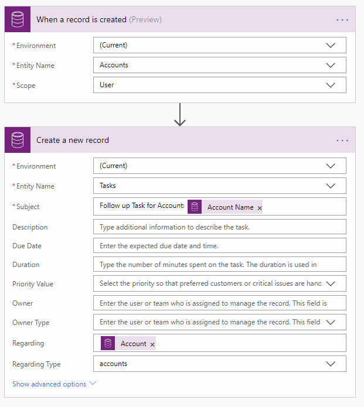
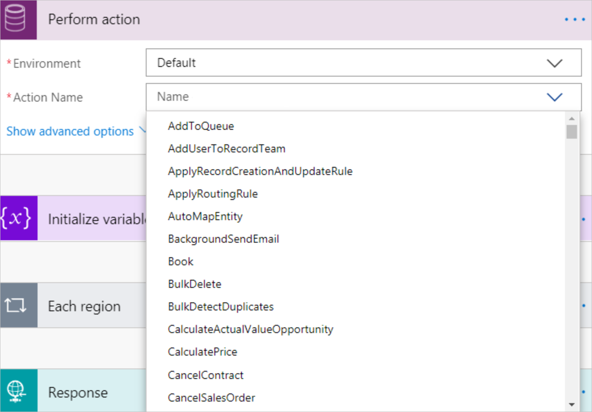

# Create an automated flow by using Common Data Service
[!INCLUDE [view-pending-approvals](includes/cc-rebrand.md)]

With the Common Data Service connector, you can create flows that are initiated by create and update events within your Common Data Service database. Additionally, you can perform create, update, retrieve, and delete actions on records within the Common Data Service database.

## Initiate a flow from Common Data Service

You can use any of the following triggers to initiate your flow:

- When a record is selected
- When a record is created
- When a record is deleted
- When a record is updated

> [!div class="mx-imgBorder"]
> 

If the selected trigger requires an environment to be selected, then you can choose `(Current)`, which will always use the database within the environment in which Microsoft Flow runs. If you want your flow to always trigger based on an event in a specific environment, select that environment.

> [!div class="mx-imgBorder"]
> 

You can use scopes to determine if your flow runs if you create a new record, if a new record is created by a user within your business unit, or if a new record is created by any user in your organization.

> [!div class="mx-imgBorder"]
> 

|Scope|Trigger timing|
| --- | --- |
|Business Unit|Action is taken on a record owned by your business unit|
|Organization|Action is taken by anyone within the organization or database|
|Parent: Child business unit|Action is taken on a record owned by your business unit or a child business unit|
|User|Action is taken on a record owned by you|

Triggers that run when a record is updated can also use filtering attributes. This ensures that the flow only runs when any of the defined attributes are updated.

> [!IMPORTANT]
> Use filter attributes to prevent your flow from unnecessarily running.

This flow triggers any time the first or last name of contact that the flow user owns is updated.

> [!div class="mx-imgBorder"]
> 

## Trigger privileges

To create a flow that triggers based on create, update, or delete on a record, the user needs to have user level permissions for create, read, write, and delete on the Callback Registration entity. Additionally, depending on the scopes defined, the user might need at least that level of read on the same entity.  [Learn more](https://docs.microsoft.com/power-platform/admin/database-security) about environment security.

## Write data into Common Data Service

Use any of the following actions to write data into Common Data Service:

- Create a new record
- Update a record

Here's an example of creating a followup task when the given user creates a new account record.  

> [!div class="mx-imgBorder"]
> 

## Advanced concepts

### Write data into customer, owner, and regarding fields

To write data into customer, owner, and regarding fields, two fields must be populated.

| Field category | Example settings |
| --- | --- |
| Regarding | Regarding = ID of the record (for example, account ID) and Regarding Type as selected from the list. |
| Customer | Represents the ID of the record and the customer type as selected from the list. |
| Owner | Represents the ID of the system user or team, and owner type as selected from the list. |

### Enable upsert behavior

You can leverage the **update a record** command to provide upsert actions, which updates the record if it already exists, or creates a new record. To invoke upsert, provide the entity and a GUID key. If the record with the specified type and key exists, an update occurs. Otherwise, a record with the specified key is created.

### Trigger behavior

If you have a trigger registered on the update of a record, the flow runs for every *committed* update to the given record. The service invokes your flow asynchronously, and with the payload that it captures at the time the invocation occurs.

> [!NOTE]
> If you have two updates that happen within seconds of each other, then the flow may be triggered more than once with the latest versioned content.

Flow runs may be delayed if there is a backlog of system jobs in your environment.  If this delay occurs, your flow is triggered when the system job to invoke the flow runs.

### Call any Common Data Service action

Automated workflows can call all actions in Common Data Service. These include everything from fulfilling a sales order to exporting a Microsoft Excel file.

 

