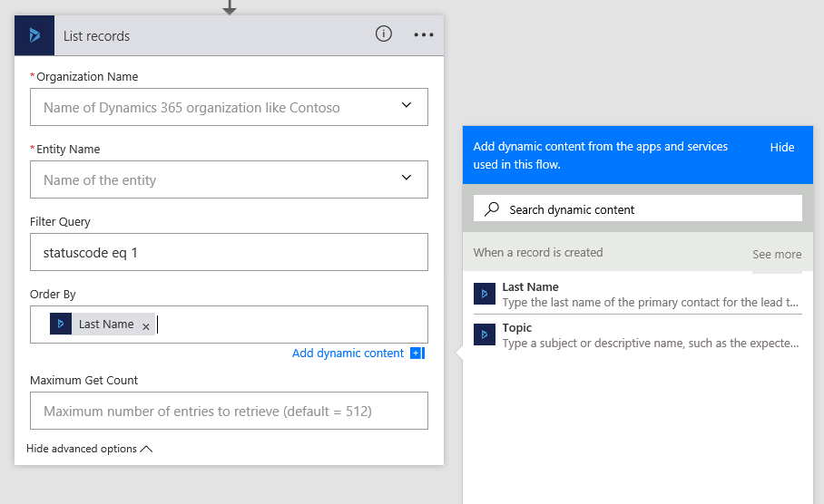
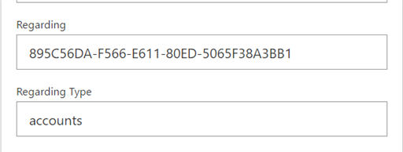
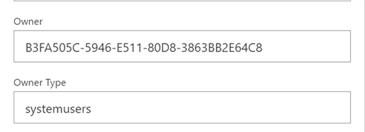

# Create a flow by using Dynamics 365 (online)
By using a Dynamics 365 connector, you can create flows that initiate when an event occurs in Dynamics 365, or some other service, which then performs an action in Dynamics 365, or some other service. 

In Microsoft Flow, you can set up automated workflows between your favorite apps and services to synchronize files, get notifications, collect data, and more. For more information, see [Get started with Microsoft Flow](getting-started.md).

## Create a flow from a template
You can create a flow using one of the many templates available, such as these examples:

* When an object is created in Dynamics 365, create a list item in SharePoint.
* Create Dynamics 365 lead records from an Excel table.
* Copy Dynamics 365 accounts to customers in Dynamics 365 for Operations.

To create a flow from a template, follow these steps.

1. Sign in to the [Microsoft Flow website](https://flow.microsoft.com/).
2. Click or tap **Services**, and then click or tap **Dynamics 365**.
3. Several templates are available. To get started, select the template that you want.

## Create a task from a lead
If a template isn’t available for what you need, create a flow from scratch. This walkthrough shows you how to create a task in Dynamics 365 whenever a lead is created in Dynamics 365.

1. Sign in to the [Microsoft Flow website](https://flow.microsoft.com/).
2. Click or tap **My flows**, and then click or tap **Create from blank**.
3. In the list of flow triggers, click or tap **Dynamics 365 - When a record is created**.
4. If prompted, sign in to Dynamics 365.
5. Under **Organization Name**, select the Dynamics 365 instance where you want the flow to listen.
6. Under **Entity Name**, select the entity that you want to listen to, which will act as a trigger initiating the flow.
   
     For this walkthrough, select **Leads**.
   
    
    > [IMPORTANT]
    > In order for the flow to trigger on the Dynamics 365 entity, the entity definition should have Change Tracking enabled. See [Enable change tracking to control data synchronization](https://docs.microsoft.com/en-us/dynamics365/customer-engagement/admin/enable-change-tracking-control-data-synchronization)
    
7. Click or tap **New step**, and then click or tap **Add an action**.
8. Click or tap **Dynamics 365 – Create a new record**.
9. Under **Organization Name**, select the Dynamics 365 instance where you want the flow to create the record. Notice that it doesn’t have to be the same instance where the event is triggered from.
10. Under **Entity Name**, select the entity that will create a record when the event occurs.
    
     For this walkthrough, select **Tasks**.
11. A **Subject** box appears. When you click or tap it, a dynamic content pane appears where you can select either of these fields.
    
    * **Last Name**. If you select this field, the last name of the lead will be inserted in the **Subject** field of the task when it's created.
    * **Topic**. If you select this field, the **Topic** field for the lead will be inserted in the **Subject** field of the task when it's created.
    
    For this walkthrough, select **Topic**.
    
    
    
    > **Tip:** On the dynamic content pane, click or tap **See more** to display more fields that are associated with the entity. For example, you can also populate the **Subject** field of the task with the **Company Name**, **Customer**, **Description**, or **Email** field of the lead.
    > 
    > 
12. Click or tap **Create flow**.

## Create a Wunderlist task from a Dynamics 365 task
This walkthrough shows you how to create a task in [Wunderlist](https://www.wunderlist.com) whenever a task is created in Dynamics 365. Wunderlist is an Internet-based service that you can use to create to-do lists, add reminders, or track errands.

1. Sign in to the [Microsoft Flow website](https://flow.microsoft.com/).
2. Click or tap **My flows**, and then click or tap **Create from blank**.
3. In the list of flow triggers, click or tap **Dynamics 365 - When a record is created**.
4. Under **Organization Name**, select the Dynamics 365 instance where you want the flow to listen.
5. Under **Entity Name**, select the entity that you want to listen to, which will act as a trigger to initiate the flow.
   
    For this walkthrough, select **Tasks**.
6. Click or tap **New step**, and then click or tap **Add an action**.
7. Type *create a task*, and then click or tap **Wunderlist – Create a task**.
8. Under **List ID**, select **inbox**.
9. Under **Title**, select **Subject** in the dynamic content pane.
10. Click or tap **Create flow**.  

## Specify advanced options
When you add a step to a flow, you can click or tap **Show advanced options** to add a filter or order by query that controls how the data is filtered in the flow.

For example, you can use a filter query to retrieve only active contacts, and you can order them by last name. To do this, enter the OData filter query **statuscode eq 1** and select **Last Name** from the dynamic content pane. For more information about filter and order by queries, see [MSDN: $filter](https://msdn.microsoft.com/library/gg309461.aspx#Anchor_1) and [MSDN: $orderby](https://msdn.microsoft.com/library/gg309461.aspx#Anchor_2).

  

### Best practices when using advanced options
When you add a value to a field, you must match the field type whether you type a value or select one from the dynamic content pane.

| Field type | How to use | Where to find | Name | Data type |
| --- | --- | --- | --- | --- |
| Text fields |Text fields require a single line of text or dynamic content that is a text type field. Examples include the **Category** and **Sub-Category** fields. |**Settings** > **Customizations** > **Customize the System** > **Entities** > **Task** > **Fields** |**category** |**Single Line of Text** |
| Integer fields |Some fields require integer or dynamic content that is an integer type field. Examples include **Percent Complete** and **Duration**. |**Settings** > **Customizations** > **Customize the System** > **Entities** > **Task** > **Fields** |**percentcomplete** |**Whole Number** |
| Date fields |Some fields require a date entered in mm/dd/yyyy format or dynamic content that is a date type field. Examples include **Created On**, **Start Date**, **Actual Start**, **Last on Hold Time**, **Actual End**, and **Due Date**. |**Settings** > **Customizations** > **Customize the System** > **Entities** > **Task** > **Fields** |**createdon** |**Date and Time** |
| Fields that require both a record ID and lookup type |Some fields that reference another entity record require both the record ID and the lookup type. |**Settings** > **Customizations** > **Customize the System** > **Entities** > **Account** > **Fields** |**accountid** |**Primary Key** |

### More examples of fields that require both a record ID and lookup type
Expanding on the previous table, here are more examples of fields that don't work with values selected from the dynamic content list. Instead, these fields require both a record ID and lookup type entered into the fields in PowerApps.

* **Owner** and **Owner Type**.
  
  * The **Owner** field must be a valid user or team record ID.
  * The **Owner Type** must be either **systemusers** or **teams**.
* **Customer** and **Customer Type**.
  
  * The **Customer** field must be a valid account or contact record ID.
  * The **Customer Type** must be either **accounts** or **contacts**.
* **Regarding** and **Regarding Type**.
  
  * The **Regarding** field must be a valid record ID, such as an account or contact record ID.
  * The **Regarding Type** must be the lookup type for the record, such as **accounts** or **contacts**.

This example adds an account record that corresponds to the record ID, adding it to the **Regarding** field of the task.

  

This example also assigns the task to a specific user based on the user's record ID.

  

To find a record's ID, see [Find the record ID](#find-the-records-id) later in this topic.

> **Important:** Fields shouldn't contain a value if they have a description of "For internal use only." These fields include **Traversed path**, **Additional Parameters**, and **Time Zone Rule Version Number.**
> 
> 

## Find the record's ID
1. In the Dynamics 365 web application, open a record, such as an account record.
2. On the actions toolbar, click or tap **Pop Out**
    (or click or tap **EMAIL A LINK** to copy the full URL to your default email program).
   
    In the address bar of the web browser, the URL contains the record ID between the %7b and %7d encoding characters.
   
   

## Related topics
[Troubleshooting a flow](fix-flow-failures.md)

[Flow in your organization Q&A](organization-q-and-a.md)

[Frequently asked questions](frequently-asked-questions.md)

