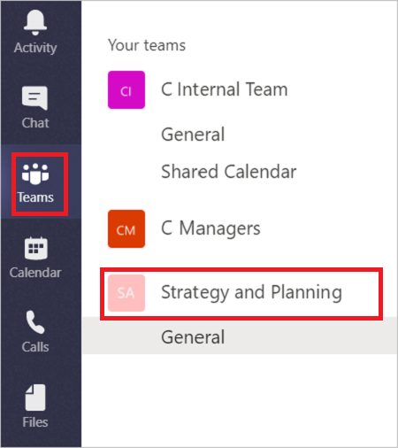
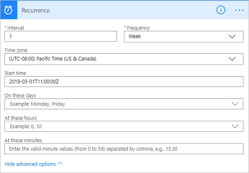
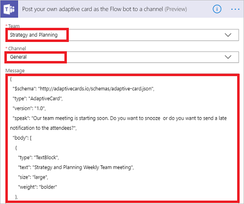

# Use adaptive cards in Microsoft Teams

You can create a flow that posts [adaptive cards](https://adaptivecards.io) to a Microsoft Teams channel. With adaptive cards, you can use rich formatting to make your posts clearer, interactive, and engaging. Adaptive cards can contain components like images, graphs, richly formatted text, and more.

## Create a flow that posts adaptive cards to a team

Follow these steps to create a flow that posts an adaptive card to the general channel in the Strategy and Planning team. The flow we create uses the **Post your own adaptive card as the flow bot to a channel (preview)** action to post the adaptive card's content to the team's channel weekly.

1. Sign into Microsoft Teams
1. Select the **Teams** icon in the navigation bar on the left, and then select the **Strategy and Planning** team.

    

1. Select the **Flow** tab at the top of the screen.
1. Select the **+** (Create from blank) icon.
1. Search for **recurrence**, and then select the **Recurrence** trigger.

    

1. Set the schedule as follows to repeat every weekly, at a time and time zone of your choice:
    
    
1. Select **New step**.
1. Search for **adaptive**, select **Microsoft Teams**, and then select the **Post your own adaptive card as the flow bot to a channel (preview)** action.

   

1. Provide a **Team**, **Channel**, and **Message** on the **Post your own adaptive card as the flow bot to a channel (preview)** card to indicate the team and channel to which the adaptive card **Message** will be posted.

   

   You can use this sample json content for the **Message**:

    ````
        {
    "$schema": "http://adaptivecards.io/schemas/adaptive-card.json",
    "type": "AdaptiveCard",
    "version": "1.0",
    "speak": "Our team meeting is starting soon. Do you want to snooze  or do you want to send a late notification to the attendees?",
    "body": [
        {
        "type": "TextBlock",
        "text": "Strategy and Planning Weekly Team meeting",
        "size": "large",
        "weight": "bolder"
        },
        {
        "type": "TextBlock",
        "text": "Conf Room 112/3377 (10)",
        "isSubtle": true
        },
        {
        "type": "TextBlock",
        "text": "12:30 PM - 1:30 PM",
        "isSubtle": true,
        "spacing": "none"
        },
        {
        "type": "TextBlock",
        "text": "Snooze for"
        },
        {
        "type": "Input.ChoiceSet",
        "id": "snooze",
        "style": "compact",
        "value": "5",
        "choices": [
            {
            "title": "5 minutes",
            "value": "5",
            "isSelected": true
            },
            {
            "title": "15 minutes",
            "value": "15"
            },
            {
            "title": "30 minutes",
            "value": "30"
            }
        ]
        }
    ],
    "actions": [
        {
        "type": "Action.Submit",
        "title": "Snooze",
        "data": {
            "x": "snooze"
        }
        },
        {
        "type": "Action.Submit",
        "title": "I'll be late",
        "data": {
            "x": "late"
        }
        }
    ]
    }
    ````


1. Give your flow a name and save it.


## Run the flow

 Notice, after the recurrence time elapses, the flow posts the adaptive card's content to the team channel that you defined.


Learn more

- Get started with [adaptive card samples](https://adaptivecards.io/samples/)
- Create [adaptive card content](https://adaptivecards.io) the easy way.


